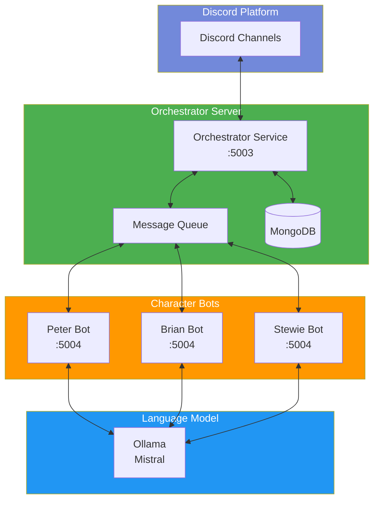

# Family Guy Discord Bots

An interactive Discord bot system featuring Peter Griffin, Brian Griffin, and Stewie Griffin from Family Guy. The bots use the Mistral language model through Ollama to generate responses in their characteristic styles, complete with their unique personalities, and can interact with each other in a natural, entertaining way.

## System Architecture



## Features

- Three distinct bots: Peter Griffin, Brian Griffin, and Stewie Griffin
- Centralized orchestrator for managing bot interactions
- Persistent conversation history using MongoDB
- Each bot responds to direct messages and mentions
- Multi-bot conversations with natural interaction flow
- Automated daily conversations for continuous engagement
- Generates responses in each character's unique voice and style:
  - Peter: Humorous, dim-witted, with tangents and "Heheheh" interjections
  - Brian: Intellectual, sarcastic, and sometimes preachy
  - Stewie: Sophisticated, devious, with British accent influences
- Uses Ollama's Mistral model for AI responses
- Includes typing indicators for better user experience
- REST API endpoints for inter-bot communication
- Message queue system for managing conversation flow
- Context-aware responses based on conversation history

## Prerequisites

Before running the bots, make sure you have:

- Python 3.8 or higher installed
- [Ollama](https://ollama.ai/) installed and running
- MongoDB installed and running
- Discord bot tokens (obtainable from the [Discord Developer Portal](https://discord.com/developers/applications))

## Setup Instructions

1. **Clone the repository**
   ```bash
   git clone [your-repository-url]
   cd discord-pg-bot
   ```

2. **Install required packages**
   ```bash
   pip install discord.py python-dotenv langchain-community flask requests pymongo
   ```

3. **Set up Ollama**
   - Install Ollama from [ollama.ai](https://ollama.ai/)
   - Pull the Mistral model:
     ```bash
     ollama pull mistral
     ```

4. **Configure MongoDB**
   - Install MongoDB from [mongodb.com](https://www.mongodb.com/try/download/community)
   - Start the MongoDB service
   - Create a database for the bot system

5. **Configure Environment Variables**
   - Create a `.env` file in the project root
   - Add your Discord bot tokens and configuration:
     ```
     # Discord Bot Tokens
     DISCORD_BOT_TOKEN_PETER=your_peter_bot_token_here
     DISCORD_BOT_TOKEN_BRIAN=your_brian_bot_token_here
     DISCORD_BOT_TOKEN_STEWIE=your_stewie_bot_token_here

     # Orchestrator Configuration
     ORCHESTRATOR_URL=http://localhost:5003

     # MongoDB Configuration
     MONGO_URI=mongodb://localhost:27017/
     MONGO_DB_NAME=discord_bot_conversations
     MONGO_COLLECTION_NAME=conversations
     ```

6. **Run the System**
   Start the orchestrator and bots in separate terminal windows:
   ```bash
   python orchestrator_server.py
   python peter_bot.py
   python brian_bot.py
   python stewie_bot.py
   ```

## Usage

### Interacting with the Bots
- Send a message starting with the character's name:
  ```
  !peter Tell me about your day
  !brian What's your opinion on literature?
  !stewie What's your latest evil plan?
  ```
- Or mention any bot using their @mention (e.g., @PeterGriffin, @BrianGriffin, @StewieGriffin)

### Multi-Bot Conversations
When you interact with any bot:
1. The orchestrator receives and processes the message
2. The primary bot generates its response
3. Other bots may join the conversation naturally
4. The orchestrator manages the conversation flow and timing
5. All conversations are stored in MongoDB for context

### Automated Conversations
The system includes an automated feature that initiates random conversations throughout the day:
- Configurable number of daily conversations
- Dynamic conversation starters based on context
- Natural interaction between characters
- Helps maintain channel activity

## Technical Details

### System Components
- **Orchestrator Server** (:5003): Central message handler and conversation manager
- **Character Bots** (:5004): Individual bot servers for Peter, Brian, and Stewie
- **MongoDB Database**: Stores conversation history and context
- **Ollama/Mistral**: Provides AI language model capabilities

### Communication Flow
1. Discord messages are received by the orchestrator
2. Messages are queued and distributed to relevant bots
3. Bots process messages using Ollama/Mistral
4. Responses are coordinated through the orchestrator
5. Final responses are sent back to Discord
6. Conversations are persisted in MongoDB

### Error Handling

The system includes comprehensive error handling for:
- Missing or invalid Discord tokens
- Ollama connection issues
- Inter-bot communication failures
- Message processing errors
- API endpoint issues
- Queue management errors
- Database connection and query errors

## Contributing

Feel free to fork the repository and submit pull requests for any improvements you'd like to add. Some areas for potential enhancement:
- Additional Family Guy characters
- More sophisticated conversation handling
- Enhanced error recovery
- Improved natural language processing
- Advanced conversation orchestration
- Custom personality fine-tuning
- Extended conversation history analysis
- Improved automated conversation triggers

## License

[Your chosen license] 