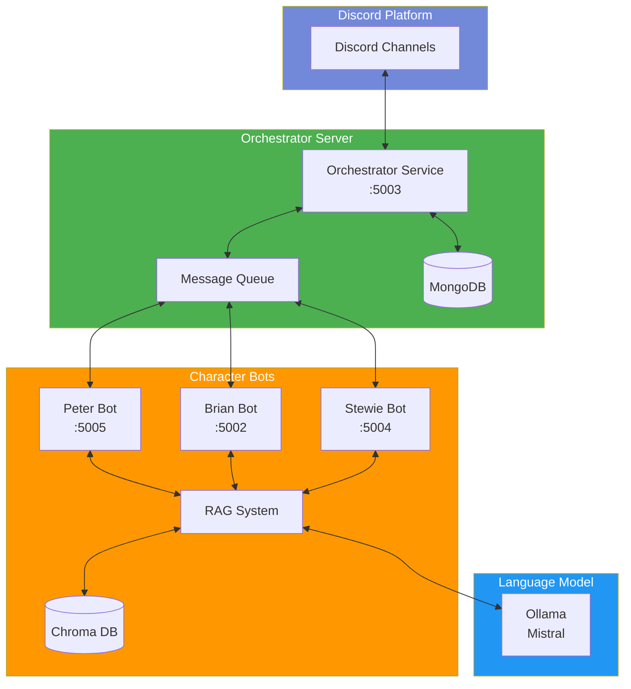

# Family Guy Discord Bots

An interactive Discord bot system featuring Peter Griffin, Brian Griffin, and Stewie Griffin from Family Guy. The bots use the Mistral language model through Ollama to generate responses in their characteristic styles, complete with their unique personalities, and can interact with each other in a natural, entertaining way.

## System Architecture



## Features

- Three distinct bots: Peter Griffin, Brian Griffin, and Stewie Griffin
- Centralized orchestrator for managing bot interactions
- Persistent conversation history using MongoDB
- RAG (Retrieval-Augmented Generation) system with Chroma DB for enhanced contextual responses
- Each bot responds to direct messages and mentions
- Multi-bot conversations with natural interaction flow
- Automated daily conversations for continuous engagement
- Generates responses in each character's unique voice and style:
  - Peter: Humorous, dim-witted, with tangents and "Heheheh" interjections
  - Brian: Intellectual, sarcastic, and sometimes preachy
  - Stewie: Sophisticated, devious, with British accent influences
- Uses Ollama's Mistral model for AI responses
- Includes typing indicators for better user experience
- REST API endpoints for inter-bot communication
- Message queue system for managing conversation flow
- Context-aware responses based on conversation history and RAG

## Prerequisites

Before running the bots, make sure you have:

- Windows 10/11, macOS, or Linux operating system
- Python 3.8 or higher installed
- [Git](https://git-scm.com/downloads) for cloning the repository
- [Ollama](https://ollama.ai/) installed and running
- MongoDB 6.0 or higher installed and running
- Discord bot tokens (obtainable from the [Discord Developer Portal](https://discord.com/developers/applications))
- At least 8GB RAM recommended for running the LLM
- Approximately 4GB free disk space for model storage
- SQLite (for Chroma DB vector storage)

## Setup Instructions

1. **Clone the repository**
   ```bash
   git clone https://github.com/DapeSec/discord-pg-bot.git
   cd discord-pg-bot
   ```

2. **Set up Python Virtual Environment**
   ```bash
   # Windows
   python -m venv .venv
   .venv\Scripts\activate

   # macOS/Linux
   python3 -m venv .venv
   source .venv/bin/activate
   ```

3. **Install required packages**
   ```bash
   pip install -r requirements.txt
   ```
   
   If requirements.txt is missing, install the following packages:
   ```bash
   pip install discord.py==2.3.2 python-dotenv==1.0.0 langchain-community==0.0.10 \
               flask==3.0.0 requests==2.31.0 pymongo==4.6.1 aiohttp==3.9.1 \
               python-dateutil==2.8.2 chromadb==0.4.22 sentence-transformers==2.2.2
   ```

4. **Set up Ollama**
   - Install Ollama from [ollama.ai](https://ollama.ai/)
   - Start the Ollama service:
     ```bash
     # Windows (Run as Administrator)
     ollama serve

     # macOS/Linux
     sudo systemctl start ollama    # If installed as a service
     # OR
     ollama serve
     ```
   - Pull the Mistral model:
     ```bash
     ollama pull mistral
     ```

5. **Configure MongoDB**
   - Install MongoDB Community Edition from [mongodb.com](https://www.mongodb.com/try/download/community)
   - Start the MongoDB service:
     ```bash
     # Windows (Run as Administrator)
     net start MongoDB

     # macOS
     brew services start mongodb-community

     # Linux
     sudo systemctl start mongod
     ```
   - Verify MongoDB is running:
     ```bash
     mongosh
     ```
   - Create a new database (in mongosh):
     ```javascript
     use discord_bot_conversations
     db.createCollection("conversations")
     ```

6. **Set up Discord Bots**
   - Go to the [Discord Developer Portal](https://discord.com/developers/applications)
   - Create three new applications (one for each character)
   - For each application:
     1. Go to the "Bot" section
     2. Click "Reset Token" and copy the new token
     3. Enable "Message Content Intent" under Privileged Gateway Intents
     4. Save changes
   - Invite the bots to your server using the OAuth2 URL Generator:
     1. Select "bot" scope
     2. Select required permissions:
        - Send Messages
        - Read Message History
        - Add Reactions
        - Use External Emojis
        - Mention Everyone
     3. Copy and visit the generated URL for each bot

7. **Configure Environment Variables**
   - Create a `.env` file in the project root:
     ```bash
     # Windows
     copy nul .env

     # macOS/Linux
     touch .env
     ```
   - Add your configuration:
     ```
     # Discord Bot Tokens
     DISCORD_BOT_TOKEN_PETER=your_peter_bot_token_here
     DISCORD_BOT_TOKEN_BRIAN=your_brian_bot_token_here
     DISCORD_BOT_TOKEN_STEWIE=your_stewie_bot_token_here

     # Orchestrator Configuration
     ORCHESTRATOR_URL=http://localhost:5003

     # MongoDB Configuration
     MONGO_URI=mongodb://localhost:27017/
     MONGO_DB_NAME=discord_bot_conversations
     MONGO_COLLECTION_NAME=conversations
     ```

8. **Run the System**
   Make sure you have all services running:
   1. Verify Ollama is running
   2. Verify MongoDB is running
   3. Start the bots (in separate terminal windows, with venv activated):
      ```bash
      # Terminal 1
      python orchestrator_server.py

      # Terminal 2
      python peter_bot.py

      # Terminal 3
      python brian_bot.py

      # Terminal 4
      python stewie_bot.py
      ```

9. **Verify Installation**
   - Check all bots appear online in your Discord server
   - Test each bot with a simple command:
     ```
     !peter hello
     !brian hello
     !stewie hello
     ```
   - Check the console output for any error messages

## Troubleshooting

If you encounter issues:

1. **Bots not responding**
   - Verify all services are running (Ollama, MongoDB)
   - Check the console output for error messages
   - Verify the bot tokens in .env are correct
   - Ensure the bots have proper permissions in Discord

2. **MongoDB Connection Issues**
   - Verify MongoDB is running: `mongosh`
   - Check if the connection string is correct
   - Ensure no firewall is blocking the connection

3. **Ollama Issues**
   - Verify Ollama is running: `ollama list`
   - Check if the Mistral model is downloaded
   - Ensure you have enough disk space

4. **Permission Issues**
   - Ensure you're running with appropriate permissions
   - Check Discord bot permissions in your server
   - Verify file permissions for .env and other files

For additional help, check the error messages in your console or create an issue on the GitHub repository.

## Usage

### Interacting with the Bots
- Send a message starting with the character's name:
  ```
  !peter Tell me about your day
  !brian What's your opinion on literature?
  !stewie What's your latest evil plan?
  ```
- Or mention any bot using their @mention (e.g., @PeterGriffin, @BrianGriffin, @StewieGriffin)

### Multi-Bot Conversations
When you interact with any bot:
1. The orchestrator receives and processes the message
2. The primary bot generates its response
3. Other bots may join the conversation naturally
4. The orchestrator manages the conversation flow and timing
5. All conversations are stored in MongoDB for context

### Automated Conversations
The system includes an automated feature that initiates random conversations throughout the day:
- Configurable number of daily conversations
- Dynamic conversation starters based on context
- Natural interaction between characters
- Helps maintain channel activity

## Technical Details

### System Components
- **Orchestrator Server** (:5003): Central message handler and conversation manager
- **Character Bots**: Individual bot servers for Peter (:5005), Brian (:5002), and Stewie (:5004)
- **MongoDB Database**: Stores conversation history and context
- **Chroma DB**: Vector database for RAG system, storing embeddings for contextual retrieval
- **Ollama/Mistral**: Provides AI language model capabilities
- **RAG System**: Enhances responses with relevant context from the vector database

### Communication Flow
1. Discord messages are received by the orchestrator
2. Messages are queued and distributed to relevant bots
3. The RAG system retrieves relevant context from Chroma DB
4. Bots process messages using Ollama/Mistral with RAG-enhanced context
5. Responses are coordinated through the orchestrator
6. Final responses are sent back to Discord
7. Conversations are persisted in MongoDB and relevant parts are vectorized for RAG

### Error Handling

The system includes comprehensive error handling for:
- Missing or invalid Discord tokens
- Ollama connection issues
- Inter-bot communication failures
- Message processing errors
- API endpoint issues
- Queue management errors
- Database connection and query errors
- RAG system and vector store issues

## Contributing

Feel free to fork the repository and submit pull requests for any improvements you'd like to add. Some areas for potential enhancement:
- Additional Family Guy characters
- More sophisticated conversation handling
- Enhanced error recovery
- Improved natural language processing
- Advanced conversation orchestration
- Custom personality fine-tuning
- Extended conversation history analysis
- Improved automated conversation triggers

## License

[Your chosen license] 