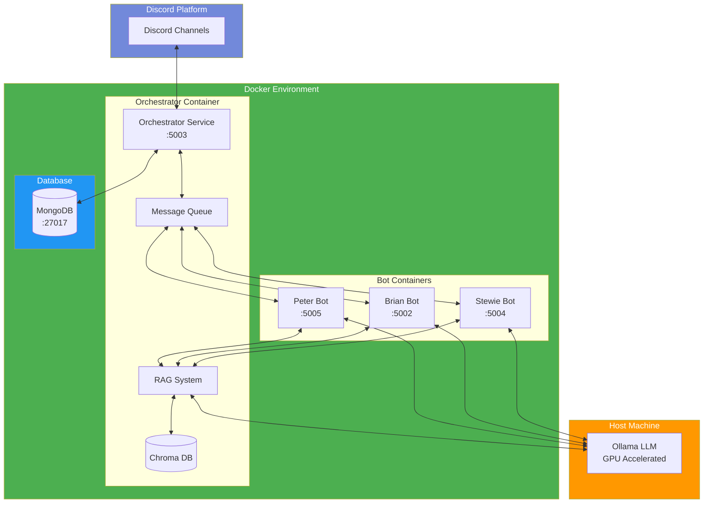

# Family Guy Discord Bots

An interactive Discord bot system featuring Peter Griffin, Brian Griffin, and Stewie Griffin from Family Guy. The bots use the Mistral language model through Ollama to generate responses in their characteristic styles, complete with their unique personalities, and can interact with each other in a natural, entertaining way.

## Table of Contents
1. [System Architecture](#system-architecture)
2. [Features](#features)
3. [Project Structure](#project-structure)
4. [Prerequisites](#prerequisites)
5. [Installation](#installation)
6. [Docker Setup](#docker-setup)
7. [Usage](#usage)
8. [Technical Details](#technical-details)
9. [Contributing](#contributing)
10. [License](#license)

## System Architecture



## Project Structure
```
discord-pg-bot/
├── docker/                 # Docker configuration files
│   ├── Dockerfile.orchestrator
│   ├── Dockerfile.bot
│   └── docker-compose.yml
├── src/                   # Source code
│   └── app/
├── tests/                 # Unit tests
├── config/               # Configuration files
├── scripts/              # Utility scripts
├── logs/                 # Application logs
├── chroma_db/           # Vector store data
├── .env                 # Environment variables
├── requirements.txt     # Python dependencies
└── README.md           # Documentation
```

## Features

- Three distinct bots with unique personalities:
  - Peter: Humorous, dim-witted, with tangents and "Heheheh" interjections
  - Brian: Intellectual, sarcastic, and sometimes preachy
  - Stewie: Sophisticated, devious, with British accent influences
- Containerized microservices architecture
- GPU-accelerated LLM responses via host Ollama
- RAG (Retrieval-Augmented Generation) system with Chroma DB
- Persistent conversation history using MongoDB
- Multi-bot conversations with natural interaction flow
- Automated daily conversations for continuous engagement
- REST API endpoints for inter-bot communication
- Message queue system for managing conversation flow
- Context-aware responses based on conversation history

## Prerequisites

1. **System Requirements**
   - Windows 10/11, macOS, or Linux operating system
   - At least 8GB RAM
   - NVIDIA GPU recommended for LLM acceleration
   - Approximately 4GB free disk space

2. **Required Software**
   - [Docker](https://www.docker.com/get-started) and Docker Compose
   - [Ollama](https://ollama.ai/) (installed on host machine)
   - [Git](https://git-scm.com/downloads)
   - Discord account and bot tokens

## Installation

1. **Clone the Repository**
   ```bash
   git clone https://github.com/DapeSec/discord-pg-bot.git
   cd discord-pg-bot
   ```

2. **Set up Ollama on Host Machine**
   ```bash
   # Start Ollama service
   ollama serve

   # In another terminal, pull the Mistral model
   ollama pull mistral
   ```

3. **Configure Environment**
   Create a `.env` file in the project root:
   ```
   # Discord Bot Tokens
   DISCORD_BOT_TOKEN_PETER=your_peter_bot_token_here
   DISCORD_BOT_TOKEN_BRIAN=your_brian_bot_token_here
   DISCORD_BOT_TOKEN_STEWIE=your_stewie_bot_token_here

   # MongoDB Configuration
   MONGO_URI=mongodb://mongodb:27017/
   MONGO_DB_NAME=discord_bot_conversations
   MONGO_COLLECTION_NAME=conversations

   # Ollama Configuration
   OLLAMA_BASE_URL=http://host.docker.internal:11434
   ```

## Docker Setup

1. **Build and Start Services**
   ```bash
   # Build and start all services
   docker-compose -f docker/docker-compose.yml up --build

   # Or run in detached mode
   docker-compose -f docker/docker-compose.yml up -d
   ```

2. **Verify Installation**
   ```bash
   # Check running containers
   docker-compose -f docker/docker-compose.yml ps

   # Check logs
   docker-compose -f docker/docker-compose.yml logs -f
   ```

3. **Container Management**
   ```bash
   # Stop all services
   docker-compose -f docker/docker-compose.yml down

   # Restart a specific service
   docker-compose -f docker/docker-compose.yml restart peter
   ```

## Usage

### Interacting with the Bots
- Send a message starting with the character's name:
  ```
  !peter Tell me about your day
  !brian What's your opinion on literature?
  !stewie What's your latest evil plan?
  ```
- Or mention any bot using their @mention (e.g., @PeterGriffin, @BrianGriffin, @StewieGriffin)

### Multi-Bot Conversations
When you interact with any bot:
1. The orchestrator receives and processes the message
2. The primary bot generates its response
3. Other bots may join the conversation naturally
4. The orchestrator manages the conversation flow and timing
5. All conversations are stored in MongoDB for context

### Automated Conversations
The system includes an automated feature that initiates random conversations throughout the day:
- Configurable number of daily conversations
- Dynamic conversation starters based on context
- Natural interaction between characters
- Helps maintain channel activity

## Technical Details

### System Components
- **Orchestrator Server** (:5003): Central message handler and conversation manager
- **Character Bots**: Individual bot servers for Peter (:5005), Brian (:5002), and Stewie (:5004)
- **MongoDB Database**: Stores conversation history and context
- **Chroma DB**: Vector database for RAG system, storing embeddings for contextual retrieval
- **Ollama/Mistral**: Provides AI language model capabilities
- **RAG System**: Enhances responses with relevant context from the vector database

### Communication Flow
1. Discord messages are received by the orchestrator
2. Messages are queued and distributed to relevant bots
3. The RAG system retrieves relevant context from Chroma DB
4. Bots process messages using Ollama/Mistral with RAG-enhanced context
5. Responses are coordinated through the orchestrator
6. Final responses are sent back to Discord
7. Conversations are persisted in MongoDB and relevant parts are vectorized for RAG

### Error Handling

The system includes comprehensive error handling for:
- Missing or invalid Discord tokens
- Ollama connection issues
- Inter-bot communication failures
- Message processing errors
- API endpoint issues
- Queue management errors
- Database connection and query errors
- RAG system and vector store issues

## Contributing

Feel free to fork the repository and submit pull requests for any improvements you'd like to add. Some areas for potential enhancement:
- Additional Family Guy characters
- More sophisticated conversation handling
- Enhanced error recovery
- Improved natural language processing
- Advanced conversation orchestration
- Custom personality fine-tuning
- Extended conversation history analysis
- Improved automated conversation triggers

## License

[Your chosen license]

## Usage

### Interacting with the Bots
- Send a message starting with the character's name:
  ```
  !peter Tell me about your day
  !brian What's your opinion on literature?
  !stewie What's your latest evil plan?
  ```
- Or mention any bot using their @mention (e.g., @PeterGriffin, @BrianGriffin, @StewieGriffin)

### Multi-Bot Conversations
When you interact with any bot:
1. The orchestrator receives and processes the message
2. The primary bot generates its response
3. Other bots may join the conversation naturally
4. The orchestrator manages the conversation flow and timing
5. All conversations are stored in MongoDB for context

### Automated Conversations
The system includes an automated feature that initiates random conversations throughout the day:
- Configurable number of daily conversations
- Dynamic conversation starters based on context
- Natural interaction between characters
- Helps maintain channel activity

## Technical Details

### System Components
- **Orchestrator Server** (:5003): Central message handler and conversation manager
- **Character Bots**: Individual bot servers for Peter (:5005), Brian (:5002), and Stewie (:5004)
- **MongoDB Database**: Stores conversation history and context
- **Chroma DB**: Vector database for RAG system, storing embeddings for contextual retrieval
- **Ollama/Mistral**: Provides AI language model capabilities
- **RAG System**: Enhances responses with relevant context from the vector database

### Communication Flow
1. Discord messages are received by the orchestrator
2. Messages are queued and distributed to relevant bots
3. The RAG system retrieves relevant context from Chroma DB
4. Bots process messages using Ollama/Mistral with RAG-enhanced context
5. Responses are coordinated through the orchestrator
6. Final responses are sent back to Discord
7. Conversations are persisted in MongoDB and relevant parts are vectorized for RAG

### Error Handling

The system includes comprehensive error handling for:
- Missing or invalid Discord tokens
- Ollama connection issues
- Inter-bot communication failures
- Message processing errors
- API endpoint issues
- Queue management errors
- Database connection and query errors
- RAG system and vector store issues

## Contributing

Feel free to fork the repository and submit pull requests for any improvements you'd like to add. Some areas for potential enhancement:
- Additional Family Guy characters
- More sophisticated conversation handling
- Enhanced error recovery
- Improved natural language processing
- Advanced conversation orchestration
- Custom personality fine-tuning
- Extended conversation history analysis
- Improved automated conversation triggers

## License

[Your chosen license]

## Docker Setup

### Prerequisites
1. Install Docker and Docker Compose
2. Install Ollama on your host machine from [ollama.ai](https://ollama.ai/)
3. Make sure ports 5002-5005 and 27017 are available
4. Ensure your GPU drivers are properly installed (for Ollama)

### Setup Steps

1. **Start Ollama on your host machine**
   ```bash
   # Start Ollama service
   ollama serve

   # In another terminal, pull the Mistral model
   ollama pull mistral
   ```

2. **Configure Environment**
   Create a `.env` file with your configuration:
   ```
   # Discord Bot Tokens
   DISCORD_BOT_TOKEN_PETER=your_peter_bot_token_here
   DISCORD_BOT_TOKEN_BRIAN=your_brian_bot_token_here
   DISCORD_BOT_TOKEN_STEWIE=your_stewie_bot_token_here

   # MongoDB Configuration
   MONGO_URI=mongodb://mongodb:27017/
   MONGO_DB_NAME=discord_bot_conversations
   MONGO_COLLECTION_NAME=conversations

   # Ollama Configuration
   OLLAMA_BASE_URL=http://host.docker.internal:11434
   ```

3. **Build and Run Containers**
   ```bash
   # Build and start all services
   docker-compose up --build

   # Or run in detached mode
   docker-compose up -d
   ```

4. **Verify Setup**
   ```bash
   # Check running containers
   docker-compose ps

   # Check logs
   docker-compose logs -f
   ```

### Architecture Notes
- Ollama runs on the host machine to utilize GPU resources
- MongoDB runs in a container with persistent storage
- Bot services and orchestrator run in separate containers
- All services communicate over a dedicated Docker network
- Logs and Chroma DB are persisted through volume mounts

### Container Management
```bash
# Stop all services
docker-compose down

# Restart a specific service
docker-compose restart peter

# View logs for a specific service
docker-compose logs -f orchestrator
```

### Troubleshooting
1. **Ollama Connection Issues**
   - Verify Ollama is running on the host: `curl http://localhost:11434/api/tags`
   - Check if the model is pulled: `ollama list`
   - Ensure host.docker.internal resolves correctly

2. **GPU Access**
   - Verify GPU is recognized by Ollama: `nvidia-smi`
   - Check Ollama logs for GPU initialization
   - Ensure CUDA drivers are installed 