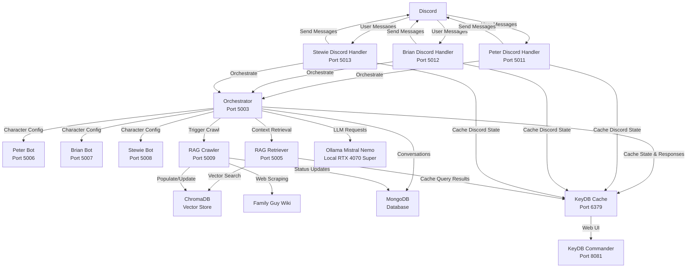
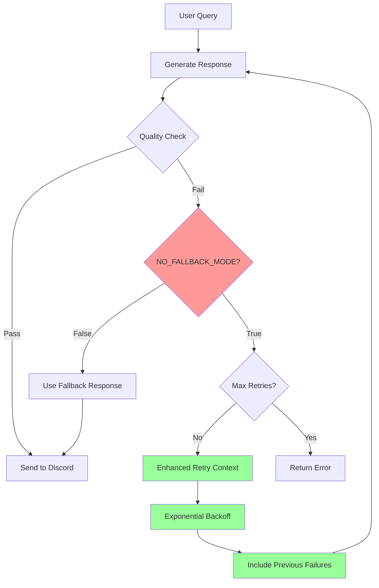
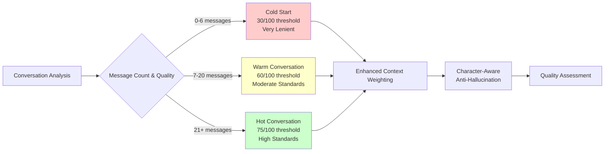
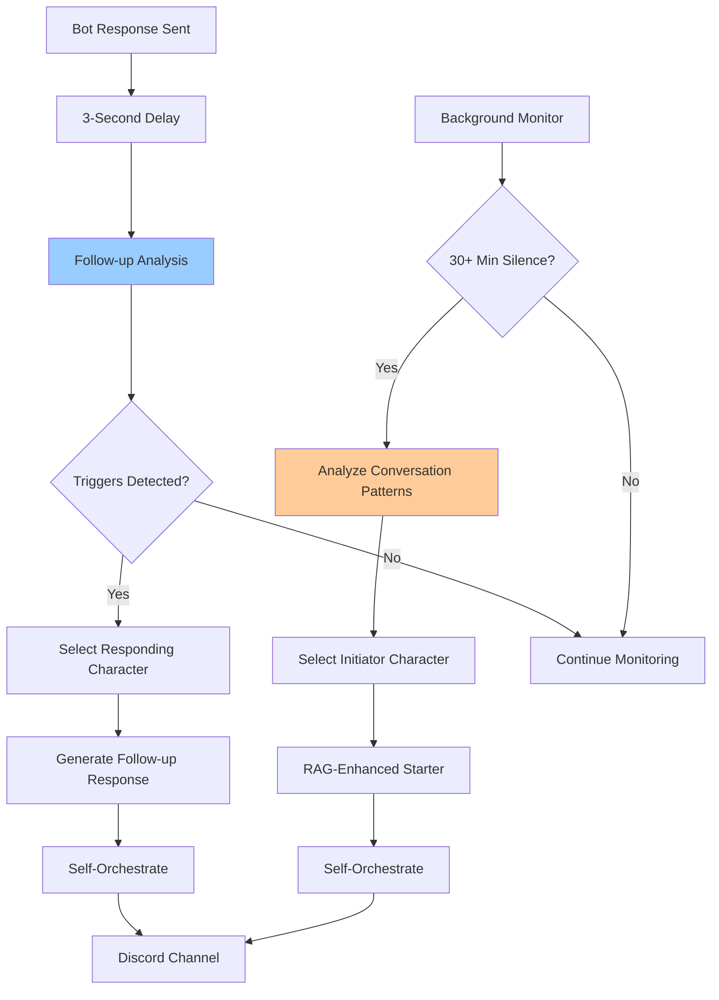
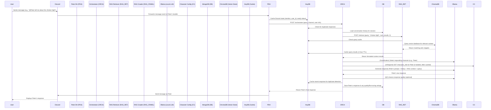
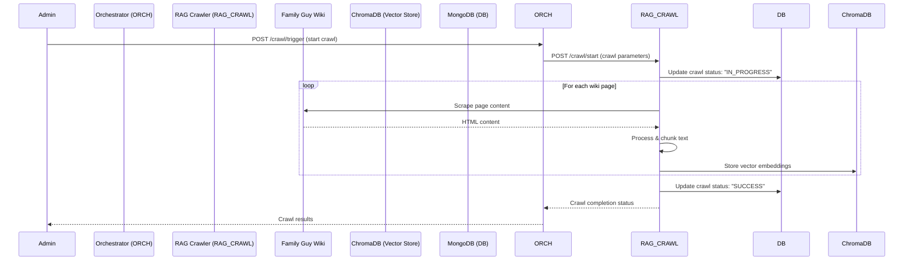
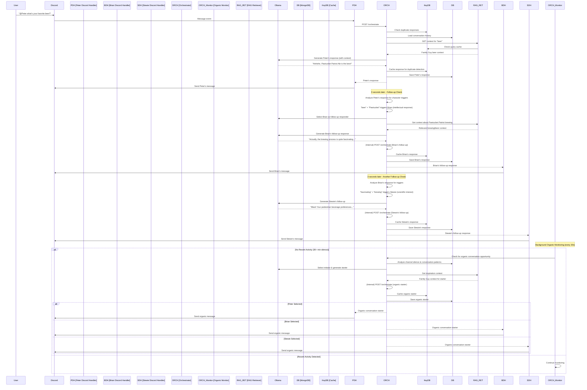

# Discord Family Guy Bot - Advanced Local LLM Edition 🎭

**A sophisticated, production-ready Discord bot system starring Peter, Brian, and Stewie Griffin from Family Guy. This version runs entirely locally using Ollama and the `mistral-nemo` model, featuring a microservices architecture managed by Docker, advanced RAG with separated microservices, self-improving fine-tuning, and organic conversation capabilities.**

**NO EXTERNAL API KEYS OR COSTS REQUIRED!**

[](https://opensource.org/licenses/MIT)

## 🌟 Key Features - Beyond Basic Chat

This isn't just another Discord bot. It's a comprehensive system built for authentic character interactions and continuous improvement:

*   🧠 **Fully Local LLM Processing**: Powered by `mistral-nemo` via Ollama for complete privacy and zero API costs.
*   🐳 **Dockerized Microservices**: Easy deployment and management with Docker Compose.
*   ⚡ **KeyDB Caching Integration**: High-performance caching with KeyDB for response deduplication, Discord state management, and RAG query caching - includes web UI monitoring.
*   📚 **Advanced RAG Microservices**: Separated RAG Retriever (real-time context) and RAG Crawler (web scraping) services for optimal performance and scaling.
*   🔧 **Supervised Fine-Tuning System**: Continuously improves character responses based on automated and (optionally) user-provided feedback.
*   📊 **Adaptive Quality Control System**: Revolutionary system that adjusts quality standards based on conversation richness (30-75/100 thresholds) and provides character-aware anti-hallucination measures.
*   🚫 **NO_FALLBACK_MODE**: Advanced infinite retry system that eliminates generic fallback responses, continuously retrying until high-quality, contextual responses are generated.
*   🌱 **Enhanced Organic Conversation Coordinator**: Bots can intelligently initiate conversations and automatically create follow-up responses for natural multi-character interactions.
*   🎭 **Authentic Character Personalities**: Deeply detailed prompts ensure Peter, Brian, and Stewie behave and speak like their show counterparts.
*   📝 **Persistent Conversation History**: Stored in MongoDB, allowing for long-term memory and context.
*   🛡️ **Robust Error Management**: Includes a Dead Letter Queue for resilient message handling.

## 🏗️ System Architecture

The Discord Family Guy Bot system is built as a **microservices architecture** optimized for local RTX 4070 Super performance with **KeyDB caching integration**:



### 🎯 **Service Breakdown**

| Service | Port | Purpose | Technology Stack |
|---------|------|---------|------------------|
| **Peter Discord Handler** | 5011 | Peter's Discord API integration | Python, discord.py, Flask, KeyDB |
| **Brian Discord Handler** | 5012 | Brian's Discord API integration | Python, discord.py, Flask, KeyDB |
| **Stewie Discord Handler** | 5013 | Stewie's Discord API integration | Python, discord.py, Flask, KeyDB |
| **Orchestrator** | 5003 | LLM coordination & conversation flow | Python, Flask, LangChain, Ollama, KeyDB |
| **RAG Retriever** | 5005 | Real-time context retrieval | Python, Flask, ChromaDB, SentenceTransformers, KeyDB |
| **RAG Crawler** | 5009 | Web scraping & vector population | Python, Flask, BeautifulSoup, ChromaDB |
| **Peter Bot** | 5006 | Character configuration | Python, Flask (lightweight) |
| **Brian Bot** | 5007 | Character configuration | Python, Flask (lightweight) |
| **Stewie Bot** | 5008 | Character configuration | Python, Flask (lightweight) |
| **KeyDB Cache** | 6379 | High-performance caching | KeyDB (Redis-compatible) |
| **KeyDB Commander** | 8081 | Cache monitoring web UI | Redis Commander |
| **MongoDB** | 27017 | Conversation & system data | MongoDB |

### 🔄 **RAG Microservices Architecture**

The RAG system is architected as **two specialized microservices** for optimal performance and operational efficiency:

#### 🔍 **RAG Retriever Service** (Port 5005)
- **Purpose**: High-frequency, real-time context retrieval for user queries
- **Operational Pattern**: Responds to 100s of requests per day with <100ms latency
- **Resource Profile**: Low CPU, moderate memory, optimized for fast vector search
- **Scaling**: Horizontal scaling for high query loads
- **Dependencies**: Minimal (ChromaDB, embeddings model)

#### 🕷️ **RAG Crawler Service** (Port 5009)
- **Purpose**: Low-frequency, batch web scraping and vector database population
- **Operational Pattern**: Runs weekly/monthly crawls, processes large amounts of data
- **Auto-Crawl**: Automatically triggers crawls if no crawl has occurred in the configured interval (default: 30 days)
- **Resource Profile**: High CPU/memory during crawls, idle between operations
- **Scaling**: Vertical scaling for processing power, can run on-demand
- **Dependencies**: BeautifulSoup, requests, ML processing libraries

**Benefits of Separation**:
- **Independent Scaling**: Scale services based on different workload patterns
- **Resource Optimization**: Right-size resources for each service type
- **Fault Isolation**: Crawler issues don't affect real-time retrieval
- **Deployment Flexibility**: Deploy and manage services independently
- **Operational Clarity**: Clear separation of concerns between real-time and batch operations

## 🚀 Quick Start & Deployment

### **Prerequisites:**

1.  **Docker & Docker Compose**: Latest versions installed.
2.  **Ollama Installed and Running**: With the `mistral-nemo` model.
    *   Install Ollama: [https://ollama.ai](https://ollama.ai)
    *   Pull the model: `ollama pull mistral-nemo`
    *   Ensure Ollama is serving: `ollama serve` (often runs automatically).
3.  **Discord Bot Tokens**: You'll need three separate Discord bot applications and their tokens (one for Peter, one for Brian, one for Stewie).
4.  **Git**: For cloning the repository.

### **🎯 One-Command Setup:**

The entire system can be set up and deployed with a single unified setup script:

1.  **Clone the repository:**
   ```bash
   git clone <this-repository-url>
   cd discord-pg-bot
   ```

2.  **Run the unified setup script:**
   ```bash
   python setup.py
   ```

   The setup script will:
   - ✅ Check all prerequisites (Docker, Ollama, mistral-nemo model)
   - 📝 Guide you through creating the `.env` file with your Discord bot tokens
   - 🐳 Build and start all Docker services in the correct order
   - 🏥 Perform health checks on all services
   - 🧪 Test Ollama integration with character responses
   - 🕷️ Trigger initial RAG crawl to populate the knowledge base
   - 📋 Show logs and next steps

### **🔧 Additional Setup Commands:**

The setup script also provides individual commands for specific tasks:

```bash
python setup.py health   # Check service health
python setup.py logs     # Show recent logs
python setup.py test     # Test Ollama integration
python setup.py crawl    # Trigger RAG crawl
python setup.py help     # Show all available commands
```

### **Key Environment Variables (automatically configured):**

The setup script will prompt you for the essential configuration:

*   `DISCORD_BOT_TOKEN_PETER`, `_BRIAN`, `_STEWIE`: Your bot tokens
*   `DEFAULT_DISCORD_CHANNEL_ID`: For organic conversation initiation
*   `PETER_BOT_MENTION_STRING`, `BRIAN_BOT_MENTION_STRING`, `STEWIE_BOT_MENTION_STRING`: Bot mentions (can be updated later)

Advanced settings are automatically configured with sensible defaults:
*   `OLLAMA_BASE_URL`: `http://host.docker.internal:11434`
*   `OLLAMA_MODEL`: `mistral-nemo`
*   `RAG_RETRIEVER_API_URL`: `http://rag-retriever:5005/retrieve`
*   `RAG_CRAWLER_API_URL`: `http://rag-crawler:5009`
*   Fine-tuning and quality control settings
*   Enhanced organic conversation parameters:
    *   `ENABLE_FOLLOW_UP_CONVERSATIONS`: `true` (enable follow-up system)
    *   `FOLLOW_UP_DELAY_SECONDS`: `3.0` (delay before follow-up check)
    *   `MIN_TIME_BETWEEN_FOLLOW_UPS`: `30.0` (minimum seconds between follow-ups)
    *   `CONVERSATION_SILENCE_THRESHOLD_MINUTES`: `30` (silence before organic conversations)
    *   `MIN_TIME_BETWEEN_ORGANIC_CONVERSATIONS`: `10` (minimum minutes between organic attempts)

### **🎭 After Setup:**

Once setup is complete:

1. **Invite your bots to Discord** using the OAuth2 URLs from Discord Developer Portal
2. **Update mention strings** in `.env` file with the actual bot mentions (format: `<@123456789>`)
3. **Restart services** if you updated the .env file:
   ```bash
   cd docker
   docker-compose restart
   ```
4. **Test the bots** by mentioning them in your Discord channel:
   - `@Peter what's up?`
   - `@Brian tell me something intellectual`
   - `@Stewie what are you plotting?`

## 🎯 Advanced Features Deep Dive

### 🚫 NO_FALLBACK_MODE: Infinite Retry System

**Revolutionary approach to response quality**: Instead of using generic fallback messages when response generation fails, the system continuously retries until a valid, high-quality response is generated.



**Key Benefits**:
- **No Generic Responses**: Eliminates fallbacks like "Hehehe, my brain just went blank"
- **Higher Quality**: Only authentic, contextual responses are sent
- **Intelligent Learning**: System learns from failures and improves on retries
- **Character Consistency**: Maintains authenticity throughout retry process

**Configuration**:
```bash
NO_FALLBACK_MODE=True
MAX_RETRY_ATTEMPTS=10
RETRY_BACKOFF_ENABLED=True
RETRY_BACKOFF_MULTIPLIER=1.5
```

### 📊 Adaptive Quality Control System

**Dynamic quality standards** that adjust based on conversation richness, ensuring appropriate expectations for different conversation stages.



**Progressive Adaptation**:
- **Context Balance**: From RAG-heavy (40%) to conversation-focused (15% RAG)
- **Response Length**: Adaptive limits based on conversation richness
- **Anti-Hallucination**: Character-specific controls (Peter: strict, Brian: moderate, Stewie: lenient)

### 🌱 Enhanced Organic Conversation Coordination

**Dual-system approach** for natural multi-character interactions and proactive conversation initiation.



**Character-Specific Triggers**:
- **Peter**: Simple/crude topics → Brian responds intellectually, Stewie condescendingly
- **Brian**: Intellectual content → Peter responds simply, Stewie competitively
- **Stewie**: Evil plans/science → Others express concern/interest

## ✨ Advanced System Features Explained

### 📚 Retrieval Augmented Generation (RAG) - Microservices Architecture

*   **Purpose**: Allows bots to access and incorporate information from an external knowledge base (Family Guy Fandom Wiki) into their responses.
*   **Architecture**: Implemented as **two specialized microservices** for optimal performance:

#### 🔍 **RAG Retriever Service** (Port 5005)
*   **Function**: Provides fast, real-time context retrieval for user queries
*   **API**: `/retrieve` endpoint accepts queries and returns relevant context
*   **Performance**: Optimized for <100ms response times
*   **Scaling**: Can be horizontally scaled for high query loads
*   **Dependencies**: ChromaDB, embeddings model (sentence-transformers)

#### 🕷️ **RAG Crawler Service** (Port 5009)
*   **Function**: Handles web scraping and vector database population
*   **API**: `/crawl/start`, `/crawl/status`, `/crawl/stop` endpoints for crawl management
*   **Operation**: Runs batch operations to scrape and process Family Guy wiki content
*   **Scheduling**: Can run on-demand or scheduled (weekly/monthly)
*   **Dependencies**: BeautifulSoup, requests, ML processing libraries

*   **How it Works**: 
    1. When a user asks a question, the Orchestrator sends a request to the RAG Retriever Service
    2. RAG Retriever queries ChromaDB vector database for relevant content
    3. Relevant snippets are returned to the Orchestrator as context for the LLM
    4. Separately, RAG Crawler periodically updates the vector database with fresh content

*   **Benefits**: 
    *   **Separation of Concerns**: Real-time retrieval isolated from batch processing
    *   **Independent Scaling**: Scale services based on different workload patterns
    *   **Resource Optimization**: Right-size resources for each service type
    *   **Fault Isolation**: Crawler issues don't affect real-time retrieval
    *   **Operational Flexibility**: Deploy and manage services independently

*   **Management**: 
    *   **Retrieval**: Automatic via Orchestrator during conversations
    *   **Crawling**: Triggered via `/crawl/trigger` endpoint on Orchestrator
    *   **Monitoring**: Health checks and status endpoints on both services

### 🔧 Supervised Fine-Tuning & Adaptive Quality Control

*   **Purpose**: To continuously improve the quality and authenticity of character responses over time with intelligent adaptation based on conversation context.
*   **Fine-Tuning**: The system logs responses and (optionally) user-provided or LLM-generated quality ratings to MongoDB. This data can be used to further fine-tune the base `mistral-nemo` model or adjust prompts.
*   **Adaptive Quality Control**: Revolutionary system that adjusts quality standards based on conversation richness:
    *   **Cold Start** (0-6 messages): 30/100 threshold - extremely lenient for first interactions
    *   **Warm Conversation** (7-20 messages): 60/100 threshold - moderate expectations with developing context
    *   **Hot Conversation** (21+ messages): 75/100 threshold - high standards with rich conversation history
*   **Enhanced Retry Context**: When responses are rejected, the system includes the rejected response and specific failure reasons in retry attempts, enabling faster learning and more targeted improvements
*   **Character-Aware Anti-Hallucination**: Different characters get personalized anti-hallucination settings:
    *   **Peter Griffin**: Stricter length controls (0.7x), higher risk assessment (1.2x), stricter validation (1.3x) - prevents rambling
    *   **Brian Griffin**: Conversational length (1.0x), lower risk (0.8x), lenient strictness (0.9x) - enables natural sarcasm and self-deprecation
    *   **Stewie Griffin**: Concise length (0.8x), lowest risk (0.6x), most lenient strictness (0.7x) - allows witty, cutting remarks
*   **Retry-Based Length Validation**: Responses exceeding adaptive limits trigger regeneration instead of truncation, preserving quality
*   **Character-Specific Conversation Guidance**: Dynamic prompts that adapt to conversation state and character personality
*   **A/B Testing**: Allows for testing different prompt versions for a percentage of traffic.

### 🌱 Enhanced Organic Conversation Coordination

*   **Purpose**: Enables the bots to initiate conversations naturally and create dynamic multi-character interactions through intelligent follow-up responses.
*   **How it Works**: The Orchestrator includes two complementary systems:
    *   **Follow-up Conversations**: Analyzes bot responses for content that would naturally trigger other characters to respond (e.g., Peter mentioning chicken fighting triggers Brian or Stewie). Responds within 3 seconds for natural flow.
    *   **Organic Conversations**: Monitors conversation flow and silence periods to start new topics when appropriate.
*   **Intelligence**: Uses character-specific trigger analysis, LLM-based selection for who should speak next, considering recent activity, topic relevance, character personality, and relationship dynamics.
*   **Configuration**:
    *   `ENABLE_FOLLOW_UP_CONVERSATIONS`: Enable/disable follow-up system (default: true)
    *   `FOLLOW_UP_DELAY_SECONDS`: Delay before checking for follow-ups (default: 3.0s)
    *   `MIN_TIME_BETWEEN_FOLLOW_UPS`: Minimum time between follow-up attempts (default: 30.0s)

## 🎭 Character Personalities

Character prompts are extensively detailed to ensure authentic portrayal by `mistral-nemo`.

*   **Peter Griffin**: Lovable oaf, impulsive, simple vocabulary, signature laughs and catchphrases (e.g., "Holy crap!", "Hehehehe"). Short responses.
*   **Brian Griffin**: Pretentious intellectual, aspiring writer, verbose, complex vocabulary, prone to existential sighs and correcting others (e.g., "Well, actually...").
*   **Stewie Griffin**: Megalomaniacal baby genius, sophisticated British accent, plans for world domination, advanced scientific knowledge (e.g., "Victory is mine!", "What the deuce?!").

*(See specific character configuration files in `src/app/bots/` for full prompt details if exploring the code.)*

## 🛠️ Development & Customization

*   **Code Structure**: The main application code is within the `src/` directory.
    *   `src/app/bots/`: Character-specific Flask apps (config only).
    *   `src/app/discord_handler/`: Individual Discord handlers for each character (Peter, Brian, Stewie).
    *   `src/app/orchestrator/`: Core LLM logic, RAG coordination, fine-tuning, etc.
    *   `src/app/rag_retriever/`: RAG Retriever microservice for real-time context retrieval.
    *   `src/app/rag_crawler/`: RAG Crawler microservice for web scraping and vector population.
    *   `src/app/utils/`: Shared utilities including KeyDB cache integration.
*   **Adding New Characters**: Would involve creating a new character config service, adding prompts to the Orchestrator, and updating Docker configurations.
*   **Modifying Prompts**: Edit the `CHARACTER_PROMPTS` in `src/app/orchestrator/server.py`.

### 🔧 Service-Specific Dependencies

The system uses **optimized, service-specific requirements files** instead of a monolithic `requirements.txt`. This approach:

- **Reduces Docker image sizes** by 14-62% per service
- **Improves build times** through better layer caching
- **Enhances security** by minimizing attack surface
- **Simplifies maintenance** with clear dependency boundaries

**Requirements Files:**
- `requirements-orchestrator.txt` - LLM coordination, MongoDB, HTTP requests
- `requirements-rag-retriever.txt` - Vector operations, embeddings, ML models
- `requirements-discord-handler.txt` - Discord API, async HTTP handling
- `requirements-bot-config.txt` - Minimal Flask services for character configs
- `requirements-rag-crawler.txt` - Web scraping, content processing
- `requirements-testing.txt` - Testing framework and mocks

See `docs/REQUIREMENTS_OPTIMIZATION.md` for detailed information about the dependency optimization strategy.

## ⚙️ Management & Monitoring

(Refer to `docker/README.md` for detailed commands)

*   **Logs**: `docker-compose logs -f` (all services) or `docker-compose logs -f orchestrator`.
*   **Health Checks**: Each service has a `/health` endpoint with cache status:
    *   Orchestrator: `http://localhost:5003/health`
    *   RAG Retriever: `http://localhost:5005/health`
    *   RAG Crawler: `http://localhost:5009/health`
    *   Peter Discord Handler: `http://localhost:5011/health`
    *   Brian Discord Handler: `http://localhost:5012/health`
    *   Stewie Discord Handler: `http://localhost:5013/health`
    *   Character services: `http://localhost:5006-5008/health`
*   **KeyDB Cache Monitoring**:
    *   **Web UI**: `http://localhost:8081` - KeyDB Commander for browsing cache keys and monitoring performance
    *   **CLI**: `docker-compose exec keydb keydb-cli` - Direct KeyDB command line access
    *   **Cache Keys**: 
        *   `bot:responses:recent:*` - Recent responses for duplicate detection
        *   `bot:rag:query:*` - Cached RAG query results
        *   `bot:discord:state:*` - Discord bot states (mentions, IDs, ready status)
*   **Performance Benefits**:
    *   **RAG Queries**: 10x faster when cached (500ms → 50ms)
    *   **Response Deduplication**: Persistent across service restarts
    *   **Discord State**: Survives container restarts, enables horizontal scaling
*   **Fine-Tuning & Adaptive Quality Control API Endpoints** (on Orchestrator, port 5003):
    *   `/rate_response` (POST): Submit ratings for responses.
    *   `/optimization_report` (GET): View performance reports.
    *   `/fine_tuning_stats` (GET): Overall system stats.
    *   `/quality_control_status` (GET): Adaptive QC configuration, thresholds, and character-aware settings.
*   **RAG Management**:
    *   `/crawl/trigger` (POST) on Orchestrator: Trigger new wiki crawl via RAG Crawler service
    *   `/crawl/status` (GET) on Orchestrator: Get crawl status from RAG Crawler service
    *   Direct RAG service endpoints:
        *   RAG Retriever: `/retrieve` (POST), `/health` (GET)
        *   RAG Crawler: `/crawl/start` (POST), `/crawl/status` (GET), `/crawl/stop` (POST), `/vector_store/info` (GET), `/auto_crawl/status` (GET), `/health` (GET)
*   **Enhanced Organic Conversation Coordination**:
    *   `/organic_conversation_status` (GET): Current configuration, statistics, and coordinator state

## 🤝 Contributing

Contributions are welcome! Please feel free to fork the repository, make changes, and submit a pull request. For major changes, please open an issue first to discuss what you would like to change.

## 📜 License

This project is licensed under the MIT License - see the [LICENSE](LICENSE) file for details (assuming a LICENSE file will be added or exists).

## ⚙️ System Interactions & Data Flow

This section details the primary operational flows within the system.

### 📊 Complete Workflow: User Message to Bot Response

This is the typical flow when a user sends a message to one of the bots:



**Key Steps:**

1.  **User to Discord Handler**: User message is relayed by Discord to the `Discord Handler`.
2.  **Handler to Orchestrator**: `Discord Handler` forwards the processed request to `Orchestrator`'s `/orchestrate` endpoint.
3.  **Orchestrator - Context Gathering**:
    *   Retrieves conversation history from `MongoDB`.
    *   Queries `RAG Retriever Service` which searches `ChromaDB` for context relevant to the user's query.
4.  **Orchestrator - Response Generation**:
    *   Intelligently selects the character to respond.
    *   Constructs a detailed prompt (base character prompt + history + RAG context + user query).
    *   Sends the prompt to the local `Ollama (mistral-nemo)` instance.
5.  **Orchestrator - Post-processing & Storage**:
    *   Receives the generated text from `Ollama`.
    *   (Optional) Performs Quality Control using an LLM assessment.
    *   Saves the response, conversation turn, and any quality/fine-tuning ratings to `MongoDB`.
6.  **Orchestrator to Handler & Discord**: The final response is sent back through the `Discord Handler` to the user on Discord.

### 🕷️ RAG Crawler Operation Flow

How the vector database gets populated and updated:



### 🌱 Enhanced Conversation Flow: Follow-up & Organic Conversations

How bots create dynamic multi-character interactions:



**Key Features:**

1.  **Follow-up Conversations** (New):
    *   **Trigger Analysis**: After each bot response, analyzes content for character-specific triggers
    *   **Character Mapping**: Peter's simple topics → Brian responds intellectually; Brian's pretentiousness → Peter/Stewie react
    *   **Fast Response**: 3-second delay for natural conversation flow
    *   **Smart Selection**: Uses LLM to pick the most appropriate character to respond

2.  **Organic Conversations** (Enhanced):
    *   **Silence Detection**: Monitors for prolonged periods without activity
    *   **Context-Driven**: Uses RAG to inspire conversation topics
    *   **Character Selection**: Intelligent selection based on recent activity and personality

3.  **Self-Orchestration**: Both systems use internal calls to the `/orchestrate` endpoint, maintaining consistency with user-initiated conversations.

### 🎯 Fine-Tuning System Operation

How the system learns and improves:

1.  **Response Logging**: All bot responses, along with conversation context, are saved to `MongoDB`.
2.  **Automated Quality Assessment**: For each response, the `Orchestrator` can use `Ollama` to perform an automated quality assessment (rating 1-5, feedback on authenticity, style, etc.). This is also stored in `MongoDB`.
3.  **(Optional) User Feedback**: An API endpoint (`/rate_response`) allows external systems or users to submit manual ratings and feedback for specific responses, which are stored in `MongoDB`.
4.  **Performance Monitoring**: The `Orchestrator` tracks average ratings and other performance metrics for each character, derived from the `MongoDB` data.
5.  **Prompt Optimization Trigger**:
    *   **Automatic**: If a character's average rating drops below a defined `OPTIMIZATION_THRESHOLD`.
    *   **Manual**: Can be triggered via an API endpoint (`/trigger_optimization`).
6.  **Optimization Process**: The `Orchestrator` gathers recent high/low rated responses and their feedback from `MongoDB`. It then constructs a prompt for `Ollama` to suggest improvements to the character's base prompt.
7.  **New Prompt Versioning**: The optimized prompt is saved as a new version in `MongoDB`.
8.  **A/B Testing**: The system can be configured to use new/optimized prompt versions for a certain percentage (`AB_TEST_PERCENTAGE`) of traffic, allowing for comparison against the current default prompt.

### 💾 Data Flow and Storage

Where different types of data reside:

*   **MongoDB (`mongodb` service - persistent volume `mongodb_data`):**
    *   **Conversation History**: Full chat logs (user messages, bot responses, speaker, channel, session ID, timestamps).
    *   **Fine-Tuning Data**:
        *   Response ratings (automated and manual).
        *   Feedback text.
        *   Versioned character prompts (original and optimized).
    *   **Performance Metrics**: Aggregated statistics on response quality, character activity, etc.
    *   **RAG Crawl Status**: Timestamps and status of Family Guy Wiki crawls.
    *   **Dead Letter Queue (DLQ)**: Failed messages that couldn't be processed or sent, for retry attempts.

*   **KeyDB Cache (`keydb` service - persistent volume `keydb_data`):**
    *   **Response Deduplication**: Recent responses for each character to prevent repetitive answers.
    *   **RAG Query Cache**: Cached vector search results with 1-hour TTL for performance optimization.
    *   **Discord State Management**: Bot mention strings, user IDs, ready status, and timestamps.
    *   **Conversation Context**: Temporary conversation state and session data.
    *   **Performance**: 10x faster retrieval vs database queries, automatic TTL cleanup.

*   **ChromaDB (Vector Store for RAG - persistent volume `../chroma_db:/app/chroma_db` shared between RAG services):**
    *   Stores vector embeddings of text chunks from the Family Guy Fandom Wiki.
    *   Embeddings are generated by the `RAG Crawler Service` (using sentence-transformer models) during the wiki crawl process.
    *   Used by the `RAG Retriever Service` to find relevant wiki information for user queries.

*   **Ollama (Local LLM Service - running on host machine):**
    *   Stores the `mistral-nemo` model files themselves.
    *   Manages the LLM inference process. Data (prompts, generated text) flows to and from the `Orchestrator` via HTTP requests.

*   **Orchestrator (`orchestrator` service):**
    *   Holds base character prompts and system configurations in memory (loaded from Python files/env vars).
    *   May maintain short-term in-memory caches (e.g., for recent responses to avoid duplicates).
    *   Coordinates between RAG services via HTTP API calls.

*   **RAG Retriever Service (`rag-retriever` service):**
    *   Stateless for retrieval operations. Loads embeddings model and ChromaDB at startup.
    *   Provides fast context retrieval via `/retrieve` endpoint.

*   **RAG Crawler Service (`rag-crawler` service):**
    *   Manages web scraping operations and vector database population.
    *   Tracks crawl status and progress in MongoDB.
    *   Can run continuously or on-demand based on deployment configuration.

*   **Character Config Services (`peter`, `brian`, `stewie` services):**
    *   Stateless. Serve character metadata directly from their Python code. No persistent data storage.

*   **Discord Handler (`discord-handler` service):**
    *   Stateless regarding long-term data. Temporarily handles message data during routing.

---

**Enjoy your fully local, intelligent Family Guy bot experience with advanced RAG microservices architecture!**
