# Discord Family Guy Bot - Enterprise Microservices Edition 🎭

**A production-ready, fully local Discord bot ecosystem featuring Peter, Brian, and Stewie Griffin with advanced AI capabilities, microservices architecture, and organic conversation systems. Built for scale, privacy, and authentic character interactions.**

**🔒 COMPLETELY LOCAL - NO API KEYS, NO COSTS, NO DATA SHARING**

[](https://opensource.org/licenses/MIT)
[](https://www.docker.com/)
[](https://ollama.ai/)

## 🌟 What Makes This Special

This isn't just another Discord bot - it's a **complete AI conversation ecosystem** that brings Family Guy characters to life with unprecedented authenticity and intelligence:

### 🏗️ **Enterprise-Grade Architecture**
- **12 Specialized Microservices** working in harmony
- **Kubernetes-ready** Docker architecture with health checks
- **Independent scaling** for different workload patterns
- **Production monitoring** with comprehensive logging

### 🧠 **Advanced AI Features** 
- **Dynamic LLM conversation starters** generated with character context
- **RAG-enhanced responses** using Family Guy knowledge base
- **Adaptive quality control** (30-75/100 thresholds based on conversation depth)
- **Organic conversation orchestration** for natural multi-character interactions
- **Character-aware anti-hallucination** with personality-specific controls

### 🎭 **Authentic Character AI**
- **Peter Griffin**: Lovable oaf with beer references and "Holy crap!" energy
- **Brian Griffin**: Intellectual dog with philosophical tendencies and literary references  
- **Stewie Griffin**: Evil genius baby with sophisticated vocabulary and world domination plans

### 💬 **Revolutionary Conversation System**
- **Follow-up responses** triggered by character-specific content analysis
- **Background conversation monitoring** for organic topic initiation
- **Cross-character dynamics** that mirror the TV show relationships
- **Context-aware timing** for natural conversation flow

---

## 🏭 System Architecture

The system is built as **12 specialized microservices** orchestrated through Docker Compose:

```mermaid
graph TB
    subgraph "Discord Interface Layer"
        PETER_BOT[Peter Discord<br/>Port 6011<br/>🍺]
        BRIAN_BOT[Brian Discord<br/>Port 6012<br/>🐕]
        STEWIE_BOT[Stewie Discord<br/>Port 6013<br/>👶]
    end
    
    subgraph "Core Processing Layer"
        MESSAGE_ROUTER[Message Router<br/>Port 6005<br/>🎯]
        LLM_SERVICE[LLM Service<br/>Port 6001<br/>🧠]
        QUALITY_CONTROL[Quality Control<br/>Port 6003<br/>🔍]
    end
    
    subgraph "Intelligence Layer"
        CONVERSATION_COORD[Conversation Coordinator<br/>Port 6002<br/>🎭]
        ORCHESTRATOR[Orchestrator<br/>Port 6008<br/>🌱]
        FINE_TUNING[Fine Tuning<br/>Port 6004<br/>📈]
    end
    
    subgraph "Knowledge Layer"
        CHARACTER_CONFIG[Character Config<br/>Port 6006<br/>📝]
        RAG_RETRIEVER[RAG Retriever<br/>Port 6007<br/>📚]
        RAG_CRAWLER[RAG Crawler<br/>Port 6009<br/>🕷️]
    end
    
    subgraph "Infrastructure Layer"
        KEYDB[(KeyDB Cache<br/>Port 6379<br/>⚡)]
        KEYDB_UI[KeyDB Commander<br/>Port 8081<br/>🖥️]
        OLLAMA[Ollama LLM<br/>Local RTX GPU<br/>🚀]
        CHROMADB[(ChromaDB<br/>Vector Store<br/>🔢)]
    end
    
    PETER_BOT --> MESSAGE_ROUTER
    BRIAN_BOT --> MESSAGE_ROUTER
    STEWIE_BOT --> MESSAGE_ROUTER
    
    MESSAGE_ROUTER --> LLM_SERVICE
    MESSAGE_ROUTER --> CHARACTER_CONFIG
    MESSAGE_ROUTER --> RAG_RETRIEVER
    MESSAGE_ROUTER --> CONVERSATION_COORD
    MESSAGE_ROUTER --> QUALITY_CONTROL
    MESSAGE_ROUTER --> FINE_TUNING
    
    ORCHESTRATOR --> MESSAGE_ROUTER
    ORCHESTRATOR --> LLM_SERVICE
    ORCHESTRATOR --> RAG_RETRIEVER
    ORCHESTRATOR --> PETER_BOT
    ORCHESTRATOR --> BRIAN_BOT
    ORCHESTRATOR --> STEWIE_BOT
    
    LLM_SERVICE --> OLLAMA
    RAG_RETRIEVER --> CHROMADB
    RAG_CRAWLER --> CHROMADB
    
    MESSAGE_ROUTER --> KEYDB
    ORCHESTRATOR --> KEYDB
    RAG_RETRIEVER --> KEYDB
    KEYDB --> KEYDB_UI
    
    style PETER_BOT fill:#ff9999
    style BRIAN_BOT fill:#99ff99  
    style STEWIE_BOT fill:#9999ff
    style ORCHESTRATOR fill:#ffff99
    style KEYDB fill:#ff99ff
```



### 🎯 **Microservices Breakdown**

| Service | Port | Purpose | Technology Stack |
|---------|------|---------|------------------|
| **🎭 Discord Handlers** | | | |
| Peter Discord | 6011 | Peter's Discord API integration | Python, discord.py, Flask, asyncio |
| Brian Discord | 6012 | Brian's Discord API integration | Python, discord.py, Flask, asyncio |
| Stewie Discord | 6013 | Stewie's Discord API integration | Python, discord.py, Flask, asyncio |
| **🧠 Core AI Services** | | | |
| LLM Service | 6001 | Ollama integration & response generation | Python, Flask, Ollama client, KeyDB cache |
| Message Router | 6005 | Central orchestration & routing | Python, Flask, Requests |
| Quality Control | 6003 | Adaptive response quality assessment | Python, Flask, ML analysis |
| **🎮 Intelligence Services** | | | |
| Conversation Coordinator | 6002 | Character selection logic | Python, Flask, KeyDB |
| Fine Tuning | 6004 | Response optimization & A/B testing | Python, Flask, KeyDB |
| Orchestrator | 6008 | **Organic conversation management** | Python, Flask, KeyDB, ML |
| **📚 Knowledge Services** | | | |
| Character Config | 6006 | Character prompt management | Python, Flask |
| RAG Retriever | 6007 | Real-time context retrieval | Python, Flask, ChromaDB, SentenceTransformers |
| RAG Crawler | 6009 | Web scraping & knowledge indexing | Python, Flask, BeautifulSoup, ChromaDB |
| **⚡ Infrastructure** | | | |
| KeyDB Cache | 6379 | High-performance caching | KeyDB (Redis-compatible) |
| KeyDB Commander | 8081 | Cache monitoring web UI | Redis Commander |
| ChromaDB | - | Vector database for RAG | ChromaDB (embedded) |
| Ollama | 11434 | Local LLM inference | Mistral-Nemo model |

---

## 🚀 Quick Start Guide

### **Prerequisites**

1. **Docker Desktop** with 16GB+ RAM allocated
2. **Ollama** installed with `mistral-nemo` model
3. **Three Discord Bot Tokens** (one for each character)
4. **GPU Support** (optional but recommended for better performance)

### **⚡ Lightning Setup (5 minutes)**

```bash
# 1. Clone the repository
git clone <repository-url>
cd discord-pg-bot

# 2. Install Ollama and model
curl -fsSL https://ollama.ai/install.sh | sh
ollama pull mistral-nemo

# 3. Create environment file
cp config/discord-tokens.env.example .env
# Edit .env with your Discord bot tokens

# 4. Start the entire ecosystem
docker-compose up --build -d

# 5. Check all services are healthy
docker-compose ps
curl http://localhost:6008/health  # Orchestrator health
```

### **🔧 Environment Configuration**

Create a `.env` file with these essential variables:

```bash
# === Discord Bot Tokens (Required) ===
DISCORD_BOT_TOKEN_PETER=your_peter_bot_token_here
DISCORD_BOT_TOKEN_BRIAN=your_brian_bot_token_here  
DISCORD_BOT_TOKEN_STEWIE=your_stewie_bot_token_here

# === Organic Conversations ===
DEFAULT_DISCORD_CHANNEL_ID=your_channel_id_for_organic_conversations

# === LLM Configuration ===
OLLAMA_BASE_URL=http://host.docker.internal:11434
OLLAMA_MODEL=mistral-nemo

# === Caching Configuration ===
REDIS_URL=redis://keydb:6379
LLM_RESPONSE_CACHE_TTL=3600
CHARACTER_CONFIG_CACHE_TTL=86400

# === Advanced Settings (Optional) ===
MIN_TIME_BETWEEN_ORGANIC_CONVERSATIONS=5  # minutes
CONVERSATION_SILENCE_THRESHOLD_MINUTES=15 # minutes  
ORGANIC_CONVERSATION_PROBABILITY=0.4      # 40% chance when conditions met
```

---

## ✨ Revolutionary Features

### 🌱 **Organic Conversation Orchestrator** (NEW!)

The **Orchestrator** service enables truly organic conversations between characters, creating dynamic interactions that feel natural and unscripted:

#### **🎭 Character Personality System**
```python
Character Traits:
• Peter:   50% initiation, topics: food/TV/work/beer/sports/family
• Brian:   30% initiation, topics: politics/literature/philosophy/culture  
• Stewie:  40% initiation, topics: science/plans/technology/intelligence
```

#### **🧠 Dynamic Conversation Starters**
- **LLM-Generated**: Each starter is created dynamically using character personality
- **RAG-Enhanced**: Incorporates relevant Family Guy knowledge for context
- **Character-Authentic**: Prompts ensure Peter says "Holy crap!" and Stewie is condescending

#### **⚡ Intelligent Triggering**
- **Silence Detection**: Monitors 15+ minutes without conversation
- **Timing Controls**: Minimum 5 minutes between organic conversations
- **Probability-Based**: 40% chance when conditions are met (configurable)

#### **🔄 Follow-up System**
After any bot response, the system:
1. **Analyzes content** for character-specific triggers
2. **Selects responding character** based on personality and topic
3. **Generates follow-up** within 2-8 seconds for natural flow
4. **Creates conversation chains** that can last several rounds

**Example Flow:**
```
Peter: "Holy crap! I just discovered this amazing beer!"
→ 3 seconds later
Brian: "Actually, the brewing process is quite fascinating from a cultural perspective..."
→ 5 seconds later  
Stewie: "Good Lord, your pedestrian beverage preferences are astounding..."
```

### 📊 **Adaptive Quality Control**

Revolutionary quality system that **adapts standards based on conversation depth**:

| Conversation Stage | Messages | Quality Threshold | Reasoning |
|-------------------|----------|------------------|-----------|
| **Cold Start** | 0-6 | 30/100 | Very lenient for first interactions |
| **Warm** | 7-20 | 60/100 | Moderate expectations with developing context |
| **Hot** | 21+ | 75/100 | High standards with rich conversation history |

**Character-Specific Controls:**
- **Peter**: Stricter length control (prevents rambling), higher risk detection
- **Brian**: Extended responses allowed, standard risk assessment  
- **Stewie**: Sophisticated vocabulary expected, lower risk tolerance

### 🚫 **NO_FALLBACK_MODE**

Eliminates generic responses through **infinite intelligent retry**:
- **No Generic Messages**: Never sends "I don't know" or "Error occurred"
- **Learning Retries**: Each retry includes information about previous failures
- **Quality Guarantees**: Only sends responses that pass quality thresholds
- **Character Consistency**: Maintains authenticity throughout retry process

### 📚 **Advanced RAG System**

**Dual-microservice architecture** optimized for different workload patterns:

#### **🔍 RAG Retriever** (Real-time)
- **<100ms response times** for user queries
- **Cached results** with 1-hour TTL via KeyDB
- **Horizontal scaling** for high query loads
- **Family Guy knowledge** from comprehensive wiki crawl

#### **🕷️ RAG Crawler** (Batch processing)  
- **Automated crawling** with configurable intervals
- **Vector database population** with ChromaDB
- **Content processing** and text chunking
- **Knowledge base maintenance** and updates

---

## 🎭 Character AI Personalities

Each character has been meticulously crafted with **authentic personality traits**, **speaking patterns**, and **interaction tendencies**:

### 🍺 **Peter Griffin** 
- **Personality**: Lovable oaf, impulsive, well-meaning but often clueless
- **Speaking Style**: Simple vocabulary, energetic, starts with "Holy crap!" or "Oh man!"
- **Topics**: Food, TV shows, work complaints, beer, sports, family situations
- **Response Pattern**: Short, enthusiastic, often references random experiences
- **Conversation Triggers**: Simple topics → intellectual Brian responses, concerned Stewie comments

### 🐕 **Brian Griffin**
- **Personality**: Intellectual, sophisticated, slightly pretentious talking dog
- **Speaking Style**: Articulate, thoughtful, references literature and politics
- **Topics**: Philosophy, culture, writing, political commentary, existential thoughts  
- **Response Pattern**: Longer responses, philosophical tangents, subtle corrections
- **Conversation Triggers**: Intellectual content → Peter simplification, Stewie competition

### 👶 **Stewie Griffin**
- **Personality**: Evil genius baby with world domination ambitions
- **Speaking Style**: Sophisticated vocabulary, condescending, British accent influence
- **Topics**: Science, technology, intelligence superiority, elaborate plans
- **Response Pattern**: Verbose, dismissive of others' intelligence, cutting remarks
- **Conversation Triggers**: Any topic → condescending superior commentary

---

## 🛠️ Development & Management

### **📊 Monitoring & Health Checks**

Every service includes comprehensive health monitoring:

```bash
# Check all services status
docker-compose ps

# Individual service health checks
curl http://localhost:6001/health  # LLM Service
curl http://localhost:6002/health  # Conversation Coordinator
curl http://localhost:6003/health  # Quality Control
curl http://localhost:6004/health  # Fine Tuning
curl http://localhost:6005/health  # Message Router  
curl http://localhost:6006/health  # Character Config
curl http://localhost:6007/health  # RAG Retriever
curl http://localhost:6008/health  # Orchestrator
curl http://localhost:6009/health  # RAG Crawler
curl http://localhost:6011/health  # Peter Discord
curl http://localhost:6012/health  # Brian Discord
curl http://localhost:6013/health  # Stewie Discord

# KeyDB Cache monitoring (Web UI)
open http://localhost:8081

# View service logs
docker-compose logs -f orchestrator
docker-compose logs -f message-router
```

### **🧪 Testing Endpoints**

The system provides extensive testing capabilities:

```bash
# Test dynamic conversation starter generation  
curl -X POST http://localhost:6008/test-starter \
  -H "Content-Type: application/json" \
  -d '{"character": "peter"}'

# Manually trigger organic conversation
curl -X POST http://localhost:6008/trigger-organic

# Test LLM service directly
curl -X POST http://localhost:6001/generate \
  -H "Content-Type: application/json" \
  -d '{"prompt": "Hello", "character_name": "Peter"}'

# Check quality control status
curl http://localhost:6003/config

# View conversation coordinator status  
curl http://localhost:6002/status

# Check RAG retriever health and status
curl http://localhost:6007/vector_store_status

# Trigger RAG crawler operation
curl -X POST http://localhost:6009/crawl/start
```

### **🔧 Configuration Management**

**Environment Variables:**
```bash
# Core LLM Settings
OLLAMA_BASE_URL=http://host.docker.internal:11434
OLLAMA_MODEL=mistral-nemo

# Caching Configuration (KeyDB)
REDIS_URL=redis://keydb:6379
LLM_RESPONSE_CACHE_TTL=3600                      # 1 hour LLM response cache
CHARACTER_CONFIG_CACHE_TTL=86400                 # 24 hours character config cache
RAG_QUERY_CACHE_TTL=3600                         # 1 hour RAG query cache

# Organic Conversation Controls
MIN_TIME_BETWEEN_ORGANIC_CONVERSATIONS=5         # minutes
CONVERSATION_SILENCE_THRESHOLD_MINUTES=15        # minutes
ORGANIC_CONVERSATION_PROBABILITY=0.4             # 40% trigger chance

# Quality Control Thresholds  
COLD_START_THRESHOLD=30.0                        # 30/100 for early conversation
WARM_CONVERSATION_THRESHOLD=60.0                 # 60/100 for developing conversation
HOT_CONVERSATION_THRESHOLD=75.0                  # 75/100 for rich conversation

# RAG System Configuration
CHROMA_DB_PATH=/app/chroma_db                    # ChromaDB persistent storage
EMBEDDINGS_MODEL_NAME=all-MiniLM-L6-v2          # SentenceTransformers model
```

### **🔧 Technology Stack**

**Core Technologies:**
- **Language**: Python 3.11+
- **LLM Framework**: LangChain 0.0.350
- **Local LLM**: Mistral-Nemo via Ollama
- **Vector Store**: ChromaDB 0.4.22
- **Cache**: KeyDB (Redis-compatible)
- **Web Framework**: Flask 2.0.1
- **Discord Integration**: discord.py 2.3.2

**AI & ML Stack:**
- **Embeddings**: SentenceTransformers 2.7.0
- **ML Libraries**: PyTorch 2.1.0, scikit-learn 1.3.0
- **NLP Processing**: Transformers 4.36.2
- **Web Scraping**: BeautifulSoup4 4.12.2

**Infrastructure:**
- **Containerization**: Docker & Docker Compose
- **Database**: MongoDB 4.6.1 (conversation history)
- **Production Server**: Gunicorn 20.1.0
- **Testing**: pytest 8.0.0 with asyncio support

### **📁 Project Structure**

```
discord-pg-bot/
├── src/services/                    # Microservices source code
│   ├── llm_service/                 # LLM integration & caching
│   ├── message_router/              # Central orchestration  
│   ├── quality_control/             # Adaptive quality assessment
│   ├── conversation_coordinator/    # Character selection logic
│   ├── orchestrator/               # 🌱 Organic conversation management
│   ├── fine_tuning/                # Response optimization
│   ├── character_config/           # Character prompt management
│   ├── rag_retriever/              # Real-time context retrieval
│   ├── rag_crawler/                # Knowledge base maintenance
│   ├── peter_discord/              # Peter's Discord integration
│   ├── brian_discord/              # Brian's Discord integration
│   └── stewie_discord/             # Stewie's Discord integration
├── docker/services/                # Dockerfiles for each service
├── requirements/                   # Service-specific dependencies
├── docs/                          # Comprehensive documentation
├── scripts/                       # Utility and testing scripts
├── data/                         # Persistent data volumes
└── docker-compose.yml            # Complete orchestration
```

---

## 🔄 System Workflows

### **👤 User Message Flow**

```mermaid
sequenceDiagram
    participant User
    participant Discord
    participant Peter_Bot
    participant Message_Router
    participant LLM_Service
    participant RAG_Retriever
    participant Quality_Control
    participant KeyDB
    participant Ollama

    User->>Discord: "@Peter what's your favorite beer?"
    Discord->>Peter_Bot: Message event
    Peter_Bot->>Message_Router: POST /orchestrate
    Message_Router->>KeyDB: Check for duplicate responses
    Message_Router->>RAG_Retriever: Get context for "beer"
    RAG_Retriever->>KeyDB: Check query cache
    RAG_Retriever-->>Message_Router: Family Guy beer context
    Message_Router->>LLM_Service: Generate Peter's response
    LLM_Service->>Ollama: Process with character prompt + context
    Ollama-->>LLM_Service: "Hehehe, Pawtucket Patriot Ale rocks!"
    LLM_Service-->>Message_Router: Generated response
    Message_Router->>Quality_Control: Assess response quality
    Quality_Control-->>Message_Router: Quality: 85/100 ✅
    Message_Router->>KeyDB: Cache response
    Message_Router-->>Peter_Bot: Final response
    Peter_Bot->>Discord: Send Peter's message
```


### **🌱 Organic Conversation Flow**


---

## 📚 Additional Documentation

For detailed information on specific aspects of the system:

- **[Quick Start Guide](docs/QUICKSTART.md)** - Get running in 5 minutes
- **[Architecture Deep Dive](docs/ARCHITECTURE.md)** - Technical implementation details  
- **[Deployment Guide](docs/DEPLOYMENT.md)** - Production deployment strategies
- **[RAG System](docs/RAG_System.md)** - Knowledge retrieval and management
- **[Quality Control](docs/Quality_Control.md)** - Adaptive quality assessment
- **[Organic Conversations](docs/Organic_Conversation_Coordinator.md)** - Advanced conversation features
- **[Troubleshooting](TROUBLESHOOTING.md)** - Common issues and solutions

---

## 🤝 Contributing

We welcome contributions! This project is built for the community:

1. **Fork the repository**
2. **Create a feature branch**: `git checkout -b feature/amazing-feature`
3. **Make your changes** with comprehensive tests
4. **Submit a pull request** with detailed description

**Areas we'd love help with:**
- Additional character personalities (Lois, Quagmire, Cleveland)
- Enhanced conversation triggers and dynamics
- Performance optimizations and monitoring
- Additional knowledge sources and RAG improvements
- Mobile app integration and web interfaces

---

## 📊 Performance Benchmarks

**System Performance on RTX 4070 Super:**
- **Response Generation**: 1.2-3.5 seconds average
- **RAG Retrieval**: <100ms (cached), <500ms (uncached)
- **Organic Conversation Triggers**: <2 seconds analysis time
- **Memory Usage**: ~8GB total (all services)
- **Concurrent Users**: Tested with 50+ simultaneous conversations

**Scaling Characteristics:**
- **Horizontal**: Discord handlers, RAG retrievers
- **Vertical**: LLM service, quality control
- **Auto-scaling**: KeyDB cache adapts to usage patterns

---

## 📜 License & Credits

**MIT License** - See [LICENSE](LICENSE) file for details.

**Built With:**
- **Python 3.11+** - Core application language
- **Docker & Docker Compose** - Containerization and orchestration
- **Ollama + Mistral-Nemo** - Local LLM inference
- **KeyDB** - High-performance caching
- **ChromaDB** - Vector database for RAG
- **Discord.py** - Discord API integration
- **Flask** - Microservices framework

**Special Thanks:**
- **Ollama Team** - Making local LLMs accessible
- **Mistral AI** - Outstanding open-source models
- **Discord.py Community** - Excellent API library
- **Family Guy Fandom Wiki** - Knowledge source for character authenticity

---

**🎭 Experience the most advanced Family Guy Discord bot ecosystem ever created - where AI meets authenticity in perfect harmony!**
