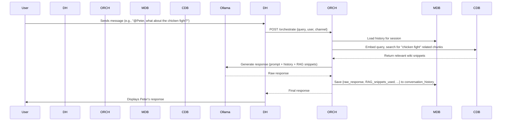
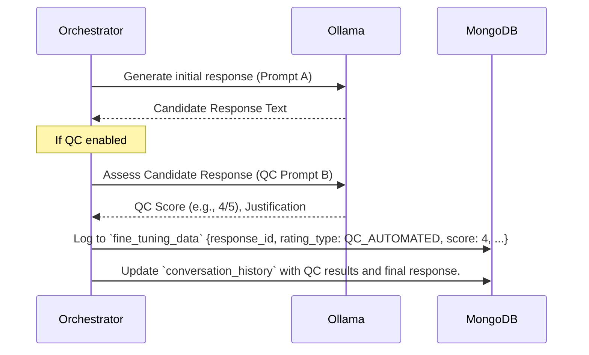
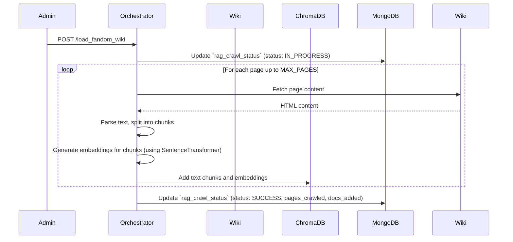
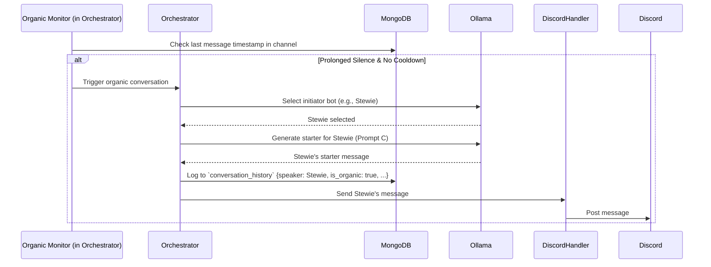

# Data Management and Flow

## 1. Overview

Effective data management is crucial for the advanced features of the Family Guy Discord Bot system, including long-term memory (conversation history), Retrieval Augmented Generation (RAG), fine-tuning, and quality control. This document details what data is stored, where it resides, and how it flows between the different services.

## 2. Primary Data Stores

The system utilizes two primary persistent data stores, both managed within the Docker environment with persistent volumes to ensure data integrity across container restarts.

### 2.1. MongoDB (`mongodb` service)

*   **Purpose**: Serves as the main operational database for structured and semi-structured data related to conversations, system learning, and operational logging.
*   **Docker Volume**: `mongodb_data` (defined in `docker-compose.yml`)
*   **Key Data Collections & Schemas (Illustrative)**:
    *   **`conversation_history`**: Stores every turn of a conversation.
        *   `session_id`: (String) Unique identifier for a continuous interaction or topic.
        *   `turn_id`: (Integer) Sequential ID within a session.
        *   `timestamp`: (DateTime) When the message was processed.
        *   `channel_id`: (String) Discord channel ID.
        *   `user_id`: (String) Discord user ID (for user messages).
        *   `speaker_type`: (Enum: `USER`, `BOT`, `SYSTEM`)
        *   `bot_name`: (String, if speaker_type is `BOT`, e.g., "Peter", "Brian", "Stewie")
        *   `message_content`: (String) The raw text of the message.
        *   `original_message_id`: (String) Discord message ID.
        *   `is_organic_initiation`: (Boolean) True if this turn was initiated by the organic conversation system.
        *   `rag_context_used`: (Array of Strings/Objects) Snippets from ChromaDB used for this response.
        *   `llm_response_raw`: (String) The direct output from Ollama.
        *   `llm_response_final`: (String) The response after any QC or formatting.
    *   **`fine_tuning_data`**: Stores data specifically for model improvement and prompt optimization.
        *   `response_id`: (String, links to a turn in `conversation_history`)
        *   `rating_type`: (Enum: `QC_AUTOMATED`, `USER_SUBMITTED`, `LLM_SUGGESTED`)
        *   `rating_score`: (Integer, e.g., 1-5)
        *   `feedback_text`: (String) Qualitative feedback or justification for the rating.
        *   `rated_by`: (String, e.g., "qc_module", user ID, "prompt_optimizer")
        *   `timestamp`: (DateTime)
        *   `prompt_version_used`: (String) Identifier for the character prompt version used to generate the response.
    *   **`character_prompts`**: Stores versioned base prompts for characters, allowing for A/B testing and rollback.
        *   `character_name`: (String, e.g., "Peter")
        *   `prompt_version`: (String, e.g., "v1.0", "v1.1_optimized")
        *   `prompt_text`: (String) The full system prompt for the character.
        *   `is_default`: (Boolean) Whether this is the current default prompt for the character.
        *   `ab_test_percentage`: (Integer, 0-100) Percentage of traffic to use this prompt if not default.
        *   `creation_date`: (DateTime)
        *   `performance_metrics`: (Object) Aggregated QC scores, engagement metrics for this prompt version.
    *   **`rag_crawl_status`**: Tracks the state of the RAG knowledge base population.
        *   `last_crawl_timestamp`: (DateTime)
        *   `pages_crawled`: (Integer)
        *   `documents_added`: (Integer)
        *   `status`: (String: `SUCCESS`, `IN_PROGRESS`, `FAILED`)
        *   `error_message`: (String, if status is `FAILED`)
    *   **`dead_letter_queue`**: For messages/events that failed processing.
        *   `failed_event_payload`: (Object) The original message or event data.
        *   `error_details`: (String) Information about why processing failed.
        *   `timestamp`: (DateTime)
        *   `retry_attempts`: (Integer)

### 2.2. ChromaDB (Vector Store for RAG)

*   **Purpose**: Stores vector embeddings of text from the Family Guy Fandom Wiki to enable semantic search for the RAG system.
*   **Docker Volume**: Mounted directly by the Orchestrator service at `../chroma_db:/app/chroma_db` (path defined in `docker-compose.yml`). The Orchestrator uses the ChromaDB library to manage this local database.
*   **Data Structure**:
    *   Collections (typically one per knowledge base, e.g., `family_guy_wiki`).
    *   Within collections: Stores embeddings (dense vectors), corresponding text chunks (documents), and metadata (e.g., source URL, chunk ID).
    *   ChromaDB handles the indexing for efficient similarity search.

## 3. Data Flow Examples

### 3.1. User Message Processing & RAG

### 3.2. Quality Control & Fine-Tuning Data Logging

### 3.3. RAG Wiki Crawl

### 3.4. Organic Conversation Initiation

## 4. Data Persistence and Backup

*   **MongoDB**: Uses a named Docker volume (`mongodb_data`). For production scenarios, standard MongoDB backup procedures (e.g., `mongodump`) should be implemented against this volume or the running container.
*   **ChromaDB**: Data is stored in a directory on the host that is volume-mounted into the Orchestrator container (`../chroma_db:/app/chroma_db`). This directory should be included in any system backup routines.
*   **Configuration**: Environment variables (`docker/.env`) are critical and should be backed up or managed via a secrets management system in production.

## 5. Security and Privacy

*   **Conversation History**: Contains user messages. Access to MongoDB should be restricted.
*   **Discord Tokens**: Stored in `docker/.env`, which should be secured.
*   **Local LLM**: As Ollama runs locally, prompts and generated content do not leave the user's infrastructure during LLM processing, enhancing privacy compared to cloud-based LLM APIs.
*   No personally identifiable information (PII) beyond Discord user IDs and message content is intentionally stored, unless present in the RAG knowledge base (public wiki content).

This structured approach to data management ensures that the bot system can learn, remember, and provide rich, context-aware interactions while maintaining data integrity. 