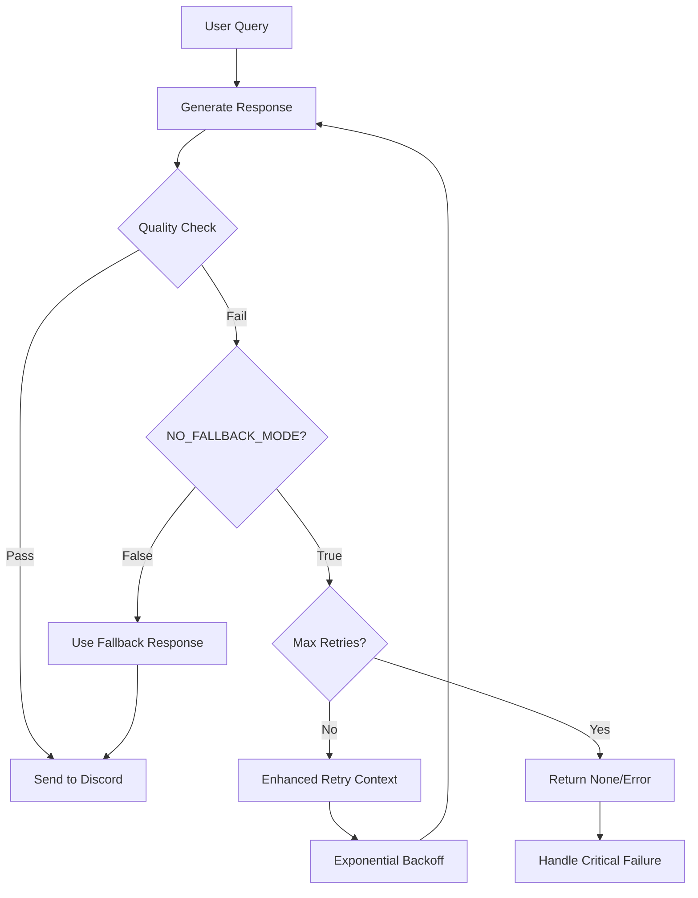

# NO_FALLBACK_MODE: Infinite Retry System

## Overview

The NO_FALLBACK_MODE is an advanced feature that completely removes all fallback responses from the Discord bot system. Instead of using generic fallback messages when response generation fails, the system will continuously retry until a valid, high-quality response is generated or a maximum retry limit is reached.

## Problem Statement

### Traditional Fallback Issues

In the traditional system, when response generation fails due to:
- Quality control rejection
- Validation failures
- Duplicate detection
- LLM generation errors
- Empty responses

The system would fall back to generic responses like:
- "Hehehe, my brain just went blank. What were we talking about?"
- "Well, this is awkward. My train of thought seems to have derailed."
- "Blast! My cognitive processes are momentarily disrupted. What the deuce?"

### User Experience Problems

These fallbacks created several issues:
1. **Unnatural Responses**: Generic messages that don't fit the conversation context
2. **Repetitive Patterns**: Same fallback messages appearing frequently
3. **Poor Quality**: Responses that don't engage with the actual conversation
4. **Character Inconsistency**: Generic responses that don't match character personality

## Solution: NO_FALLBACK_MODE

### Core Principle

**Never give up, never surrender**: The system will keep trying until it generates a valid response that meets quality standards.

### Key Features

1. **Infinite Retry Logic**: Continues attempting response generation until success
2. **Exponential Backoff**: Prevents overwhelming the LLM with rapid requests
3. **Enhanced Retry Context**: Each retry includes information about previous failures
4. **Adaptive Quality Control**: Works with existing adaptive thresholds
5. **Graceful Failure Handling**: Returns None only after maximum attempts exhausted

## Configuration

### Environment Variables

```bash
# Enable/disable no-fallback mode
NO_FALLBACK_MODE=True

# Maximum retry attempts before giving up (default: 10)
MAX_RETRY_ATTEMPTS=10

# Enable exponential backoff delays (default: True)
RETRY_BACKOFF_ENABLED=True

# Backoff multiplier for exponential delays (default: 1.5)
RETRY_BACKOFF_MULTIPLIER=1.5

# Enable enhanced retry context (default: True)
ENHANCED_RETRY_CONTEXT_ENABLED=True
```

### Recommended Settings

#### Production Environment
```bash
NO_FALLBACK_MODE=True
MAX_RETRY_ATTEMPTS=8
RETRY_BACKOFF_ENABLED=True
RETRY_BACKOFF_MULTIPLIER=1.5
```

#### Development/Testing
```bash
NO_FALLBACK_MODE=True
MAX_RETRY_ATTEMPTS=5
RETRY_BACKOFF_ENABLED=False  # Faster testing
RETRY_BACKOFF_MULTIPLIER=1.2
```

#### High-Traffic Environment
```bash
NO_FALLBACK_MODE=True
MAX_RETRY_ATTEMPTS=6
RETRY_BACKOFF_ENABLED=True
RETRY_BACKOFF_MULTIPLIER=2.0  # Longer delays to reduce load
```

## How It Works

### 1. Response Generation Flow



### 2. Retry Mechanisms

#### Basic Retry Loop
```python
attempt = 0
while attempt < MAX_RETRY_ATTEMPTS:
    attempt += 1
    
    # Generate response
    response = generate_response(...)
    
    # Quality check
    if quality_check_passes(response):
        return response
    
    # Enhanced retry context
    if ENHANCED_RETRY_CONTEXT_ENABLED:
        add_failure_context(previous_response, issues)
    
    # Exponential backoff
    if RETRY_BACKOFF_ENABLED and attempt > 1:
        delay = base_delay * (RETRY_BACKOFF_MULTIPLIER ** (attempt - 1))
        time.sleep(delay)

# All attempts failed
return None
```

#### Exponential Backoff Pattern
```
Attempt 1: No delay
Attempt 2: 1.0s delay
Attempt 3: 1.5s delay  
Attempt 4: 2.25s delay
Attempt 5: 3.375s delay
...
```

### 3. Enhanced Retry Context

Each retry includes detailed context about previous failures:

```
🔄 RETRY GUIDANCE (Attempt 3): Speak in FIRST PERSON only - use 'I' not your character name

PREVIOUS ATTEMPT 3 FAILED:
Rejected Response: "Brian thinks that's actually quite fascinating. Brian would like to add that..."
Score: 25.0/100 (below 50.0 threshold)
Specific Issues: Third person self-reference detected, Character addressing themselves
```

### 4. Failure Type Handling

The system provides specific guidance based on failure types:

#### Length Issues
- "Keep it much shorter and more concise"
- "Give a brief, natural response"
- "Respond with just a few words or a short sentence"

#### Third Person Issues
- "Speak in FIRST PERSON only - use 'I' not your character name"
- "Respond as yourself using 'I' statements, not third person"
- "Use first person perspective - 'I think' not 'Character thinks'"

#### Self-Addressing Issues
- "Respond naturally to the conversation, don't address other characters directly"
- "Engage with the conversation flow, avoid talking to specific people"
- "React to what was said without addressing anyone by name"

#### Repetitive Issues
- "Try a completely different response approach"
- "Use different words and phrasing entirely"
- "Take a fresh angle on the topic"

## Integration Points

### 1. Quality Control System

NO_FALLBACK_MODE integrates seamlessly with the existing quality control system:

```python
def generate_character_response_with_quality_control(...):
    # Check if NO_FALLBACK_MODE is enabled
    if NO_FALLBACK_MODE:
        return generate_character_response_with_infinite_retry(...)
    
    # Traditional quality control with fallbacks
    return traditional_quality_control(...)
```

### 2. Basic Response Generation

All fallback points in the basic generation function check NO_FALLBACK_MODE:

```python
# LLM generation failure
if NO_FALLBACK_MODE:
    return None
else:
    return character_specific_fallback()

# Validation failure
if NO_FALLBACK_MODE:
    return None
else:
    return validation_fallback()
```

### 3. Orchestrator Integration

The orchestrator handles None responses appropriately:

```python
response_text = generate_character_response_with_quality_control(...)

if response_text is None:
    if NO_FALLBACK_MODE:
        return jsonify({
            "error": "NO_FALLBACK_MODE: Failed to generate valid response",
            "suggestion": "Check LLM health or lower quality thresholds"
        }), 500
```

## Monitoring and Observability

### 1. Logging

NO_FALLBACK_MODE provides detailed logging:

```
🚫 No Fallback Mode: Generating Brian response with infinite retry...
   📈 Context Value: 45.2 (Messages: 3, Avg Length: 67)
   🎯 Adaptive Threshold: 30.0/100
🔄 Attempt 1/10...
   ❌ Response rejected with combined score 25.0/100 (below 30.0 adaptive threshold)
   📊 Flow Score: 20.0/100, LLM Score: 35.0/100
   ⚠️ Issues: Third person self-reference detected
🔄 Attempt 2/10...
   ⏳ Backoff delay: 1.2s
   ❌ Response rejected with combined score 28.0/100 (below 30.0 adaptive threshold)
🔄 Attempt 3/10...
   ⏳ Backoff delay: 1.8s
   ✅ No Fallback Mode: Response approved with combined score 32.0/100 (attempt 3/10)
```

### 2. Metrics Collection

The system tracks NO_FALLBACK_MODE performance:

```python
# Success metrics
rating_id = prompt_fine_tuner.record_rating(
    character_name=character_name,
    response_text=response_text,
    rating=combined_score,
    feedback=f"No Fallback Mode Success: Flow={flow_score:.1f}, LLM={llm_score:.1f}, Combined={combined_score:.1f}, Attempt={attempt}",
    user_id="no_fallback_mode_assessment"
)

# Failure metrics  
rating_id = prompt_fine_tuner.record_rating(
    character_name=character_name,
    response_text=response_text,
    rating=combined_score,
    feedback=f"No Fallback Mode Rejected: Flow={flow_score:.1f}, LLM={llm_score:.1f}, Issues: {', '.join(issues)}, Attempt={attempt}",
    user_id="no_fallback_mode_assessment"
)
```

### 3. Status Endpoint

The quality control status endpoint includes NO_FALLBACK_MODE information:

```bash
GET /quality_control_status
```

```json
{
  "configuration": {
    "no_fallback_mode": true,
    "max_retry_attempts": 10,
    "retry_backoff_enabled": true,
    "retry_backoff_multiplier": 1.5,
    "enhanced_retry_context_enabled": true
  },
  "statistics": {
    "no_fallback_assessments": 45
  }
}
```

## Performance Considerations

### 1. Response Time Impact

NO_FALLBACK_MODE can increase response times:

- **Best Case**: Same as traditional (first attempt succeeds)
- **Average Case**: 2-3 attempts with backoff delays (3-5 seconds)
- **Worst Case**: Maximum attempts with full backoff (15-30 seconds)

### 2. LLM Load Impact

More requests to the LLM:
- **Traditional**: 1 request + potential 1 retry = 1-2 requests
- **NO_FALLBACK_MODE**: 1-10 requests (average 2-3)

### 3. Resource Usage

- **CPU**: Minimal increase (retry logic is lightweight)
- **Memory**: Slight increase (storing retry context)
- **Network**: Proportional to retry attempts
- **Database**: More quality control records

### 4. Optimization Strategies

#### Reduce Retry Frequency
- Lower quality thresholds for cold starts
- Improve character prompts to reduce failures
- Better validation logic to catch issues early

#### Optimize Backoff Strategy
- Use jittered backoff to prevent thundering herd
- Adaptive backoff based on failure type
- Circuit breaker pattern for persistent failures

## Testing

### 1. Test Script

Use the provided test script to validate NO_FALLBACK_MODE:

```bash
python test_no_fallback_mode.py
```

### 2. Test Scenarios

The test script covers:
- Normal conversation flow
- Simple questions
- Complex topics
- Character-specific mentions
- Ambiguous inputs

### 3. Expected Outcomes

#### With NO_FALLBACK_MODE=True
- No generic fallback responses
- Higher quality responses (may take longer)
- Detailed retry logging
- Potential timeout errors if system struggles

#### With NO_FALLBACK_MODE=False
- Traditional fallback responses
- Faster response times
- Lower quality tolerance
- More predictable behavior

## Troubleshooting

### 1. Common Issues

#### High Retry Rates
**Symptoms**: Many attempts before success
**Causes**: 
- Quality thresholds too high
- Character prompts need improvement
- LLM model issues

**Solutions**:
- Lower adaptive quality thresholds
- Review and improve character prompts
- Check LLM model performance
- Temporarily disable NO_FALLBACK_MODE

#### Timeout Errors
**Symptoms**: Requests timing out
**Causes**:
- MAX_RETRY_ATTEMPTS too high
- Backoff delays too long
- System under heavy load

**Solutions**:
- Reduce MAX_RETRY_ATTEMPTS
- Adjust RETRY_BACKOFF_MULTIPLIER
- Increase request timeouts
- Scale LLM infrastructure

#### Complete Failures
**Symptoms**: All retries exhausted
**Causes**:
- LLM model offline
- Quality control too strict
- Character prompts broken

**Solutions**:
- Check LLM health
- Temporarily disable quality control
- Review character prompt configuration
- Enable traditional fallback mode

### 2. Monitoring Checklist

- [ ] Response time metrics
- [ ] Retry attempt distribution
- [ ] Success rate by character
- [ ] Quality score trends
- [ ] Error rate monitoring
- [ ] LLM request volume
- [ ] User satisfaction metrics

### 3. Emergency Procedures

#### Disable NO_FALLBACK_MODE
```bash
# Set environment variable
NO_FALLBACK_MODE=False

# Restart orchestrator service
docker-compose restart orchestrator
```

#### Lower Quality Thresholds
```bash
# Reduce adaptive thresholds
COLD_START_THRESHOLD=20.0
WARM_CONVERSATION_THRESHOLD=40.0
HOT_CONVERSATION_THRESHOLD=60.0
```

#### Reduce Retry Attempts
```bash
# Limit retry attempts
MAX_RETRY_ATTEMPTS=3
RETRY_BACKOFF_ENABLED=False
```

## Best Practices

### 1. Gradual Rollout

1. **Development Testing**: Enable in dev environment first
2. **Limited Production**: Enable for specific channels
3. **Full Rollout**: Enable system-wide after validation
4. **Monitoring**: Continuously monitor performance metrics

### 2. Configuration Tuning

1. **Start Conservative**: Lower MAX_RETRY_ATTEMPTS initially
2. **Monitor Performance**: Track response times and success rates
3. **Adjust Gradually**: Increase limits based on performance
4. **Character-Specific**: Consider different settings per character

### 3. Quality Threshold Management

1. **Adaptive Thresholds**: Use existing adaptive quality control
2. **Context-Aware**: Lower thresholds for cold starts
3. **Performance-Based**: Adjust based on success rates
4. **User Feedback**: Incorporate user satisfaction metrics

### 4. Fallback Strategy

1. **Hybrid Approach**: Use NO_FALLBACK_MODE for most cases
2. **Emergency Fallback**: Keep traditional mode as backup
3. **Circuit Breaker**: Automatically disable if failure rate too high
4. **Manual Override**: Allow operators to disable quickly

## Future Enhancements

### 1. Planned Features

- **Adaptive Retry Limits**: Adjust MAX_RETRY_ATTEMPTS based on success rates
- **Character-Specific Limits**: Different retry limits per character
- **Intelligent Backoff**: Adjust delays based on failure type
- **Circuit Breaker**: Automatic fallback mode switching

### 2. Advanced Retry Strategies

- **Prompt Variation**: Try different prompt variations on retries
- **Model Switching**: Use different LLM models for retries
- **Context Reduction**: Simplify context on repeated failures
- **Quality Threshold Relaxation**: Gradually lower thresholds on retries

### 3. Machine Learning Integration

- **Failure Prediction**: Predict likely failures before generation
- **Optimal Retry Count**: Learn optimal retry limits per scenario
- **Context Optimization**: Automatically improve retry context
- **Success Pattern Recognition**: Identify patterns in successful retries

## Conclusion

NO_FALLBACK_MODE represents a significant advancement in response quality for the Family Guy Discord bot. By eliminating generic fallback responses and implementing intelligent retry mechanisms, the system ensures that users receive authentic, contextual, and high-quality responses that truly match the character personalities.

The system's adaptive nature, combined with comprehensive monitoring and configuration options, makes it suitable for production deployment while maintaining the flexibility to adjust behavior based on performance requirements and user feedback.

Key benefits:
- **Higher Quality**: No more generic fallback responses
- **Better User Experience**: Contextual, character-appropriate responses
- **Intelligent Retry**: Enhanced context learning from failures
- **Comprehensive Monitoring**: Detailed logging and metrics
- **Flexible Configuration**: Adaptable to different environments and requirements

The NO_FALLBACK_MODE feature ensures that the Discord bot maintains the highest standards of response quality while providing the reliability and performance needed for production use. 