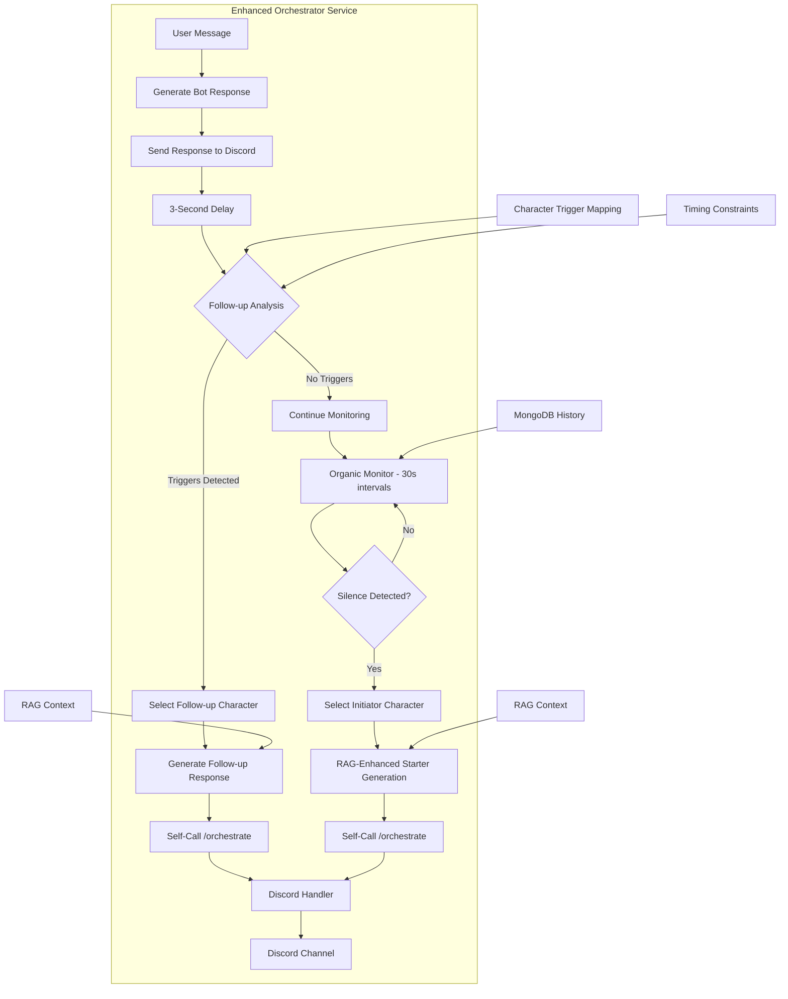

# Enhanced Organic Conversation Coordinator

## 1. Overview

The Enhanced Organic Conversation Coordinator is a sophisticated feature designed to create dynamic, multi-character interactions by enabling bots to both initiate conversations and automatically respond to each other's messages. This system creates natural conversation flow through two complementary mechanisms:

1. **Follow-up Conversations**: Analyzes bot responses for content that would naturally trigger other characters to respond, creating immediate multi-character interactions.
2. **Organic Conversations**: Monitors channel activity and initiates new conversations during periods of silence.

This dual approach simulates authentic group dynamics where characters naturally react to each other's statements while also being proactive in starting new topics.

## 2. Architecture & Components

This system resides within the **Orchestrator** service and includes:

### 2.1 Follow-up Conversation System (New)

*   **Response Analyzer (Orchestrator)**:
    *   Analyzes each bot response immediately after it's sent (3-second delay for natural flow).
    *   Uses character-specific trigger mapping to determine if other characters would naturally want to respond.
    *   Considers content, personality dynamics, and relationship patterns.

*   **Character-Specific Trigger Mapping**:
    *   **Peter triggers**: Simple/crude content → Brian responds intellectually, Stewie responds condescendingly
    *   **Brian triggers**: Intellectual/pretentious content → Peter responds simply, Stewie responds competitively  
    *   **Stewie triggers**: Evil plans/science → Other characters respond with concern/interest

*   **Follow-up Responder Selection (LLM-based)**:
    *   Intelligently selects which character should respond based on trigger analysis.
    *   Excludes the character who just spoke to ensure different voices.
    *   Uses LLM coordination for optimal character selection.

*   **Follow-up Response Generation**:
    *   Creates contextual responses that directly relate to the previous message.
    *   Maintains character authenticity while creating natural conversation flow.
    *   Uses the same quality control and RAG systems as regular responses.

### 2.2 Organic Conversation System (Enhanced)

*   **Activity Monitor (Orchestrator)**:
    *   Continuously analyzes conversation history and timestamps from `MongoDB`.
    *   Tracks silence periods, recent activity patterns, and conversation endpoints.
    *   Now operates on a 30-second check interval for more responsive monitoring.

*   **Enhanced Initiation Triggers**:
    *   `CONVERSATION_SILENCE_THRESHOLD_MINUTES`: Prolonged silence detection (default: 30 minutes)
    *   `MIN_TIME_BETWEEN_ORGANIC_CONVERSATIONS`: Cooldown between organic attempts (default: 10 minutes)
    *   Conversation pattern analysis for natural break points

*   **Intelligent Character Selector (LLM-based)**:
    *   Uses full character descriptions and recent activity analysis.
    *   Considers who hasn't spoken recently for balance.
    *   Analyzes conversation context for topic-appropriate character selection.

*   **RAG-Enhanced Starter Generator**:
    *   Generates conversation starters using Family Guy universe knowledge.
    *   Creates contextually relevant topics based on recent conversation themes.
    *   Produces character-authentic conversation starters.

### 2.3 Unified Coordination System

*   **Self-Orchestration Calls**: Both systems use internal calls to `/orchestrate` endpoint for consistency.
*   **Timing Management**: Sophisticated timing controls prevent spam while maintaining natural flow.
*   **Quality Control Integration**: All generated responses pass through the same quality control system.

## 3. Enhanced Workflow

### 3.1 Follow-up Conversation Flow

1. **User Message Processing**: Standard message processing through orchestrator.
2. **Response Generation**: Bot generates and sends response to Discord.
3. **Follow-up Analysis** (3 seconds later):
   - Analyze the bot's response content for character-specific triggers
   - Check timing constraints (minimum 30 seconds between follow-ups)
   - Determine if other characters would naturally want to respond
4. **Character Selection**: If triggers detected, select appropriate responding character (excluding last speaker).
5. **Follow-up Generation**: Generate contextual response that relates to the previous message.
6. **Self-Orchestration**: Internal call to `/orchestrate` with follow-up response.

### 3.2 Organic Conversation Flow (Enhanced)

1. **Continuous Monitoring**: Check every 30 seconds for conversation opportunities.
2. **Silence Detection**: Identify periods of 30+ minutes without activity.
3. **Context Analysis**: Analyze recent conversation patterns and natural break points.
4. **Character Selection**: Use LLM with full character descriptions to select initiator.
5. **RAG-Enhanced Generation**: Create conversation starter with Family Guy universe context.
6. **Self-Orchestration**: Internal call to `/orchestrate` with organic starter.

## 4. Configuration

Key environment variables in `docker/.env`:

### Follow-up Conversation Settings
*   `ENABLE_FOLLOW_UP_CONVERSATIONS` (default: `true`): Enable/disable follow-up system
*   `FOLLOW_UP_DELAY_SECONDS` (default: `3.0`): Delay before checking for follow-ups
*   `MIN_TIME_BETWEEN_FOLLOW_UPS` (default: `30.0`): Minimum seconds between follow-up attempts

### Organic Conversation Settings  
*   `CONVERSATION_SILENCE_THRESHOLD_MINUTES` (default: `30`): Minutes of silence before considering organic conversation
*   `MIN_TIME_BETWEEN_ORGANIC_CONVERSATIONS` (default: `10`): Minimum minutes between organic attempts

### General Settings
*   `DEFAULT_DISCORD_CHANNEL_ID`: Primary channel for conversation coordination
*   `QUALITY_CONTROL_ENABLED`: Apply quality control to generated responses
*   `RAG_RETRIEVER_API_URL`: RAG service for context enhancement

## 5. Character-Specific Trigger Analysis

### Peter Griffin Triggers
**Content that makes other characters want to respond:**
- Simple/crude topics → Brian responds intellectually
- Beer/TV mentions → Brian corrects or analyzes  
- Random observations → Stewie responds condescendingly
- Chicken fighting → Others express concern/interest

### Brian Griffin Triggers  
**Content that makes other characters want to respond:**
- Intellectual/pretentious statements → Peter responds simply
- Cultural references → Stewie responds competitively
- Political opinions → Others disagree or mock
- Writing/literature → Stewie shows superior knowledge

### Stewie Griffin Triggers
**Content that makes other characters want to respond:**
- Evil plans → Others express alarm
- Scientific topics → Brian engages intellectually  
- British sophistication → Peter misunderstands
- Baby genius observations → Others are confused

## 6. Benefits

### Follow-up Conversations
*   **Dynamic Interactions**: Creates immediate multi-character conversations from single user messages
*   **Natural Flow**: 3-second delay mimics natural conversation timing
*   **Character Relationships**: Leverages established character dynamics and conflicts
*   **Reduced User Effort**: Users don't need to mention multiple characters to get group interactions

### Enhanced Organic Conversations  
*   **Proactive Engagement**: Bots initiate conversations during quiet periods
*   **Context-Driven Topics**: RAG integration provides relevant conversation starters
*   **Balanced Participation**: Intelligent character selection ensures fair speaking opportunities
*   **Natural Timing**: Respects conversation flow and prevents spam

## 7. API Endpoints & Monitoring

*   **`/organic_conversation_status` (GET)**: Current configuration and statistics
*   **`/fine_tuning_stats` (GET)**: Includes follow-up conversation effectiveness metrics
*   **MongoDB Collections**:
    *   Conversation history with follow-up indicators
    *   Timing metrics for both systems
    *   Character selection patterns and success rates

## 8. Testing & Validation

A comprehensive test suite (`scripts/test_follow_up_conversations.py`) validates:
*   Follow-up trigger analysis logic
*   Character-specific trigger mapping
*   Timing constraint enforcement
*   Expected behavior for various message types

## 9. Future Enhancements

*   **Learning System**: Analyze which follow-ups generate the most user engagement
*   **Contextual Triggers**: More sophisticated content analysis for trigger detection
*   **Multi-Channel Support**: Extend follow-up system to multiple Discord channels
*   **User Preferences**: Allow users to adjust follow-up frequency per channel
*   **Advanced Relationship Modeling**: More nuanced character interaction patterns
*   **Conversation Threading**: Maintain conversation topics across multiple follow-ups 