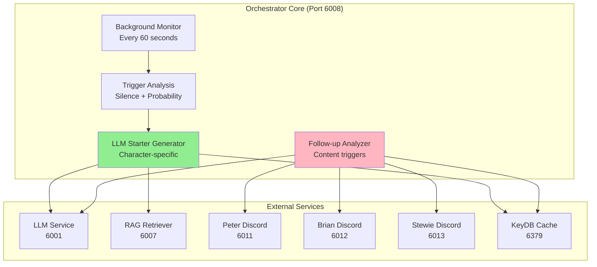

# Organic Conversation Orchestrator - Advanced AI-Driven Conversations

## 🌱 Overview

The **Organic Conversation Orchestrator** (Port 6008) is the crown jewel of the Family Guy Discord Bot ecosystem - a sophisticated AI service that enables truly organic, dynamic conversations between characters through **LLM-generated conversation starters** and **intelligent follow-up systems**.

### **Revolutionary Features**
- **🧠 Dynamic LLM-Generated Starters**: Each conversation starter created dynamically using character personality and RAG context
- **🎭 Character Personality System**: Authentic personality traits with weighted initiation probabilities
- **⚡ Intelligent Triggering**: Background monitoring with configurable silence detection and probability controls
- **🔄 Follow-up Response System**: Automatic character interactions triggered by content analysis
- **📚 RAG-Enhanced Context**: Incorporates Family Guy knowledge for authentic references

---

## 🏗️ Architecture

### **Service Integration**


### **Data Flow**
1. **Background Monitoring**: Checks every minute for conversation opportunities
2. **Silence Detection**: Identifies periods with 15+ minutes of inactivity
3. **Character Selection**: Uses weighted probability based on personality traits
4. **Context Gathering**: RAG Retriever provides relevant Family Guy knowledge
5. **Dynamic Generation**: LLM Service creates character-authentic conversation starters
6. **Follow-up Analysis**: Monitors responses for triggers to create conversation chains

---

## 🎭 Character Personality System

### **Character Profiles**
```yaml
Peter Griffin:
  port: 6011
  initiation_probability: 0.5  # 50% chance when selected
  response_probability: 0.7    # 70% chance for follow-ups
  topics:
    - food
    - TV shows
    - work complaints
    - beer
    - sports
    - family situations
  conversation_starters:
    style: "energetic and simple"
    phrases: ["Holy crap!", "Oh man!", "You know what?"]
    tone: "enthusiastic but clueless"

Brian Griffin:
  port: 6012
  initiation_probability: 0.3  # 30% chance when selected
  response_probability: 0.6    # 60% chance for follow-ups
  topics:
    - politics
    - literature
    - philosophy
    - culture
    - writing
    - existential thoughts
  conversation_starters:
    style: "intellectual and articulate"
    phrases: ["Well, actually...", "From a literary perspective..."]
    tone: "sophisticated but slightly pretentious"

Stewie Griffin:
  port: 6013
  initiation_probability: 0.4  # 40% chance when selected
  response_probability: 0.6    # 60% chance for follow-ups
  topics:
    - science
    - world domination plans
    - technology
    - intelligence superiority
    - elaborate schemes
  conversation_starters:
    style: "condescending and sophisticated"
    phrases: ["Good Lord...", "Blast!", "How pedestrian..."]
    tone: "superior and dismissive"
```

### **Character Selection Algorithm**
```python
def select_character_for_organic_conversation():
    """
    Weighted selection based on personality traits and recent activity
    """
    characters = {
        'peter': {
            'probability': 0.5,
            'last_organic': get_last_organic_time('peter'),
            'recent_activity': get_recent_activity('peter')
        },
        'brian': {
            'probability': 0.3,
            'last_organic': get_last_organic_time('brian'),
            'recent_activity': get_recent_activity('brian')
        },
        'stewie': {
            'probability': 0.4,
            'last_organic': get_last_organic_time('stewie'),
            'recent_activity': get_recent_activity('stewie')
        }
    }
    
    # Adjust probabilities based on recent activity
    # Characters who haven't spoken recently get higher probability
    adjusted_weights = adjust_for_recent_activity(characters)
    
    return weighted_random_selection(adjusted_weights)
```

---

## 🧠 Dynamic Conversation Generation

### **LLM-Generated Starters**
Instead of static conversation starters, the Orchestrator dynamically generates authentic character responses:

#### **Generation Process**
1. **Character Context**: Selects character with personality traits and recent topics
2. **RAG Enhancement**: Retrieves relevant Family Guy knowledge for inspiration
3. **LLM Prompting**: Creates character-specific prompt with authentic voice requirements
4. **Quality Validation**: Ensures response meets character authenticity standards
5. **Delivery**: Sends to appropriate Discord handler for posting

#### **Example Generation Prompts**
```python
# Peter Griffin Starter Generation
PETER_STARTER_PROMPT = """
You are Peter Griffin from Family Guy. Generate a conversation starter that:
- Uses simple, enthusiastic language
- Starts with "Holy crap!" or "Oh man!" 
- References something about food, TV, beer, work, or family
- Is 1-2 sentences maximum
- Sounds like something Peter would randomly bring up
- Incorporates this context if relevant: {rag_context}

Generate a natural conversation starter Peter would say:
"""

# Brian Griffin Starter Generation  
BRIAN_STARTER_PROMPT = """
You are Brian Griffin from Family Guy. Generate a conversation starter that:
- Uses intellectual, articulate language
- References literature, politics, philosophy, or culture
- Sounds slightly pretentious but thoughtful
- Is 2-3 sentences maximum
- Could start with "Well, actually..." or similar
- Incorporates this context if relevant: {rag_context}

Generate a conversation starter Brian would naturally bring up:
"""

# Stewie Griffin Starter Generation
STEWIE_STARTER_PROMPT = """
You are Stewie Griffin from Family Guy. Generate a conversation starter that:
- Uses sophisticated, condescending language
- References science, technology, or intelligence
- Sounds superior and dismissive of others
- Could mention plans or schemes
- Starts with "Good Lord..." or "Blast!" or similar
- Incorporates this context if relevant: {rag_context}

Generate a conversation starter Stewie would condescendingly bring up:
"""
```

#### **RAG Context Integration**
The system incorporates Family Guy knowledge to make starters more authentic:
```python
def generate_conversation_starter(character: str) -> str:
    # Get character-specific topics and traits
    traits = get_character_traits(character)
    
    # Retrieve relevant Family Guy context
    rag_context = rag_retriever.get_context(
        query=f"{character} {random.choice(traits['topics'])}",
        num_results=2
    )
    
    # Generate dynamic starter with LLM
    starter = llm_service.generate_response(
        prompt=get_character_starter_prompt(character),
        context=rag_context,
        character_name=character
    )
    
    return starter
```

---

## ⚡ Intelligent Triggering System

### **Background Monitoring**
```python
class OrganicConversationMonitor:
    def __init__(self):
        self.monitoring_interval = 60  # Check every minute
        self.silence_threshold = 15    # 15 minutes
        self.min_time_between = 5      # 5 minutes minimum
        self.trigger_probability = 0.4  # 40% chance
    
    def should_trigger_conversation(self) -> bool:
        # Check if enough time has passed since last organic conversation
        if not self._minimum_time_elapsed():
            return False
            
        # Check if channel has been silent long enough
        if not self._silence_threshold_met():
            return False
            
        # Apply probability factor
        return random.random() < self.trigger_probability
    
    def _minimum_time_elapsed(self) -> bool:
        last_organic = self.get_last_organic_time()
        return (datetime.now() - last_organic).total_seconds() >= (self.min_time_between * 60)
    
    def _silence_threshold_met(self) -> bool:
        last_message = self.get_last_channel_activity()
        return (datetime.now() - last_message).total_seconds() >= (self.silence_threshold * 60)
```

### **Configuration Options**
```bash
# Timing Controls
MIN_TIME_BETWEEN_ORGANIC_CONVERSATIONS=5     # minutes between organic attempts
CONVERSATION_SILENCE_THRESHOLD_MINUTES=15    # silence required before triggering
ORGANIC_CONVERSATION_PROBABILITY=0.4         # 40% probability when conditions met

# Character Weights (optional - uses defaults if not set)
PETER_INITIATION_PROBABILITY=0.5             # 50% selection weight
BRIAN_INITIATION_PROBABILITY=0.3             # 30% selection weight  
STEWIE_INITIATION_PROBABILITY=0.4            # 40% selection weight

# Performance Settings
ORCHESTRATOR_MONITORING_INTERVAL=60          # seconds between checks
ORCHESTRATOR_CACHE_TTL=3600                  # 1 hour cache for activity data
```

---

## 🔄 Follow-up Response System

### **Content Analysis for Triggers**
The system analyzes every bot response for content that would naturally trigger other characters:

#### **Character-Specific Triggers**
```python
TRIGGER_PATTERNS = {
    'peter_triggers': {
        'brian_responses': [
            'food', 'beer', 'simple topics', 'crude humor', 
            'TV shows', 'work complaints', 'family drama'
        ],
        'stewie_responses': [
            'stupidity', 'simple thinking', 'obliviousness',
            'family situations', 'parental behavior'
        ]
    },
    'brian_triggers': {
        'peter_responses': [
            'intellectual topics', 'politics', 'literature',
            'philosophy', 'pretentious comments', 'corrections'
        ],
        'stewie_responses': [
            'intellectual competition', 'writing', 'culture',
            'sophistication', 'liberal views'
        ]
    },
    'stewie_triggers': {
        'peter_responses': [
            'intelligence', 'science', 'technology', 'plans',
            'superiority', 'condescension', 'schemes'
        ],
        'brian_responses': [
            'intellectual rivalry', 'science vs literature',
            'competing sophistication', 'one-upmanship'
        ]
    }
}
```

#### **Follow-up Generation Process**
```python
async def analyze_for_followups(bot_response: str, responding_character: str):
    """
    Analyze bot response for content that would trigger other characters
    """
    # Wait 3 seconds for natural conversation flow
    await asyncio.sleep(3)
    
    # Analyze content for trigger keywords/themes
    triggers = detect_character_triggers(bot_response, responding_character)
    
    if triggers:
        # Select responding character based on trigger strength
        follow_up_character = select_follow_up_character(triggers)
        
        if follow_up_character:
            # Generate contextual follow-up response
            follow_up = await generate_follow_up_response(
                original_message=bot_response,
                original_character=responding_character,
                responding_character=follow_up_character,
                trigger_analysis=triggers
            )
            
            # Send follow-up with random delay (2-8 seconds)
            delay = random.uniform(2, 8)
            await asyncio.sleep(delay)
            
            await send_follow_up_message(follow_up_character, follow_up)

def detect_character_triggers(message: str, original_character: str) -> Dict:
    """
    Analyze message content for character-specific triggers
    """
    triggers = {}
    
    # Get potential responding characters (exclude original speaker)
    potential_responders = [char for char in ['peter', 'brian', 'stewie'] 
                          if char != original_character]
    
    for character in potential_responders:
        trigger_strength = calculate_trigger_strength(message, original_character, character)
        if trigger_strength > 0.3:  # 30% threshold
            triggers[character] = {
                'strength': trigger_strength,
                'keywords': extract_trigger_keywords(message, character),
                'response_type': determine_response_type(original_character, character)
            }
    
    return triggers
```

### **Natural Timing System**
```python
class FollowUpTiming:
    def __init__(self):
        self.base_delay = 3.0           # Base delay before analysis
        self.response_delay_min = 2.0   # Minimum response delay
        self.response_delay_max = 8.0   # Maximum response delay
        self.cooldown_period = 30.0     # Minimum time between follow-ups
    
    async def schedule_follow_up_analysis(self, message_data):
        # Wait for natural conversation flow
        await asyncio.sleep(self.base_delay)
        
        # Check if follow-up is appropriate
        if self._should_attempt_follow_up():
            triggers = await self.analyze_triggers(message_data)
            
            if triggers:
                # Random delay for natural feel
                delay = random.uniform(self.response_delay_min, self.response_delay_max)
                await asyncio.sleep(delay)
                
                await self.generate_and_send_follow_up(triggers)
    
    def _should_attempt_follow_up(self) -> bool:
        last_follow_up = self.get_last_follow_up_time()
        return (datetime.now() - last_follow_up).total_seconds() >= self.cooldown_period
```

---

## 📊 Performance & Analytics

### **Orchestrator Metrics**
```python
class OrchestrationMetrics:
    def __init__(self):
        self.organic_conversations_initiated = 0
        self.follow_ups_generated = 0
        self.character_selection_stats = {
            'peter': {'selected': 0, 'successful': 0},
            'brian': {'selected': 0, 'successful': 0},
            'stewie': {'selected': 0, 'successful': 0}
        }
        self.conversation_chain_lengths = []
        self.trigger_success_rates = {}
    
    def record_organic_conversation(self, character: str, success: bool):
        self.organic_conversations_initiated += 1
        self.character_selection_stats[character]['selected'] += 1
        if success:
            self.character_selection_stats[character]['successful'] += 1
    
    def record_follow_up(self, trigger_type: str, success: bool):
        self.follow_ups_generated += 1
        if trigger_type not in self.trigger_success_rates:
            self.trigger_success_rates[trigger_type] = {'attempts': 0, 'successes': 0}
        
        self.trigger_success_rates[trigger_type]['attempts'] += 1
        if success:
            self.trigger_success_rates[trigger_type]['successes'] += 1
```

### **Health Monitoring**
```bash
# Orchestrator Health Check
curl http://localhost:6008/health

# Expected Response:
{
    "status": "healthy",
    "service": "organic-conversation-orchestrator",
    "version": "3.0.0",
    "uptime": "2 days, 4 hours, 15 minutes",
    "monitoring": {
        "background_thread": "active",
        "last_check": "2025-01-20T10:30:00Z",
        "checks_performed": 2880
    },
    "statistics": {
        "organic_conversations_today": 12,
        "follow_ups_today": 28,
        "conversation_chains_today": 8,
        "character_activity": {
            "peter": {"initiated": 6, "responded": 14},
            "brian": {"initiated": 3, "responded": 8}, 
            "stewie": {"initiated": 3, "responded": 12}
        }
    },
    "dependencies": {
        "llm_service": "healthy",
        "rag_retriever": "healthy",
        "keydb_cache": "healthy"
    }
}
```

---

## 🧪 Testing & Development

### **Manual Testing Endpoints**
```bash
# Test dynamic conversation starter generation
curl -X POST http://localhost:6008/test-starter \
  -H "Content-Type: application/json" \
  -d '{
    "character": "peter",
    "include_rag": true,
    "custom_topic": "beer"
  }'

# Expected Response:
{
    "success": true,
    "character": "peter",
    "starter": "Holy crap! You know what I just realized about beer? The way they make Pawtucket Patriot Ale is like, totally different from regular beer!",
    "rag_context_used": true,
    "generation_time_ms": 1250
}

# Manually trigger organic conversation
curl -X POST http://localhost:6008/trigger-organic

# Test follow-up analysis
curl -X POST http://localhost:6008/test-follow-up \
  -H "Content-Type: application/json" \
  -d '{
    "original_message": "Well, actually, the socioeconomic implications of beer consumption...",
    "original_character": "brian"
  }'

# Get orchestrator status and statistics
curl http://localhost:6008/status

# Get conversation activity timeline
curl http://localhost:6008/activity-timeline?hours=24
```

### **Development Configuration**
```bash
# Enable debug logging for development
ORCHESTRATOR_DEBUG_MODE=true
ORCHESTRATOR_LOG_LEVEL=DEBUG

# Test mode settings
ORCHESTRATOR_TEST_MODE=true                    # Enables test endpoints
MIN_TIME_BETWEEN_ORGANIC_CONVERSATIONS=1       # 1 minute for testing
CONVERSATION_SILENCE_THRESHOLD_MINUTES=2       # 2 minutes for testing
ORGANIC_CONVERSATION_PROBABILITY=1.0           # 100% for testing

# Character testing weights
PETER_INITIATION_PROBABILITY=1.0               # Force Peter selection
BRIAN_INITIATION_PROBABILITY=0.0               # Disable Brian
STEWIE_INITIATION_PROBABILITY=0.0              # Disable Stewie
```

---

## 🔧 Advanced Configuration

### **Character Personality Tuning**
```bash
# Fine-tune character selection probabilities
PETER_INITIATION_PROBABILITY=0.5
BRIAN_INITIATION_PROBABILITY=0.3
STEWIE_INITIATION_PROBABILITY=0.4

# Adjust follow-up response probabilities
PETER_FOLLOWUP_PROBABILITY=0.7
BRIAN_FOLLOWUP_PROBABILITY=0.6
STEWIE_FOLLOWUP_PROBABILITY=0.6

# Conversation chain limits
MAX_FOLLOWUP_CHAIN_LENGTH=5                    # Prevent infinite chains
FOLLOWUP_COOLDOWN_MINUTES=0.5                  # 30 seconds between follow-ups
```

### **Performance Optimization**
```bash
# Monitoring and caching settings
ORCHESTRATOR_MONITORING_INTERVAL=60            # seconds between background checks
ORCHESTRATOR_CACHE_TTL=3600                    # 1 hour cache duration
ORCHESTRATOR_MAX_CONCURRENT_GENERATIONS=3      # Limit parallel LLM calls

# Quality and reliability
ORCHESTRATOR_RETRY_ATTEMPTS=3                  # Retry failed generations
ORCHESTRATOR_QUALITY_THRESHOLD=0.7             # Minimum quality for starters
ORCHESTRATOR_RAG_CONTEXT_LIMIT=2               # Max RAG results per generation
```

### **Integration Settings**
```bash
# Service URLs (automatically configured in Docker)
LLM_SERVICE_URL=http://llm-service:6001
RAG_RETRIEVER_URL=http://rag-retriever:6007
PETER_DISCORD_URL=http://peter-discord:6011
BRIAN_DISCORD_URL=http://brian-discord:6012
STEWIE_DISCORD_URL=http://stewie-discord:6013

# KeyDB cache configuration
REDIS_URL=redis://keydb:6379
ORCHESTRATOR_CACHE_PREFIX=orchestrator:
ORCHESTRATOR_ACTIVITY_CACHE_TTL=86400          # 24 hours for activity data
```

---

## 🎯 Example Conversation Flows

### **Organic Conversation Initiation**
```
[Background Monitor] - Detects 20 minutes of silence
[Trigger Analysis] - Conditions met, 40% probability triggered
[Character Selection] - Peter selected (50% weight, low recent activity)
[RAG Context] - "beer brewing, Pawtucket Patriot Ale, bar scenes"
[LLM Generation] - "Holy crap! You know what I just realized about chicken fighting?"
[Discord Delivery] - Peter posts message

[3 seconds later - Follow-up Analysis]
[Trigger Detection] - "chicken fighting" triggers Brian (intellectual response)
[Character Selection] - Brian chosen for follow-up (60% probability)
[LLM Generation] - "Actually, the anthropology of ritualized combat is fascinating..."
[Discord Delivery] - Brian posts follow-up

[5 seconds later - Another Follow-up]
[Trigger Detection] - "anthropology" triggers Stewie (competitive intelligence)
[Character Selection] - Stewie chosen for follow-up (60% probability)  
[LLM Generation] - "Blast! Your pedestrian analysis lacks any real sophistication..."
[Discord Delivery] - Stewie posts follow-up
```

### **User-Triggered Follow-up Chain**
```
User: "@Peter what's your favorite beer?"
Peter: "Hehehe, Pawtucket Patriot Ale is the best beer ever!"

[3 seconds later - Follow-up Analysis]
[Trigger Detection] - "beer" + "Pawtucket" triggers Brian (cultural commentary)
Brian: "Well, actually, the brewing process reflects working-class American culture..."

[4 seconds later - Another Follow-up]
[Trigger Detection] - "working-class" triggers Stewie (condescending response)
Stewie: "Good Lord, your pedestrian beverage preferences are astounding..."
```

---

## 📈 Future Enhancements

### **Planned Features**
- **Conversation Topic Memory**: Remember and reference previous organic conversations
- **User Interaction Learning**: Adapt to user preferences and conversation patterns
- **Advanced Character Relationships**: Dynamic relationship status affecting interactions
- **Emotional State Tracking**: Character moods influencing conversation styles
- **Multi-Channel Orchestration**: Coordinate conversations across multiple Discord channels

### **Advanced AI Features**
- **Conversation Quality Scoring**: Rate and improve organic conversation success
- **Semantic Content Analysis**: Deeper understanding of conversation themes
- **Character Development**: Evolving personality traits based on interactions
- **Contextual Memory**: Long-term memory of character interactions and topics

---

**🌱 The Organic Conversation Orchestrator represents the pinnacle of AI-driven character interaction - where authentic personalities meet dynamic conversation generation for truly organic Discord experiences!** 