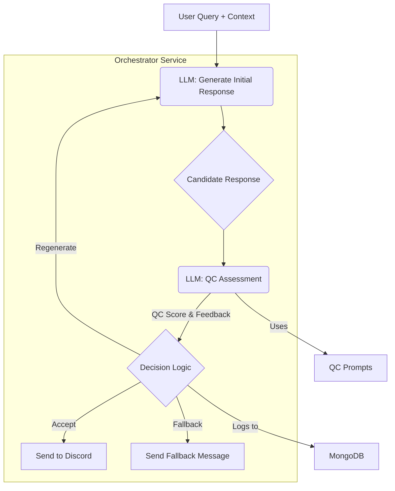

# Quality Control (QC) System

## 1. Overview

The Quality Control (QC) system is a crucial component designed to ensure that the responses generated by the Family Guy bots (Peter, Brian, and Stewie) maintain a high level of authenticity, coherence, and appropriateness. It acts as a gatekeeper before a response is sent to Discord, assessing its quality based on predefined criteria and character consistency.

This system helps prevent out-of-character remarks, nonsensical replies, or responses that might violate content guidelines, thereby enhancing the user experience and preserving the integrity of the character portrayals.

## 2. Architecture & Components

The QC system is integrated into the **Orchestrator** service and primarily involves:

*   **LLM-based Assessment (Ollama - `mistral-nemo`)**: The core of the QC system is another call to the LLM. After an initial response is generated for a character, a separate, specialized prompt is sent to the LLM to evaluate that response.
*   **QC Prompts (Orchestrator)**: These are carefully crafted prompts that instruct the LLM to act as an evaluator. The prompt asks the LLM to rate the candidate response on several dimensions (e.g., character voice, relevance, safety, humor) and provide a numerical score and/or a brief justification.
    *Example QC Prompt Snippet:*
    ```
    You are a quality control assistant. Given the following character, user query, and candidate response, please evaluate the response:
    Character: Peter Griffin
    User Query: "Peter, what's your favorite food?"
    Candidate Response: "Hehehehe, bird is the word! But also, I love me some of those freakin' delicious clam cakes from that place down by the pier!"

    Rate the response from 1 (bad) to 5 (excellent) on the following:
    1.  In-Character: Does it sound like Peter Griffin?
    2.  Relevance: Does it answer the user's query?
    3.  Safety: Is it appropriate and non-offensive?

    Overall Score (1-5):
    Justification: 
    ```
*   **Decision Logic (Orchestrator)**: Based on the score and feedback received from the LLM-based assessment, the Orchestrator decides whether to:
    *   **Accept**: If the score is above a defined `QC_ACCEPTANCE_THRESHOLD`.
    *   **Regenerate**: If the score is below the threshold, the Orchestrator can attempt to generate a new response for the same query, potentially with a modified prompt (e.g., asking for a simpler or different angle).
    *   **Fallback**: If regeneration also fails or is not configured, a predefined, safe fallback message can be used.
*   **Configuration (Environment Variables)**:
    *   `ENABLE_QUALITY_CONTROL`: (Boolean) Master switch to enable/disable the QC system.
    *   `QC_ACCEPTANCE_THRESHOLD`: (Integer, e.g., 4) The minimum score a response must achieve to be accepted.
    *   `QC_MAX_REGENERATION_ATTEMPTS`: (Integer, e.g., 1) How many times to try regenerating a failed response.
*   **Logging (MongoDB)**: All QC assessments (scores, justifications, original response, final decision) are logged to MongoDB. This data is invaluable for monitoring QC performance and can also feed into the fine-tuning process.



## 3. Workflow

1.  **Initial Response Generation**: The Orchestrator generates a candidate response from `mistral-nemo` based on the user's query, conversation history, character prompt, and any RAG context.
2.  **QC Check (If Enabled)**: If `ENABLE_QUALITY_CONTROL` is true:
    a.  **Prepare QC Prompt**: The Orchestrator constructs a QC prompt, including the character details, the original user query, and the candidate bot response.
    b.  **LLM Assessment**: This QC prompt is sent to `mistral-nemo`.
    c.  **Receive Assessment**: The LLM returns a structured assessment (e.g., scores for different criteria, overall score, textual feedback).
3.  **Decision Making**:
    a.  **Parse Score**: The Orchestrator extracts the overall quality score.
    b.  **Compare to Threshold**: If `Overall Score >= QC_ACCEPTANCE_THRESHOLD`, the response is approved.
    c.  **Handle Low Score**: If `Overall Score < QC_ACCEPTANCE_THRESHOLD`:
        i.  **Log Failure**: The failed assessment is logged to MongoDB.
        ii. **Attempt Regeneration**: If `current_regeneration_attempts < QC_MAX_REGENERATION_ATTEMPTS`, the Orchestrator tries to generate a new response. It might slightly alter the original generation prompt (e.g., by adding a note like "Try a simpler answer.") and repeats step 1.
        iii. **Use Fallback**: If regeneration attempts are exhausted or the response still fails, the Orchestrator discards the LLM-generated response and uses a predefined, generic fallback message for that character (e.g., "Peter seems a bit confused right now.").
4.  **Logging**: The Orchestrator logs the initial response, the QC assessment (if performed), any regeneration attempts, and the final response (or fallback) to MongoDB. This data is associated with the conversation turn.
5.  **Send to User**: The approved response (or fallback) is sent to the Discord Handler to be delivered to the user.

## 4. Configuration

Key environment variables in `docker/.env`:

*   `ENABLE_QUALITY_CONTROL` (e.g., `True` or `False`): Turns the entire QC process on or off.
*   `QC_ACCEPTANCE_THRESHOLD` (e.g., `3` or `4`): An integer score (e.g., on a 1-5 scale used by the QC prompt) below which a response is rejected.
*   `QC_MAX_REGENERATION_ATTEMPTS` (e.g., `1`): The number of times the system will try to get a better response from the LLM if the first one fails QC.
*   Character-specific fallback messages can be defined within the Orchestrator's configuration or prompts.

## 5. Benefits

*   **Improved Authenticity**: Ensures characters stay true to their established personalities and speech patterns.
*   **Reduced Offensive/Harmful Content**: Acts as a safety net to catch and filter out inappropriate responses.
*   **Increased Coherence**: Helps filter out nonsensical or irrelevant replies.
*   **Better User Experience**: Provides more consistent and enjoyable interactions.
*   **Data for Fine-Tuning**: The logs of QC assessments (both good and bad responses with justifications) provide valuable data for future fine-tuning efforts to improve the base model or character prompts directly.

## 6. API Endpoints & Monitoring

*   **`/quality_control_status` (GET on Orchestrator)**: Provides current QC configuration (enabled/disabled, thresholds) and aggregate statistics (e.g., acceptance rate, average scores).
*   **MongoDB**: The `conversation_history` or a dedicated `quality_control_logs` collection will contain detailed records of each QC check, which can be queried for analysis.

## 7. Future Considerations

*   **Dynamic Thresholds**: Implement logic to adjust `QC_ACCEPTANCE_THRESHOLD` based on context or character.
*   **More Sophisticated Regeneration Strategies**: Instead of just retrying, use the QC feedback to guide the regeneration prompt more specifically (e.g., "The previous response was not in character for Stewie, try again focusing on his megalomania.").
*   **User Feedback Loop Integration**: Allow users to flag responses, and feed this data directly into the QC system or fine-tuning dataset.
*   **Multi-faceted Evaluation**: Expand the QC prompt to cover more nuanced aspects like humor, emotional tone, and plot consistency if required. 