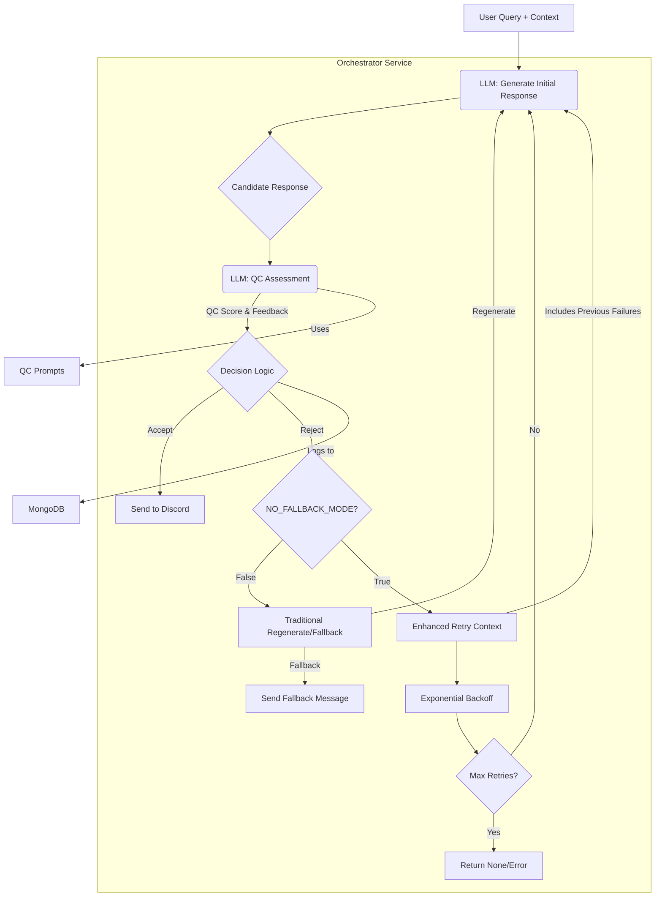

# Quality Control (QC) System

## 1. Overview

The Quality Control (QC) system is a crucial component designed to ensure that the responses generated by the Family Guy bots (Peter, Brian, and Stewie) maintain a high level of authenticity, coherence, and appropriateness. It acts as a gatekeeper before a response is sent to Discord, assessing its quality based on predefined criteria and character consistency.

This system helps prevent out-of-character remarks, nonsensical replies, or responses that might violate content guidelines, thereby enhancing the user experience and preserving the integrity of the character portrayals.

## 2. Architecture & Components

The QC system is integrated into the **Orchestrator** service and primarily involves:

*   **LLM-based Assessment (Ollama - `llama3:8b-instruct-q5_K_M`)**: The core of the QC system is another call to the LLM. After an initial response is generated for a character, a separate, specialized prompt is sent to the LLM to evaluate that response.
*   **QC Prompts (Orchestrator)**: These are carefully crafted prompts that instruct the LLM to act as an evaluator. The prompt asks the LLM to rate the candidate response on several dimensions (e.g., character voice, relevance, safety, humor) and provide a numerical score and/or a brief justification.
    *Example QC Prompt Snippet:*
    ```
    You are a quality control assistant. Given the following character, user query, and candidate response, please evaluate the response:
    Character: Peter Griffin
    User Query: "Peter, what's your favorite food?"
    Candidate Response: "Hehehehe, bird is the word! But also, I love me some of those freakin' delicious clam cakes from that place down by the pier!"

    Rate the response from 1 (bad) to 5 (excellent) on the following:
    1.  In-Character: Does it sound like Peter Griffin?
    2.  Relevance: Does it answer the user's query?
    3.  Safety: Is it appropriate and non-offensive?

    Overall Score (1-5):
    Justification: 
    ```
*   **Decision Logic (Orchestrator)**: Based on the score and feedback received from the LLM-based assessment, the Orchestrator decides whether to:
    *   **Accept**: If the score is above a defined `QC_ACCEPTANCE_THRESHOLD`.
    *   **Regenerate**: If the score is below the threshold, the Orchestrator can attempt to generate a new response for the same query, potentially with a modified prompt (e.g., asking for a simpler or different angle).
    *   **Fallback or NO_FALLBACK_MODE**: 
        *   **Traditional Mode**: If regeneration also fails or is not configured, a predefined, safe fallback message can be used.
        *   **NO_FALLBACK_MODE**: When enabled, the system uses infinite retry with exponential backoff instead of fallbacks, continuously attempting to generate valid responses until success or maximum attempts reached.
*   **Configuration (Environment Variables)**:
    *   `ENABLE_QUALITY_CONTROL`: (Boolean) Master switch to enable/disable the QC system.
    *   `QC_ACCEPTANCE_THRESHOLD`: (Integer, e.g., 4) The minimum score a response must achieve to be accepted.
    *   `QC_MAX_REGENERATION_ATTEMPTS`: (Integer, e.g., 1) How many times to try regenerating a failed response.
    *   `NO_FALLBACK_MODE`: (Boolean) Enable infinite retry system instead of fallback responses.
    *   `MAX_RETRY_ATTEMPTS`: (Integer, e.g., 10) Maximum retry attempts in NO_FALLBACK_MODE.
    *   `RETRY_BACKOFF_ENABLED`: (Boolean) Enable exponential backoff between retries.
    *   `RETRY_BACKOFF_MULTIPLIER`: (Float, e.g., 1.5) Multiplier for exponential backoff delays.
*   **Logging (MongoDB)**: All QC assessments (scores, justifications, original response, final decision) are logged to MongoDB. This data is invaluable for monitoring QC performance and can also feed into the fine-tuning process.



## 3. Workflow

1.  **Initial Response Generation**: The Orchestrator generates a candidate response from `llama3:8b-instruct-q5_K_M` based on the user's query, conversation history, character prompt, and any RAG context.
2.  **QC Check (If Enabled)**: If `ENABLE_QUALITY_CONTROL` is true:
    a.  **Prepare QC Prompt**: The Orchestrator constructs a QC prompt, including the character details, the original user query, and the candidate bot response.
    b.  **LLM Assessment**: This QC prompt is sent to `llama3:8b-instruct-q5_K_M`.
    c.  **Receive Assessment**: The LLM returns a structured assessment (e.g., scores for different criteria, overall score, textual feedback).
3.  **Decision Making**:
    a.  **Parse Score**: The Orchestrator extracts the overall quality score.
    b.  **Compare to Threshold**: If `Overall Score >= QC_ACCEPTANCE_THRESHOLD`, the response is approved.
    c.  **Handle Low Score**: If `Overall Score < QC_ACCEPTANCE_THRESHOLD`:
        i.  **Log Failure**: The failed assessment is logged to MongoDB.
        ii. **Check Mode**: The system checks if `NO_FALLBACK_MODE` is enabled:
            *   **Traditional Mode**: If `current_regeneration_attempts < QC_MAX_REGENERATION_ATTEMPTS`, the Orchestrator tries to generate a new response. It might slightly alter the original generation prompt (e.g., by adding a note like "Try a simpler answer.") and repeats step 1. If regeneration attempts are exhausted, it uses a predefined, generic fallback message for that character (e.g., "Peter seems a bit confused right now.").
            *   **NO_FALLBACK_MODE**: The system enters infinite retry mode with enhanced context and exponential backoff:
                - **Enhanced Retry Context**: Includes the rejected response and specific failure reasons in the next attempt
                - **Exponential Backoff**: Applies increasing delays between retry attempts to prevent overwhelming the LLM
                - **Failure Type Guidance**: Provides specific guidance based on failure type (length, third person, self-addressing, repetitive)
                - **Maximum Attempts**: Continues until success or `MAX_RETRY_ATTEMPTS` is reached
                - **Graceful Failure**: Returns None if all attempts are exhausted, allowing calling code to handle the failure appropriately
4.  **Logging**: The Orchestrator logs the initial response, the QC assessment (if performed), any regeneration attempts, and the final response (or fallback) to MongoDB. This data is associated with the conversation turn.
5.  **Send to User**: The approved response (or fallback) is sent to the Discord Handler to be delivered to the user.

## 4. Configuration

Key environment variables in `docker/.env`:

### Traditional Quality Control
*   `ENABLE_QUALITY_CONTROL` (e.g., `True` or `False`): Turns the entire QC process on or off.
*   `QC_ACCEPTANCE_THRESHOLD` (e.g., `3` or `4`): An integer score (e.g., on a 1-5 scale used by the QC prompt) below which a response is rejected.
*   `QC_MAX_REGENERATION_ATTEMPTS` (e.g., `1`): The number of times the system will try to get a better response from the LLM if the first one fails QC.

### NO_FALLBACK_MODE Configuration
*   `NO_FALLBACK_MODE` (e.g., `True` or `False`): Enable infinite retry system instead of fallback responses.
*   `MAX_RETRY_ATTEMPTS` (e.g., `10`): Maximum retry attempts before giving up in NO_FALLBACK_MODE.
*   `RETRY_BACKOFF_ENABLED` (e.g., `True` or `False`): Enable exponential backoff delays between retries.
*   `RETRY_BACKOFF_MULTIPLIER` (e.g., `1.5`): Multiplier for exponential backoff delays.
*   `ENHANCED_RETRY_CONTEXT_ENABLED` (e.g., `True` or `False`): Include previous failure context in retries.

### Adaptive Quality Control (Advanced)
*   `ADAPTIVE_QUALITY_CONTROL_ENABLED` (e.g., `True` or `False`): Enable adaptive quality thresholds based on conversation richness.
*   `COLD_START_THRESHOLD` (e.g., `30.0`): Quality threshold for conversations with 0-6 messages.
*   `WARM_CONVERSATION_THRESHOLD` (e.g., `60.0`): Quality threshold for conversations with 7-20 messages.
*   `HOT_CONVERSATION_THRESHOLD` (e.g., `75.0`): Quality threshold for conversations with 21+ messages.

### Legacy Configuration
*   Character-specific fallback messages can be defined within the Orchestrator's configuration or prompts (used only when NO_FALLBACK_MODE is disabled).

## 5. Benefits

### Traditional Quality Control Benefits
*   **Improved Authenticity**: Ensures characters stay true to their established personalities and speech patterns.
*   **Reduced Offensive/Harmful Content**: Acts as a safety net to catch and filter out inappropriate responses.
*   **Increased Coherence**: Helps filter out nonsensical or irrelevant replies.
*   **Better User Experience**: Provides more consistent and enjoyable interactions.
*   **Data for Fine-Tuning**: The logs of QC assessments (both good and bad responses with justifications) provide valuable data for future fine-tuning efforts to improve the base model or character prompts directly.

### NO_FALLBACK_MODE Additional Benefits
*   **Elimination of Generic Responses**: Completely removes fallback messages like "Hehehe, my brain just went blank" that break character immersion.
*   **Higher Quality Standards**: Only authentic, contextual responses that meet quality thresholds are sent to users.
*   **Intelligent Learning**: Enhanced retry context allows the system to learn from specific failures and improve on subsequent attempts.
*   **Character Consistency**: Maintains character authenticity throughout the retry process without falling back to generic responses.
*   **Adaptive Performance**: Works seamlessly with adaptive quality control to provide appropriate retry behavior based on conversation richness.
*   **Comprehensive Monitoring**: Detailed logging of retry attempts, failure patterns, and success rates for performance optimization.

## 6. API Endpoints & Monitoring

*   **`/quality_control_status` (GET on Orchestrator)**: Provides current QC configuration (enabled/disabled, thresholds) and aggregate statistics (e.g., acceptance rate, average scores).
*   **MongoDB**: The `conversation_history` or a dedicated `quality_control_logs` collection will contain detailed records of each QC check, which can be queried for analysis.

## 7. Future Considerations

### Traditional Quality Control Enhancements
*   **Dynamic Thresholds**: Implement logic to adjust `QC_ACCEPTANCE_THRESHOLD` based on context or character (partially implemented via Adaptive Quality Control).
*   **User Feedback Loop Integration**: Allow users to flag responses, and feed this data directly into the QC system or fine-tuning dataset.
*   **Multi-faceted Evaluation**: Expand the QC prompt to cover more nuanced aspects like humor, emotional tone, and plot consistency if required.

### NO_FALLBACK_MODE Enhancements
*   **Adaptive Retry Limits**: Adjust `MAX_RETRY_ATTEMPTS` based on success rates and conversation context.
*   **Character-Specific Retry Strategies**: Different retry approaches for different characters based on their typical failure patterns.
*   **Intelligent Backoff**: Adjust delays based on failure type and LLM load.
*   **Circuit Breaker Pattern**: Automatically disable NO_FALLBACK_MODE if failure rates become too high.
*   **Prompt Variation**: Try different prompt variations on retries instead of just enhanced context.
*   **Model Switching**: Use different LLM models for retries if available.

### Advanced Features
*   **Failure Prediction**: Use machine learning to predict likely failures before generation.
*   **Context Optimization**: Automatically improve retry context based on success patterns.
*   **Real-Time Performance Tuning**: Adjust quality control parameters based on real-time performance metrics.
*   **Hybrid Fallback Strategy**: Intelligent switching between NO_FALLBACK_MODE and traditional fallbacks based on system load and performance. 