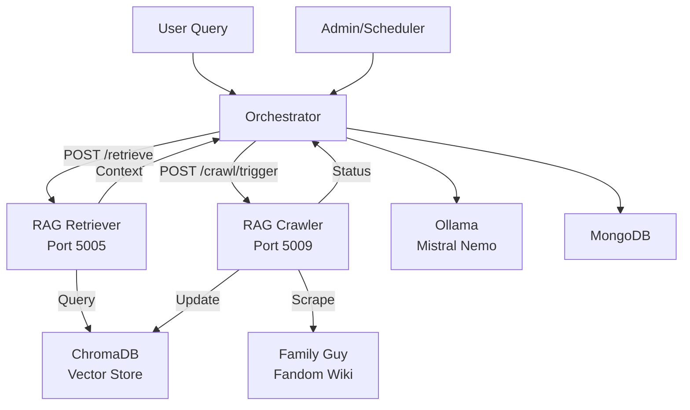

# RAG System Documentation - Microservices Architecture

## Overview

The RAG (Retrieval Augmented Generation) system has been architected as **two separate microservices** to optimize for different operational patterns and provide better separation of concerns:

1. **RAG Retriever Service** (Port 5005) - Real-time context retrieval
2. **RAG Crawler Service** (Port 5009) - Web scraping and vector database population

This separation allows for independent scaling, specialized optimization, and better fault isolation.

## Architecture Diagram



## RAG Retriever Service

### Purpose
Handles real-time context retrieval for user queries with low latency and high availability.

### Technology Stack
- **Framework**: Python Flask
- **Embeddings**: SentenceTransformers (all-MiniLM-L6-v2)
- **Vector Database**: ChromaDB (read operations)
- **HTTP Client**: Requests for API communication

### Key Features
- **Fast Query Processing**: Optimized for sub-second response times
- **Semantic Search**: Uses vector similarity for context matching
- **Result Filtering**: Applies relevance score thresholds
- **Health Monitoring**: Comprehensive status reporting

### API Endpoints

#### POST /retrieve
Retrieve relevant context for a given query.

**Request:**
```json
{
    "query": "Peter Griffin chicken fight",
    "num_results": 3,
    "min_relevance_score": 0.7
}
```

**Response:**
```json
{
    "success": true,
    "context": "In the episode 'Da Boom', Peter Griffin engages in a prolonged fight with Ernie the Giant Chicken...",
    "documents_found": 3,
    "query_processed": "Peter Griffin chicken fight",
    "results": [
        {
            "content": "In the episode 'Da Boom', Peter Griffin engages in a prolonged fight with Ernie the Giant Chicken...",
            "source": "familyguy.fandom.com/wiki/Ernie_the_Giant_Chicken",
            "relevance_score": 0.89
        }
    ]
}
```

#### GET /health
Service health check and status.

**Response:**
```json
{
    "service_name": "RAG_Retriever_Service",
    "status": "healthy",
    "timestamp": "2024-01-15T10:30:00Z",
    "dependencies": {
        "mongodb": "connected",
        "embeddings_model": "loaded",
        "vector_store": "ready"
    }
}
```

#### GET /vector_store_status
Vector store information and statistics.

**Response:**
```json
{
    "vector_store": "ChromaDB",
    "document_count": 1500,
    "status": "available",
    "path": "/app/chroma_db"
}
```

### Configuration
```bash
# Environment Variables
RAG_RETRIEVER_PORT=5005
CHROMA_DB_PATH=/app/chroma_db
EMBEDDINGS_MODEL=all-MiniLM-L6-v2
```

## RAG Crawler Service

### Purpose
Handles web scraping, content processing, and vector database population as batch operations.

### Technology Stack
- **Framework**: Python Flask
- **Web Scraping**: BeautifulSoup, Scrapy
- **Text Processing**: LangChain text splitters
- **Embeddings**: SentenceTransformers (all-MiniLM-L6-v2)
- **Vector Database**: ChromaDB (write operations)

### Key Features
- **Intelligent Crawling**: Respects robots.txt and implements delays
- **Content Processing**: Advanced text extraction and chunking
- **Batch Operations**: Efficient large-scale vector updates
- **Status Tracking**: Comprehensive crawl monitoring
- **Error Handling**: Robust failure recovery

### API Endpoints

#### POST /crawl/start
Start a new crawling operation.

**Request:**
```json
{
    "start_url": "https://familyguy.fandom.com/wiki/Main_Page",
    "max_pages": 100,
    "delay": 1,
    "update_existing": false
}
```

**Response:**
```json
{
    "message": "Crawl started successfully",
    "status": "started",
    "crawl_id": "crawl_20240115_103000",
    "parameters": {
        "start_url": "https://familyguy.fandom.com/wiki/Main_Page",
        "max_pages": 100,
        "delay": 1
    },
    "timestamp": "2024-01-15T10:30:00Z"
}
```

#### POST /crawl/stop
Stop the current crawling operation.

**Response:**
```json
{
    "message": "Crawl stop requested",
    "status": "stopping",
    "note": "Crawl will stop after current page completes"
}
```

#### GET /crawl/status
Get current crawl status and history.

**Response:**
```json
{
    "service_name": "RAG_Crawler_Service",
    "crawl_in_progress": false,
    "current_crawl": null,
    "last_crawl": {
        "crawl_id": "crawl_20240115_103000",
        "timestamp": "2024-01-15T10:30:00Z",
        "status": "SUCCESS",
        "pages_crawled": 150,
        "documents_added": 1200,
        "documents_updated": 50,
        "error_message": null,
        "duration_seconds": 1800
    }
}
```

#### GET /health
Service health check and crawl status.

**Response:**
```json
{
    "service_name": "RAG_Crawler_Service",
    "status": "healthy",
    "timestamp": "2024-01-15T10:30:00Z",
    "crawl_status": "idle",
    "dependencies": {
        "mongodb": "connected",
        "embeddings_model": "loaded"
    }
}
```

#### GET /vector_store/info
Vector store information and statistics.

**Response:**
```json
{
    "vector_store": "ChromaDB",
    "document_count": 1500,
    "status": "available",
    "path": "/app/chroma_db",
    "last_update": "2024-01-15T10:30:00Z",
    "size_mb": 45.2
}
```

### Configuration
```bash
# Environment Variables
RAG_CRAWLER_PORT=5009
CHROMA_DB_PATH=/app/chroma_db
EMBEDDINGS_MODEL=all-MiniLM-L6-v2
FANDOM_WIKI_START_URL=https://familyguy.fandom.com/wiki/Main_Page
FANDOM_WIKI_MAX_PAGES=100
FANDOM_WIKI_CRAWL_DELAY=1
```

## Orchestrator Integration

### RAG Retrieval Integration
The orchestrator integrates with the RAG Retriever service for real-time context retrieval:

```python
def retrieve_context(query, num_results=3):
    """Retrieve context from RAG Retriever service."""
    try:
        response = requests.post(
            RAG_RETRIEVER_API_URL,
            json={
                "query": query,
                "num_results": num_results,
                "min_relevance_score": 0.7
            },
            timeout=10
        )
        
        if response.status_code == 200:
            data = response.json()
            if data.get("success"):
                return data.get("context", "")
        
        return ""
    except Exception as e:
        logger.error(f"RAG retrieval failed: {e}")
        return ""
```

### RAG Crawling Integration
The orchestrator provides endpoints to trigger and monitor crawling operations:

```python
@app.route('/crawl/trigger', methods=['POST'])
def trigger_crawl():
    """Trigger RAG crawling via RAG Crawler service."""
    try:
        crawl_data = request.get_json()
        
        response = requests.post(
            f"{RAG_CRAWLER_API_URL}/crawl/start",
            json=crawl_data,
            timeout=30
        )
        
        if response.status_code == 202:
            crawler_response = response.json()
            return jsonify({
                "message": "RAG crawl triggered successfully",
                "status": "initiated",
                "crawler_response": crawler_response,
                "timestamp": datetime.now().isoformat()
            }), 202
        else:
            return jsonify({
                "error": "Failed to trigger crawl",
                "status": response.status_code
            }), response.status_code
            
    except Exception as e:
        return jsonify({
            "error": f"Crawl trigger failed: {str(e)}"
        }), 500
```

## Workflow Examples

### Real-time Context Retrieval
1. User sends message: "Tell me about the chicken fight"
2. Orchestrator receives query
3. Orchestrator sends POST to RAG Retriever `/retrieve`
4. RAG Retriever generates query embedding
5. RAG Retriever searches ChromaDB
6. RAG Retriever returns relevant context
7. Orchestrator integrates context into LLM prompt
8. LLM generates response with context

### Batch Content Update
1. Admin triggers crawl via Orchestrator `/crawl/trigger`
2. Orchestrator forwards request to RAG Crawler `/crawl/start`
3. RAG Crawler validates no crawl in progress
4. RAG Crawler starts background crawling process
5. RAG Crawler scrapes Family Guy Fandom Wiki
6. RAG Crawler processes and chunks content
7. RAG Crawler generates embeddings
8. RAG Crawler updates ChromaDB
9. RAG Crawler updates status in MongoDB

## Benefits of Microservices Architecture

### Separation of Concerns
- **Retrieval Service**: Optimized for low-latency queries
- **Crawler Service**: Optimized for batch processing and web scraping
- **Clear Responsibilities**: Each service has a single, well-defined purpose

### Independent Scaling
- **Horizontal Scaling**: RAG Retriever can be scaled for high query loads
- **Vertical Scaling**: RAG Crawler can be allocated more resources for intensive operations
- **Resource Optimization**: Each service uses resources appropriate to its workload

### Operational Flexibility
- **Independent Updates**: Services can be updated without affecting each other
- **Different Schedules**: Retrieval runs continuously, crawling runs on schedule
- **Technology Specialization**: Each service can use optimal libraries and configurations

### Fault Isolation
- **Crawler Failures**: Don't affect real-time retrieval operations
- **Retrieval Issues**: Don't impact content crawling and updates
- **Graceful Degradation**: System continues operating with reduced functionality

## Monitoring and Management

### Health Checks
Both services provide comprehensive health check endpoints:
- Service status and uptime
- Dependency status (MongoDB, ChromaDB, embeddings model)
- Resource utilization
- Error rates and performance metrics

### Logging
Structured logging with different levels:
- **INFO**: Normal operations, successful requests
- **WARNING**: Non-critical issues, fallback operations
- **ERROR**: Failed operations, service errors
- **DEBUG**: Detailed operation traces

### Metrics
Key performance indicators:
- **Retrieval Service**: Query latency, cache hit rates, result relevance
- **Crawler Service**: Pages crawled per hour, success rates, vector store growth
- **Overall**: System availability, error rates, resource usage

## Configuration Management

### Environment Variables
```bash
# Shared Configuration
CHROMA_DB_PATH=/app/chroma_db
EMBEDDINGS_MODEL=all-MiniLM-L6-v2
MONGODB_URI=mongodb://mongodb:27017/family_guy_bot

# RAG Retriever Specific
RAG_RETRIEVER_PORT=5005
RAG_RETRIEVER_API_URL=http://rag-retriever:5005

# RAG Crawler Specific
RAG_CRAWLER_PORT=5009
RAG_CRAWLER_API_URL=http://rag-crawler:5009
FANDOM_WIKI_START_URL=https://familyguy.fandom.com/wiki/Main_Page
FANDOM_WIKI_MAX_PAGES=100
FANDOM_WIKI_CRAWL_DELAY=1

# Orchestrator Integration
RAG_RETRIEVER_API_URL=http://rag-retriever:5005/retrieve
RAG_CRAWLER_API_URL=http://rag-crawler:5009
```

### Docker Configuration
Both services share the same ChromaDB volume for data consistency:

```yaml
volumes:
  - ../chroma_db:/app/chroma_db
```

## Troubleshooting

### Common Issues

#### RAG Retriever Service
- **No results returned**: Check vector store status, verify embeddings model loaded
- **Slow queries**: Monitor ChromaDB performance, consider result caching
- **Connection errors**: Verify network connectivity, check service health

#### RAG Crawler Service
- **Crawl failures**: Check website accessibility, verify robots.txt compliance
- **Memory issues**: Monitor resource usage during large crawls
- **Vector store errors**: Check ChromaDB write permissions, disk space

### Performance Optimization

#### RAG Retriever
- **Caching**: Implement query result caching for common queries
- **Batch Processing**: Group multiple queries for efficiency
- **Index Optimization**: Regularly optimize ChromaDB indices

#### RAG Crawler
- **Parallel Processing**: Use multiple workers for large crawls
- **Incremental Updates**: Only crawl changed content
- **Resource Management**: Monitor memory usage during processing

This microservices architecture provides a robust, scalable, and maintainable foundation for the RAG system, enabling efficient real-time retrieval and flexible content management. 