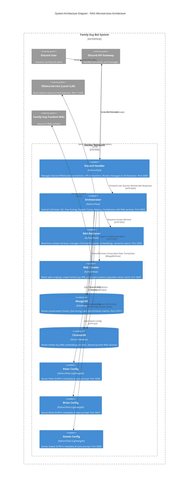
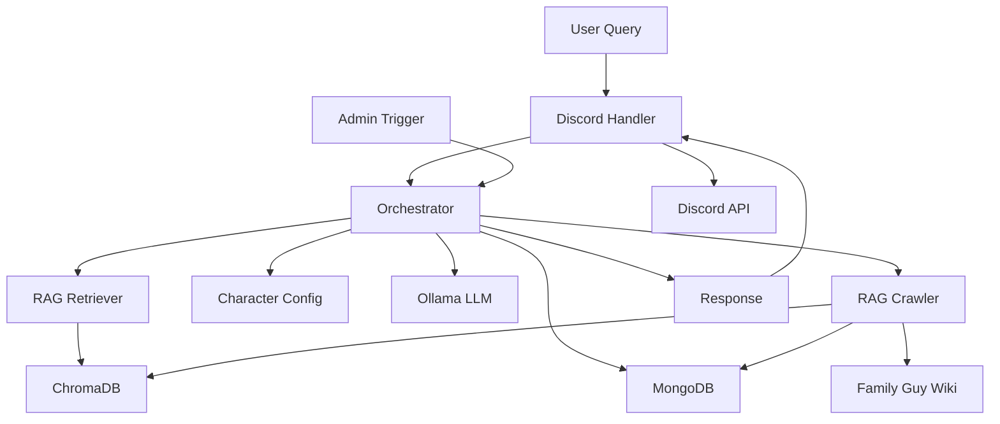
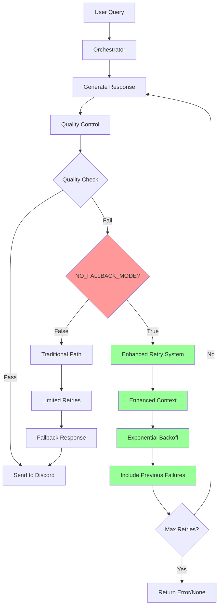
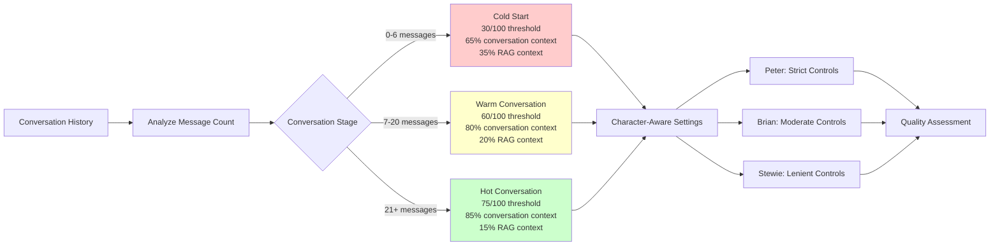
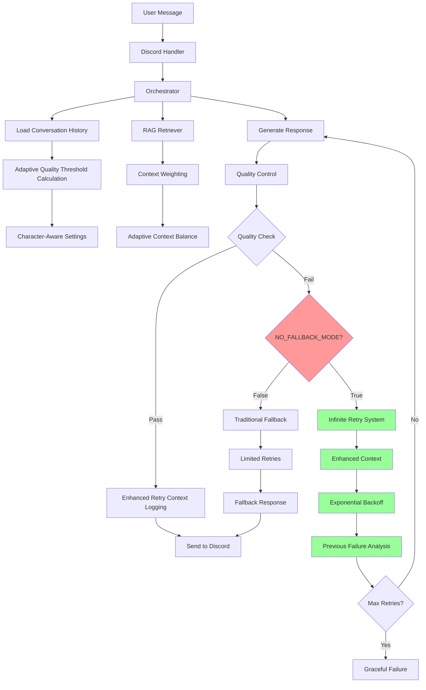

# System Architecture

## 1. Overview

This Family Guy Discord Bot system employs a microservices architecture, fully containerized with Docker and orchestrated via Docker Compose. The design prioritizes local LLM processing (using `mistral-nemo` via Ollama), modularity for easier development and scaling, and a clear separation of concerns. This document provides a more in-depth look at each service and its responsibilities than the overview in the main `README.md`.

**Key Architectural Change**: The RAG (Retrieval Augmented Generation) system has been separated into **two dedicated microservices** (`rag-retriever` and `rag-crawler`) to improve separation of concerns, enable independent scaling, optimize for different operational patterns, and provide a cleaner architecture.

## 2. Core Principles

*   **Local First**: All core LLM processing happens locally via Ollama, eliminating external API dependencies and costs for this crucial function.
*   **Microservices**: Each distinct piece of functionality (Discord interaction, LLM orchestration, RAG retrieval, RAG crawling, character configuration, database) is a separate service.
*   **Dockerization**: All services are containerized for consistent environments and simplified deployment.
*   **Centralized Orchestration**: A single `Orchestrator` service acts as the brain, handling complex logic like LLM calls, fine-tuning, and QC, while delegating RAG operations to the dedicated services.
*   **Stateless vs. Stateful**: Application services (Handler, Orchestrator, Character Configs, RAG services) aim to be largely stateless, relying on MongoDB and ChromaDB for persistent data.
*   **Operational Separation**: RAG retrieval (high-frequency, real-time) and RAG crawling (low-frequency, batch) are separated for optimal resource allocation and scaling.

## 3. Service Breakdown



### 3.1. Discord Handler (`discord-handler`)

*   **Technology**: Python, Flask, `discord.py` library.
*   **Responsibilities**:
    *   Connects to the Discord Gateway using the bot tokens for Peter, Brian, and Stewie.
    *   Listens for incoming messages, mentions, and other relevant Discord events.
    *   Parses incoming Discord messages to extract user intent, mentioned bot, content, channel ID, user ID, etc.
    *   Forwards processed requests to the Orchestrator's `/orchestrate` endpoint via an HTTP POST request.
    *   Receives the generated bot response from the Orchestrator.
    *   Formats and sends the response back to the appropriate Discord channel using the correct bot identity.
    *   Handles basic Discord API rate limits and connection retries.
*   **Key Interactions**: Discord API, Orchestrator.
*   **Dockerfile**: `docker/Dockerfile.discord_handler`
*   **State**: Largely stateless, but manages active Discord connections.

### 3.2. Orchestrator (`orchestrator`)

*   **Technology**: Python, Flask, LangChain, libraries for MongoDB and other utilities.
*   **Responsibilities (The "Brain")**:
    *   **LLM Interaction**: Constructs detailed prompts and sends requests to the local Ollama service (`mistral-nemo`) for text generation.
    *   **Character Coordination**: Determines which character should respond or initiate a conversation.
    *   **Prompt Engineering**: Manages complex prompt templates incorporating character personality, conversation history, RAG context, and user query.
    *   **RAG Coordination**: 
        *   Requests context retrieval from the RAG Retriever service for real-time queries.
        *   Triggers crawling operations via the RAG Crawler service for content updates.
        *   Integrates retrieved context into LLM prompts.
    *   **Adaptive Quality Control (QC)**: Dynamically adjusts quality standards based on conversation richness (30-75/100 thresholds) and applies character-aware anti-hallucination measures. Uses LLM-based evaluation for authenticity, relevance, and safety with retry-based length validation.
    *   **NO_FALLBACK_MODE**: Advanced infinite retry system that eliminates generic fallback responses, using enhanced retry context and exponential backoff to continuously attempt response generation until quality standards are met.
    *   **Supervised Fine-Tuning Support**: Logs responses and quality assessments to MongoDB. Provides API endpoints for submitting ratings and triggering prompt optimization processes.
    *   **Enhanced Organic Conversation Coordination**: Monitors channel activity for both follow-up opportunities (immediate multi-character responses) and organic conversation initiation (proactive conversation starters during silence periods).
    *   **Conversation History Management**: Loads and saves conversation history from/to MongoDB to provide context to the LLM.
    *   **State Management**: Tracks session IDs, current speakers, and other conversational states.
    *   **API Endpoints**: Exposes various endpoints for Discord Handler interaction (`/orchestrate`), fine-tuning (`/rate_response`, `/optimization_report`, `/prompt_performance`, `/trigger_optimization`, `/fine_tuning_stats`), health checks (`/health`), crawl management (`/crawl/trigger`, `/crawl/status`), and status monitoring (`/quality_control_status`, `/organic_conversation_status`).
*   **Key Interactions**: Discord Handler, Ollama, RAG Retriever, RAG Crawler, MongoDB, Character Config services.
*   **Dockerfile**: `docker/Dockerfile.orchestrator`
*   **State**: Relies heavily on MongoDB for persistent state; maintains some in-memory caches or session details for short periods.

### 3.3. RAG Retriever (`rag-retriever`)

*   **Technology**: Python, Flask, LangChain, SentenceTransformers, ChromaDB.
*   **Responsibilities**:
    *   **Real-time Context Retrieval**: Provides fast, efficient semantic search and context retrieval for user queries.
    *   **Vector Database Queries**: Manages read operations on the ChromaDB vector database.
    *   **Embedding Generation**: Generates embeddings for incoming queries using SentenceTransformers.
    *   **Result Filtering**: Applies relevance score filtering and result ranking.
    *   **Health Monitoring**: Exposes health check endpoints and vector store status information.
    *   **API Endpoints**: 
        *   `/retrieve` (POST): Main endpoint for context retrieval given a query
        *   `/health` (GET): Health check and service status
        *   `/vector_store_status` (GET): Information about the current vector store state
*   **Key Interactions**: Orchestrator (primary consumer), ChromaDB (read operations).
*   **Dockerfile**: `docker/Dockerfile.rag_retriever`
*   **State**: Stateless application logic, accesses shared ChromaDB data via volume mounts.
*   **Operational Pattern**: High-frequency, low-latency operations (every user query).

### 3.4. RAG Crawler (`rag-crawler`)

*   **Technology**: Python, Flask, LangChain, SentenceTransformers, ChromaDB, BeautifulSoup, Scrapy.
*   **Responsibilities**:
    *   **Web Scraping**: Crawls the Family Guy Fandom Wiki and other content sources.
    *   **Content Processing**: Handles text extraction, cleaning, and chunking of scraped content.
    *   **Vector Database Population**: Generates embeddings and stores them in ChromaDB.
    *   **Crawl Management**: Manages crawling schedules, status tracking, and error handling.
    *   **Batch Operations**: Handles large-scale content updates and vector store maintenance.
    *   **API Endpoints**:
        *   `/crawl/start` (POST): Start a new crawling operation
        *   `/crawl/stop` (POST): Stop current crawling operation
        *   `/crawl/status` (GET): Get current crawl status and history
        *   `/health` (GET): Health check and service status
        *   `/vector_store/info` (GET): Vector store information and statistics
*   **Key Interactions**: Orchestrator (receives triggers), ChromaDB (write operations), External websites (scraping).
*   **Dockerfile**: `docker/Dockerfile.rag_crawler`
*   **State**: Maintains crawl state and progress; accesses shared ChromaDB data via volume mounts.
*   **Operational Pattern**: Low-frequency, high-resource batch operations (weekly/monthly crawls).

### 3.5. Character Configuration Services (`peter`, `brian`, `stewie`)

*   **Technology**: Python, Flask (very lightweight).
*   **Responsibilities**:
    *   Serve basic static configuration and metadata for each respective character.
    *   This typically includes the character's name, a detailed base system prompt outlining their personality, speech patterns, catchphrases, relationships, and any specific rules for their portrayal.
    *   Exposes a simple `/character_info` endpoint that the Orchestrator can call to get this data.
    *   **Crucially, these services DO NOT make any LLM calls themselves.** They are purely for providing configuration to the Orchestrator.
*   **Key Interactions**: Orchestrator.
*   **Dockerfile**: `docker/Dockerfile.bot_config` (a single generic Dockerfile for all three lightweight config services).
*   **State**: Stateless. Configuration is part of their codebase or loaded from simple files at startup.

### 3.6. MongoDB (`mongodb`)

*   **Technology**: Official `mongo:5.0` Docker image.
*   **Responsibilities**:
    *   **Conversation History**: Stores detailed logs of all interactions (user messages, bot responses, timestamps, channel, user, session ID).
    *   **Fine-Tuning Data**: Stores response ratings (automated QC scores, manual user ratings), feedback text, and versioned character prompts.
    *   **Performance Metrics**: Can store aggregated stats on response quality, character activity, etc.
    *   **RAG Crawl Status**: Timestamps and status of Family Guy Wiki crawls managed by RAG Crawler.
    *   **Dead Letter Queue (DLQ)**: Stores messages that failed processing or delivery for later inspection or retry.
*   **Key Interactions**: Orchestrator, RAG Crawler (for crawl status tracking).
*   **Persistence**: Data is persisted via a Docker named volume (`mongodb_data`).

### 3.7. Ollama (External Service)

*   **Technology**: Ollama running on the host machine (or accessible on the network).
*   **Responsibilities**:
    *   Serves the `mistral-nemo` Large Language Model.
    *   Handles the actual LLM inference (text generation) based on prompts received from the Orchestrator.
    *   Exposes an API (typically on `http://host.docker.internal:11434` from within Docker containers) that the Orchestrator calls.
*   **Key Interactions**: Orchestrator.
*   **Note**: While essential, Ollama runs *outside* the project's Docker Compose setup but must be accessible by it.

### 3.8. ChromaDB (RAG Vector Store)

*   **Technology**: ChromaDB library used within both RAG services; data stored on a persistent volume.
*   **Responsibilities**:
    *   Stores vector embeddings of text chunks from the Family Guy Fandom Wiki.
    *   Enables efficient semantic similarity searches for the RAG system.
*   **Key Interactions**: 
    *   RAG Retriever (queries and reads)
    *   RAG Crawler (writes and updates)
*   **Persistence**: Data is persisted via a Docker volume mount (`../chroma_db:/app/chroma_db`), ensuring the RAG index survives container restarts.
*   **Shared Access**: Both RAG services access the same ChromaDB instance through shared volume mounts.

## 4. Communication Flow (Example: User Message)

1.  **User** sends a message (e.g., `@Peter hello`) in Discord.
2.  **Discord API** forwards this to the **Discord Handler**.
3.  **Discord Handler** identifies Peter as the target, processes the message, and `POST`s it to `Orchestrator:/orchestrate`.
4.  **Orchestrator**:
    a.  Loads conversation history from **MongoDB**.
    b.  (If RAG is relevant) Sends `POST` request to **RAG Retriever** `/retrieve` endpoint with the user query.
    c.  **RAG Retriever** processes the query, searches **ChromaDB**, and returns relevant context.
    d.  (If Character Config not cached) `GET`s Peter's config from `Peter Config:/character_info`.
    e.  Constructs a full prompt for **Ollama** including the retrieved context.
    f.  Sends prompt to **Ollama**, receives generated text.
    g.  (If QC enabled) Performs QC assessment using **Ollama** again.
    h.  Saves response and any QC/tuning data to **MongoDB**.
    i.  Returns the final response to the **Discord Handler**.
5.  **Discord Handler** sends Peter's response back to Discord via the **Discord API**.
6.  **User** sees Peter's reply.

### 4.1. RAG Retrieval Flow (Detailed)

When the Orchestrator needs context for a user query:

1.  **Orchestrator** sends `POST /retrieve` to **RAG Retriever** with:
    ```json
    {
        "query": "chicken fight construction site",
        "num_results": 3,
        "min_relevance_score": 0.7
    }
    ```
2.  **RAG Retriever**:
    a.  Generates embedding for the query using SentenceTransformers
    b.  Performs similarity search in **ChromaDB**
    c.  Filters results by relevance score
    d.  Formats and returns context chunks
3.  **RAG Retriever** responds with:
    ```json
    {
        "success": true,
        "context": "In the episode 'Da Boom', Peter Griffin engages in a prolonged fight with Ernie the Giant Chicken...",
        "documents_found": 3,
        "results": [
            {
                "content": "In the episode 'Da Boom', Peter Griffin engages in a prolonged fight with Ernie the Giant Chicken...",
                "source": "familyguy.fandom.com/wiki/Ernie_the_Giant_Chicken",
                "relevance_score": 0.89
            }
        ]
    }
    ```

### 4.2. RAG Crawling Flow (Detailed)

When new content needs to be added to the vector store:

1.  **Admin/Scheduler** triggers crawl via **Orchestrator** `POST /crawl/trigger` with:
    ```json
    {
        "start_url": "https://familyguy.fandom.com/wiki/Main_Page",
        "max_pages": 100,
        "delay": 1
    }
    ```
2.  **Orchestrator** forwards request to **RAG Crawler** `POST /crawl/start`.
3.  **RAG Crawler**:
    a.  Validates no crawl is currently in progress
    b.  Starts background crawling process
    c.  Scrapes content from Family Guy Fandom Wiki
    d.  Processes and chunks text content
    e.  Generates embeddings using SentenceTransformers
    f.  Stores new vectors in **ChromaDB**
    g.  Updates crawl status in **MongoDB**
4.  **RAG Crawler** responds immediately with:
    ```json
    {
        "message": "Crawl started successfully",
        "status": "started",
        "parameters": {
            "start_url": "https://familyguy.fandom.com/wiki/Main_Page",
            "max_pages": 100,
            "delay": 1
        }
    }
    ```
5.  Crawl continues in background; status can be checked via `GET /crawl/status`.

## 5. RAG Microservices Benefits

### 5.1. Separation of Concerns
*   **RAG Retriever**: Optimized for real-time, low-latency context retrieval
*   **RAG Crawler**: Optimized for batch processing, web scraping, and data ingestion
*   **Orchestrator**: Focused on LLM coordination without RAG implementation details

### 5.2. Independent Scaling
*   **Retrieval Service**: Can be scaled horizontally for high query loads
*   **Crawler Service**: Can be scaled vertically for intensive scraping operations
*   **Resource Optimization**: Each service can be allocated resources based on its specific needs

### 5.3. Operational Flexibility
*   **Different Update Schedules**: Retrieval service runs continuously; crawler runs on schedule
*   **Maintenance Independence**: Can update/restart services independently
*   **Technology Specialization**: Each service can use optimal libraries and configurations

### 5.4. Fault Isolation
*   **Crawler Failures**: Don't affect real-time retrieval operations
*   **Retrieval Issues**: Don't impact content crawling and updates
*   **Graceful Degradation**: System can operate with reduced functionality if one RAG service fails

## 6. Port Assignments

| Service | Port | Purpose |
|---------|------|---------|
| Orchestrator | 5003 | Central coordination and LLM processing |
| Discord Handler | 5004 | Discord API interactions |
| RAG Retriever | 5005 | Real-time context retrieval |
| Peter Config | 5006 | Peter Griffin character configuration |
| Brian Config | 5007 | Brian Griffin character configuration |
| Stewie Config | 5008 | Stewie Griffin character configuration |
| RAG Crawler | 5009 | Web scraping and vector store population |
| MongoDB | 27017 | Database operations |
| Ollama | 11434 | Local LLM inference (external) |

## 7. Data Flow and Dependencies



## 8. Advanced Features Integration

### 8.1. NO_FALLBACK_MODE Integration

The NO_FALLBACK_MODE feature integrates seamlessly with the existing quality control and retry systems:



### 8.2. Adaptive Quality Control Flow

The adaptive quality control system adjusts thresholds based on conversation richness:



### 8.3. Complete System Integration

This diagram shows how all advanced features work together:



This architecture provides a robust, scalable, and maintainable foundation for the Family Guy Discord Bot system, with clear separation of concerns, optimized resource utilization across different operational patterns, and advanced quality control features that ensure high-quality, authentic character responses. 