# System Architecture

## 1. Overview

This Family Guy Discord Bot system employs a microservices architecture, fully containerized with Docker and orchestrated via Docker Compose. The design prioritizes local LLM processing (using `llama3:8b-instruct-q5_K_M` via Ollama), modularity for easier development and scaling, and a clear separation of concerns. This document provides a more in-depth look at each service and its responsibilities than the overview in the main `README.md`.

**Key Architectural Changes**: 
- The RAG (Retrieval Augmented Generation) system has been separated into **two dedicated microservices** (`rag-retriever` and `rag-crawler`) to improve separation of concerns, enable independent scaling, optimize for different operational patterns, and provide a cleaner architecture.
- **KeyDB replaces Redis** for improved performance and better memory efficiency
- **12 total microservices** provide complete separation of concerns

## 2. Core Principles

*   **Local First**: All core LLM processing happens locally via Ollama, eliminating external API dependencies and costs for this crucial function.
*   **Microservices**: Each distinct piece of functionality (Discord interaction, LLM orchestration, RAG retrieval, RAG crawling, character configuration, caching) is a separate service.
*   **Dockerization**: All services are containerized for consistent environments and simplified deployment.
*   **Centralized Orchestration**: The `Message Router` service acts as the central hub, while the `Orchestrator` handles organic conversations and the `LLM Service` provides centralized language model access.
*   **Stateless vs. Stateful**: Application services aim to be largely stateless, relying on KeyDB for caching and ChromaDB for persistent vector data.
*   **Operational Separation**: RAG retrieval (high-frequency, real-time) and RAG crawling (low-frequency, batch) are separated for optimal resource allocation and scaling.

## 3. Service Breakdown

```mermaid
graph TB
    subgraph "Discord Interface Layer"
        PETER_BOT[Peter Discord<br/>Port 6011<br/>🍺]
        BRIAN_BOT[Brian Discord<br/>Port 6012<br/>🐕]
        STEWIE_BOT[Stewie Discord<br/>Port 6013<br/>👶]
    end
    
    subgraph "Core Processing Layer"
        MESSAGE_ROUTER[Message Router<br/>Port 6005<br/>🎯]
        LLM_SERVICE[LLM Service<br/>Port 6001<br/>🧠]
        QUALITY_CONTROL[Quality Control<br/>Port 6003<br/>🔍]
    end
    
    subgraph "Intelligence Layer"
        CONVERSATION_COORD[Conversation Coordinator<br/>Port 6002<br/>🎭]
        ORCHESTRATOR[Orchestrator<br/>Port 6008<br/>🌱]
        FINE_TUNING[Fine Tuning<br/>Port 6004<br/>📈]
    end
    
    subgraph "Knowledge Layer"
        CHARACTER_CONFIG[Character Config<br/>Port 6006<br/>📝]
        RAG_RETRIEVER[RAG Retriever<br/>Port 6007<br/>📚]
        RAG_CRAWLER[RAG Crawler<br/>Port 6009<br/>🕷️]
    end
    
    subgraph "Infrastructure Layer"
        KEYDB[(KeyDB Cache<br/>Port 6379<br/>⚡)]
        KEYDB_UI[KeyDB Commander<br/>Port 8081<br/>🖥️]
        OLLAMA[Ollama LLM<br/>Local RTX GPU<br/>🚀]
        CHROMADB[(ChromaDB<br/>Vector Store<br/>🔢)]
    end
    
    PETER_BOT --> MESSAGE_ROUTER
    BRIAN_BOT --> MESSAGE_ROUTER
    STEWIE_BOT --> MESSAGE_ROUTER
    
    MESSAGE_ROUTER --> LLM_SERVICE
    MESSAGE_ROUTER --> CHARACTER_CONFIG
    MESSAGE_ROUTER --> RAG_RETRIEVER
    MESSAGE_ROUTER --> CONVERSATION_COORD
    MESSAGE_ROUTER --> QUALITY_CONTROL
    MESSAGE_ROUTER --> FINE_TUNING
    
    ORCHESTRATOR --> MESSAGE_ROUTER
    ORCHESTRATOR --> LLM_SERVICE
    ORCHESTRATOR --> RAG_RETRIEVER
    ORCHESTRATOR --> PETER_BOT
    ORCHESTRATOR --> BRIAN_BOT
    ORCHESTRATOR --> STEWIE_BOT
    
    LLM_SERVICE --> OLLAMA
    RAG_RETRIEVER --> CHROMADB
    RAG_CRAWLER --> CHROMADB
    
    MESSAGE_ROUTER --> KEYDB
    ORCHESTRATOR --> KEYDB
    RAG_RETRIEVER --> KEYDB
    KEYDB --> KEYDB_UI
    
    style PETER_BOT fill:#ff9999
    style BRIAN_BOT fill:#99ff99  
    style STEWIE_BOT fill:#9999ff
    style ORCHESTRATOR fill:#ffff99
    style KEYDB fill:#ff99ff
```

### 3.1. Discord Handler Services (`peter-discord`, `brian-discord`, `stewie-discord`)

*   **Technology**: Python, Flask, `discord.py` library.
*   **Ports**: 6011 (Peter), 6012 (Brian), 6013 (Stewie)
*   **Responsibilities**:
    *   Each service connects to Discord using its respective bot token
    *   Listens for incoming messages, mentions, and other relevant Discord events
    *   Parses incoming Discord messages to extract user intent, mentioned bot, content, channel ID, user ID, etc.
    *   Forwards processed requests to the Message Router's `/orchestrate` endpoint via HTTP POST
    *   Receives the generated bot response from the Message Router
    *   Formats and sends the response back to the appropriate Discord channel using the correct bot identity
    *   Handles basic Discord API rate limits and connection retries
*   **Key Interactions**: Discord API, Message Router
*   **State**: Largely stateless, but manages active Discord connections

### 3.2. Message Router (`message-router`)

*   **Technology**: Python, Flask, Requests, KeyDB integration
*   **Port**: 6005
*   **Responsibilities (Central Hub)**:
    *   **Request Routing**: Routes incoming messages to appropriate services based on content type and character
    *   **Service Orchestration**: Coordinates calls between LLM Service, Character Config, RAG Retriever, Quality Control, and other services
    *   **Response Assembly**: Combines outputs from multiple services into final responses
    *   **Caching Management**: Implements response caching via KeyDB to improve performance
    *   **Load Balancing**: Distributes requests across available service instances
    *   **Health Monitoring**: Monitors the health of downstream services
*   **Key Interactions**: All Discord Handlers, LLM Service, Character Config, RAG services, Quality Control, Conversation Coordinator, Fine Tuning
*   **State**: Stateless with KeyDB for caching

### 3.3. LLM Service (`llm-service`)

*   **Technology**: Python, Flask, LangChain, Ollama client
*   **Port**: 6001
*   **Responsibilities (Centralized AI)**:
    *   **Ollama Integration**: Single point of access for all LLM operations using `llama3:8b-instruct-q5_K_M`
    *   **Response Generation**: Processes prompts and generates character-appropriate responses
    *   **Response Caching**: Caches LLM responses in KeyDB to reduce duplicate API calls
    *   **Model Management**: Handles model configuration and optimization
    *   **Performance Monitoring**: Tracks response times and quality metrics
*   **Key Interactions**: Message Router, Orchestrator, Ollama
*   **State**: Stateless with aggressive KeyDB caching

### 3.4. Quality Control (`quality-control`)

*   **Technology**: Python, Flask, ML analysis libraries
*   **Port**: 6003
*   **Responsibilities**:
    *   **Adaptive Quality Assessment**: Dynamically adjusts quality thresholds based on conversation depth (30-75/100)
    *   **Character-Specific Controls**: Applies different quality standards for Peter, Brian, and Stewie
    *   **Anti-Hallucination**: Prevents responses that are out of character or factually incorrect
    *   **Response Validation**: Ensures responses meet length, content, and safety requirements
    *   **NO_FALLBACK_MODE**: Implements infinite retry system with enhanced context
*   **Key Interactions**: Message Router, LLM Service
*   **State**: Stateless with configuration caching

### 3.5. Orchestrator (`orchestrator`)

*   **Technology**: Python, Flask, KeyDB, ML libraries
*   **Port**: 6008
*   **Responsibilities (Organic Conversations)**:
    *   **Organic Conversation Management**: Monitors channel activity and initiates natural conversations
    *   **Follow-up Coordination**: Triggers character responses based on content analysis
    *   **Timing Management**: Controls conversation flow with appropriate delays
    *   **Character Selection**: Determines which character should respond to specific topics
    *   **Dynamic Starter Generation**: Creates LLM-generated conversation starters with character context
*   **Key Interactions**: Message Router, LLM Service, RAG Retriever, Discord Handlers
*   **State**: Uses KeyDB for conversation state tracking

### 3.6. Conversation Coordinator (`conversation-coordinator`)

*   **Technology**: Python, Flask, KeyDB
*   **Port**: 6002
*   **Responsibilities**:
    *   **Character Selection Logic**: Implements intelligent character selection based on content
    *   **Personality Matching**: Matches topics to character interests and speaking patterns
    *   **Response Coordination**: Ensures appropriate character responses to user interactions
    *   **Multi-Character Dynamics**: Manages interactions between characters
*   **Key Interactions**: Message Router, KeyDB
*   **State**: Uses KeyDB for character state and preferences

### 3.7. Fine Tuning (`fine-tuning`)

*   **Technology**: Python, Flask, KeyDB, ML analysis
*   **Port**: 6004
*   **Responsibilities**:
    *   **Response Optimization**: A/B tests different prompt strategies
    *   **Performance Analytics**: Tracks response quality and user engagement
    *   **Prompt Evolution**: Continuously improves character prompts based on feedback
    *   **Quality Metrics**: Provides detailed analytics on response effectiveness
*   **Key Interactions**: Message Router, KeyDB
*   **State**: Uses KeyDB for metrics and optimization data

### 3.8. Character Config (`character-config`)

*   **Technology**: Python, Flask (lightweight)
*   **Port**: 6006
*   **Responsibilities**:
    *   **Character Metadata**: Serves character configurations including prompts, personality traits, and speaking patterns
    *   **Prompt Management**: Manages versioned character prompts for Peter, Brian, and Stewie
    *   **Configuration Caching**: Implements 24-hour caching for character configurations
    *   **Dynamic Updates**: Allows for runtime character configuration updates
*   **Key Interactions**: Message Router
*   **State**: Stateless with configuration caching in KeyDB

### 3.9. RAG Retriever (`rag-retriever`)

*   **Technology**: Python, Flask, LangChain, SentenceTransformers, ChromaDB
*   **Port**: 6007
*   **Responsibilities**:
    *   **Real-time Context Retrieval**: Provides fast semantic search for user queries (<100ms)
    *   **Vector Database Queries**: Manages read operations on ChromaDB vector database
    *   **Embedding Generation**: Generates embeddings using `all-MiniLM-L6-v2` model
    *   **Result Caching**: Caches frequent queries in KeyDB for 1-hour TTL
    *   **Relevance Filtering**: Applies semantic relevance scoring and filtering
*   **Key Interactions**: Message Router, Orchestrator, ChromaDB, KeyDB
*   **State**: Stateless with query result caching
*   **Operational Pattern**: High-frequency, low-latency operations

### 3.10. RAG Crawler (`rag-crawler`)

*   **Technology**: Python, Flask, BeautifulSoup, ChromaDB, SentenceTransformers
*   **Port**: 6009
*   **Responsibilities**:
    *   **Web Scraping**: Crawls Family Guy Fandom Wiki and other content sources
    *   **Content Processing**: Handles text extraction, cleaning, and chunking
    *   **Vector Database Population**: Generates and stores embeddings in ChromaDB
    *   **Batch Operations**: Manages large-scale content updates and maintenance
    *   **Crawl Scheduling**: Handles automated crawling with configurable intervals
*   **Key Interactions**: Orchestrator, ChromaDB, External websites
*   **State**: Maintains crawl state and progress in local storage
*   **Operational Pattern**: Low-frequency, high-resource batch operations

### 3.11. KeyDB Cache (`keydb`)

*   **Technology**: KeyDB (Redis-compatible with better performance)
*   **Port**: 6379
*   **Responsibilities**:
    *   **High-Performance Caching**: Faster than Redis with multi-threading support
    *   **Session Management**: Stores conversation state and user sessions
    *   **Response Caching**: Caches LLM responses, character configs, and RAG queries
    *   **Performance Optimization**: 2GB memory limit with LRU eviction policy
*   **Key Interactions**: All application services
*   **Management**: Web UI available via KeyDB Commander on port 8081

### 3.12. ChromaDB (Vector Store)

*   **Technology**: ChromaDB (embedded vector database)
*   **Responsibilities**:
    *   **Vector Storage**: Stores embeddings of Family Guy knowledge base
    *   **Semantic Search**: Enables fast similarity searches for RAG operations
    *   **Persistence**: Data persisted via Docker volume mounts
*   **Key Interactions**: RAG Retriever (reads), RAG Crawler (writes)
*   **Access Pattern**: Shared access via volume mounts across RAG services

### 3.13. Ollama (External Service)

*   **Technology**: Ollama with LLaMA 3 8B model
*   **Port**: 11434 (external to Docker network)
*   **Responsibilities**:
    *   **Local LLM Inference**: Runs LLaMA 3 8B model for text generation
    *   **GPU Acceleration**: Utilizes RTX GPUs for faster inference
    *   **API Access**: Provides HTTP API for LLM operations
*   **Key Interactions**: LLM Service
*   **Note**: Runs outside Docker but accessible via `host.docker.internal:11434`

## 4. Communication Flow (Example: User Message)

1.  **User** sends a message (e.g., `@Peter hello`) in Discord.
2.  **Discord API** forwards this to the appropriate **Discord Handler** (Peter).
3.  **Peter Discord Handler** processes the message and POSTs to **Message Router** `/orchestrate`.
4.  **Message Router**:
    a.  Checks **KeyDB** for cached responses
    b.  Requests character config from **Character Config Service**
    c.  Requests context from **RAG Retriever** if relevant
    d.  Sends generation request to **LLM Service**
5.  **LLM Service** processes the request with **Ollama** and returns response
6.  **Message Router** sends response to **Quality Control** for assessment
7.  **Quality Control** validates response quality and authenticity
8.  **Message Router** caches final response in **KeyDB** and returns to **Peter Discord Handler**
9.  **Peter Discord Handler** sends Peter's response to Discord
10. **Orchestrator** analyzes the interaction for potential follow-up opportunities

## 5. RAG Microservices Benefits

### 5.1. Separation of Concerns
*   **RAG Retriever**: Optimized for real-time, low-latency context retrieval
*   **RAG Crawler**: Optimized for batch processing, web scraping, and data ingestion
*   **Orchestrator**: Focused on LLM coordination without RAG implementation details

### 5.2. Independent Scaling
*   **Retrieval Service**: Can be scaled horizontally for high query loads
*   **Crawler Service**: Can be scaled vertically for intensive scraping operations
*   **Resource Optimization**: Each service can be allocated resources based on its specific needs

### 5.3. Operational Flexibility
*   **Different Update Schedules**: Retrieval service runs continuously; crawler runs on schedule
*   **Maintenance Independence**: Can update/restart services independently
*   **Technology Specialization**: Each service can use optimal libraries and configurations

### 5.4. Fault Isolation
*   **Crawler Failures**: Don't affect real-time retrieval operations
*   **Retrieval Issues**: Don't impact content crawling and updates
*   **Graceful Degradation**: System can operate with reduced functionality if one RAG service fails

## 6. Port Assignments

| Service | Port | Purpose |
|---------|------|---------|
| Orchestrator | 6008 | Central coordination and LLM processing |
| Discord Handlers | 6011 (Peter), 6012 (Brian), 6013 (Stewie) | Discord API interactions |
| RAG Retriever | 6007 | Real-time context retrieval |
| RAG Crawler | 6009 | Web scraping and vector store population |
| Ollama | 11434 | Local LLM inference (external) |

## 7. Data Flow and Dependencies

## 8. Advanced Features Integration

### 8.1. NO_FALLBACK_MODE Integration

The NO_FALLBACK_MODE feature integrates seamlessly with the existing quality control and retry systems:

### 8.2. Adaptive Quality Control Flow

The adaptive quality control system adjusts thresholds based on conversation richness:

### 8.3. Complete System Integration

This diagram shows how all advanced features work together:

This architecture provides a robust, scalable, and maintainable foundation for the Family Guy Discord Bot system, with clear separation of concerns, optimized resource utilization across different operational patterns, and advanced quality control features that ensure high-quality, authentic character responses. 