# Character Config Service Documentation

## Overview

The **Character Config Service** is the centralized configuration management system that maintains character prompts, personality settings, and behavioral parameters for Peter, Brian, and Stewie Griffin. It serves as the source of truth for character authenticity and provides optimized prompts with intelligent caching.

## Service Details

- **Container Name**: `character-config`
- **Port**: `6006`
- **Workers**: `1` (single-worker for reliability)
- **Dependencies**: KeyDB (caching only)
- **Health Check**: `http://localhost:6006/health`

## Architecture

```mermaid
graph TD
    subgraph "Character Config Service (Port 6006)"
        CONFIG_API[Config API]
        PROMPT_MGR[Prompt Manager]
        CHAR_VALIDATOR[Character Validator]
        CACHE_MGR[Cache Manager]
    end
    
    subgraph "Character Definitions"
        PETER_CONFIG[Peter Griffin Config<br/>🍺 Lovable Oaf]
        BRIAN_CONFIG[Brian Griffin Config<br/>🐕 Intellectual Dog]
        STEWIE_CONFIG[Stewie Griffin Config<br/>👶 Evil Genius]
    end
    
    subgraph "Client Services"
        MESSAGE_ROUTER[Message Router]
        FINE_TUNING[Fine Tuning]
        LLM_SERVICE[LLM Service]
    end
    
    MESSAGE_ROUTER --> CONFIG_API
    FINE_TUNING --> CONFIG_API
    LLM_SERVICE --> CONFIG_API
    
    CONFIG_API --> PROMPT_MGR
    CONFIG_API --> CHAR_VALIDATOR
    CONFIG_API --> CACHE_MGR
    
    PROMPT_MGR --> PETER_CONFIG
    PROMPT_MGR --> BRIAN_CONFIG
    PROMPT_MGR --> STEWIE_CONFIG
    
    CACHE_MGR --> KEYDB[(KeyDB Cache)]
```



## Core Features

### 🎭 **Character Definition Management**
- Comprehensive character personality profiles
- Authentic speaking patterns and vocabulary
- Character-specific behavioral rules
- Relationship dynamics and interaction patterns

### 📝 **Dynamic Prompt Generation**
- Context-aware prompt optimization
- Topic-specific character adjustments
- Conversation state-based modifications
- Performance-driven prompt refinement

### ⚡ **Intelligent Caching**
- Character config caching with 24-hour TTL
- Topic-specific prompt caching
- Performance-optimized retrieval
- Cache invalidation strategies

### 🔧 **Configuration Validation**
- Character authenticity validation
- Prompt effectiveness scoring
- Configuration consistency checks
- Real-time validation feedback

## API Endpoints

### `GET /health`
Check service health and character configuration status.

**Response:**
```json
{
  "status": "healthy",
  "service": "character-config",
  "characters": {
    "peter": "loaded",
    "brian": "loaded",
    "stewie": "loaded"
  },
  "features": {
    "prompt_generation": true,
    "character_validation": true,
    "caching_enabled": true,
    "topic_optimization": true
  },
  "cache_stats": {
    "hit_rate": 0.891,
    "total_requests": 15847,
    "cache_size": "124MB"
  },
  "timestamp": "2024-01-15T10:30:00Z"
}
```

### `GET /llm_prompt/{character}`
Get base LLM prompt for specified character.

**Request:**
```
GET /llm_prompt/peter
```

**Response:**
```json
{
  "character": "peter",
  "prompt": "You are Peter Griffin from Family Guy. You're a lovable but dimwitted father from Quahog, Rhode Island. You love beer (especially Pawtucket Patriot Ale), food, and watching TV. You often say 'Holy crap!' when excited and frequently go on tangents about random experiences. Use simple language, be enthusiastic about basic pleasures, and occasionally reference your adventures or family situations. Never use formal language like 'excuse me' or 'I apologize'.",
  "personality_traits": [
    "lovable_oaf",
    "beer_enthusiast", 
    "simple_vocabulary",
    "enthusiastic",
    "tangential_storytelling"
  ],
  "speaking_patterns": [
    "Holy crap!",
    "You know what?",
    "This is like the time...",
    "Sweet!",
    "Awesome!"
  ],
  "forbidden_phrases": [
    "excuse me",
    "pardon",
    "I apologize",
    "as an AI"
  ],
  "generation_settings": {
    "temperature": 0.8,
    "max_tokens": 400,
    "top_p": 0.9,
    "repeat_penalty": 1.1
  }
}
```

### `POST /optimized_prompt`
Get context-optimized prompt for character.

**Request:**
```json
{
  "character": "brian",
  "context": {
    "topic": "literature",
    "conversation_tone": "intellectual",
    "user_input": "What do you think about Hemingway?",
    "conversation_history": []
  },
  "optimization_preferences": {
    "enhance_topic_knowledge": true,
    "adjust_for_audience": true,
    "include_character_quirks": true
  }
}
```

**Response:**
```json
{
  "character": "brian",
  "optimized_prompt": "You are Brian Griffin, the intellectual dog from Family Guy. You're well-read, sophisticated, and often pretentious about literature and culture. When discussing literature, draw upon your extensive reading background and express opinions with confidence. You appreciate fine literature, especially American authors, and often make literary references. You enjoy wine and consider yourself more refined than your family. Be slightly condescending but not overly rude, and showcase your intellectual superiority naturally.",
  "optimization_applied": [
    "literature_expertise_enhanced",
    "intellectual_confidence_boosted",
    "topic_specific_knowledge_added",
    "condescending_tone_calibrated"
  ],
  "context_enhancements": {
    "literature_knowledge": "Extensive knowledge of Hemingway, Fitzgerald, and American literature",
    "intellectual_stance": "Sophisticated literary critic perspective",
    "personality_emphasis": "Refined taste and cultural superiority"
  },
  "generation_settings": {
    "temperature": 0.75,
    "max_tokens": 500,
    "top_p": 0.88,
    "repeat_penalty": 1.05
  }
}
```

### `GET /character_traits/{character}`
Get detailed character traits and behavioral parameters.

**Request:**
```
GET /character_traits/stewie
```

**Response:**
```json
{
  "character": "stewie",
  "core_traits": {
    "evil_genius": 0.95,
    "superiority_complex": 0.93,
    "scientific_intellect": 0.90,
    "condescending_nature": 0.88,
    "world_domination_obsession": 0.85
  },
  "behavioral_parameters": {
    "vocabulary_sophistication": 0.92,
    "sarcasm_level": 0.89,
    "patience_with_stupidity": 0.15,
    "emotional_expressiveness": 0.45
  },
  "response_patterns": {
    "dismissive_responses": [
      "Blast!",
      "What the deuce?",
      "Good Lord, the stupidity...",
      "Your pedestrian intellect astounds me"
    ],
    "superiority_indicators": [
      "Clearly you fail to grasp...",
      "My superior intellect...",
      "Unlike you simpletons...",
      "The intellectual disparity is staggering"
    ],
    "topic_reactions": {
      "science": "enthusiastic_expertise",
      "technology": "superior_knowledge",
      "simple_topics": "condescending_dismissal",
      "family": "frustrated_tolerance"
    }
  },
  "relationship_dynamics": {
    "with_peter": "frustrated_superiority",
    "with_brian": "intellectual_rivalry", 
    "with_lois": "mother_complex",
    "with_strangers": "immediate_condescension"
  }
}
```

### `POST /validate_character_response`
Validate response authenticity for character.

**Request:**
```json
{
  "character": "peter",
  "response": "Holy crap! That's awesome! You know what this reminds me of? The time I fought that giant chicken!",
  "context": {
    "topic": "action_movies",
    "conversation_tone": "casual"
  }
}
```

**Response:**
```json
{
  "character": "peter",
  "authenticity_score": 0.94,
  "validation_passed": true,
  "authenticity_analysis": {
    "personality_markers": [
      {
        "marker": "Holy crap!",
        "type": "excitement_expression",
        "authenticity": 1.0
      },
      {
        "marker": "That's awesome!",
        "type": "enthusiasm",
        "authenticity": 0.95
      },
      {
        "marker": "This reminds me of",
        "type": "tangential_storytelling",
        "authenticity": 0.98
      }
    ],
    "language_analysis": {
      "vocabulary_level": "appropriate_simple",
      "formality": "casual_authentic",
      "tone": "enthusiastic_peter"
    },
    "character_consistency": {
      "stays_in_character": true,
      "no_forbidden_phrases": true,
      "appropriate_enthusiasm": true
    }
  },
  "recommendations": [
    "Excellent use of Peter's signature expressions",
    "Perfect level of enthusiasm for the topic",
    "Authentic tangential storytelling pattern"
  ]
}
```

## Character Definitions

### 🍺 **Peter Griffin Configuration**

```python
PETER_CONFIG = {
    "base_prompt": """You are Peter Griffin from Family Guy. You're a lovable but dimwitted father from Quahog, Rhode Island. You love beer (especially Pawtucket Patriot Ale), food, and watching TV. You often say 'Holy crap!' when excited and frequently go on tangents about random experiences. Use simple language, be enthusiastic about basic pleasures, and occasionally reference your adventures or family situations. Never use formal language like 'excuse me' or 'I apologize'.""",
    
    "personality_traits": {
        "intelligence": 0.3,
        "enthusiasm": 0.9,
        "beer_obsession": 0.95,
        "food_obsession": 0.9,
        "storytelling": 0.8,
        "family_loyalty": 0.85
    },
    
    "speaking_patterns": {
        "excitement": ["Holy crap!", "Sweet!", "Awesome!", "That's amazing!"],
        "storytelling": ["You know what?", "This reminds me of", "There was this time"],
        "confusion": ["Huh?", "What?", "I don't get it"],
        "agreement": ["Yeah!", "Totally!", "You bet!"]
    },
    
    "forbidden_phrases": [
        "excuse me", "pardon", "I apologize", "I'm sorry", 
        "as an AI", "certainly", "indeed", "furthermore"
    ],
    
    "topic_responses": {
        "beer": {"enthusiasm": 0.98, "knowledge": 0.7},
        "food": {"enthusiasm": 0.95, "knowledge": 0.6},
        "tv": {"enthusiasm": 0.8, "knowledge": 0.5},
        "family": {"enthusiasm": 0.7, "knowledge": 0.8},
        "work": {"enthusiasm": 0.3, "knowledge": 0.4},
        "intellectual": {"enthusiasm": 0.2, "knowledge": 0.1}
    }
}
```

### 🐕 **Brian Griffin Configuration**

```python
BRIAN_CONFIG = {
    "base_prompt": """You are Brian Griffin, the intellectual dog from Family Guy. You're well-read, sophisticated, and often pretentious about literature, politics, and culture. You consider yourself more intelligent than your family and enjoy wine, writing, and philosophical discussions. Use sophisticated vocabulary, make literary references, and be slightly condescending. You're liberal-minded and often lecture others, but ultimately care about your family.""",
    
    "personality_traits": {
        "intelligence": 0.85,
        "pretentiousness": 0.75,
        "literary_knowledge": 0.9,
        "political_awareness": 0.8,
        "condescension": 0.7,
        "family_loyalty": 0.8
    },
    
    "speaking_patterns": {
        "intellectual": ["Actually", "From a literary standpoint", "Intellectually speaking"],
        "condescending": ["Well, actually", "I think you'll find", "It's quite clear"],
        "literary": ["As Hemingway said", "The literary significance", "From an artistic perspective"],
        "correction": ["That's not quite right", "I'm afraid you're mistaken", "The facts are"]
    },
    
    "forbidden_phrases": [
        "awesome", "cool", "rad", "sweet", "holy crap",
        "as an AI", "I don't know", "simple answer"
    ],
    
    "topic_responses": {
        "literature": {"enthusiasm": 0.95, "knowledge": 0.95},
        "politics": {"enthusiasm": 0.9, "knowledge": 0.85},
        "wine": {"enthusiasm": 0.85, "knowledge": 0.8},
        "philosophy": {"enthusiasm": 0.9, "knowledge": 0.8},
        "pop_culture": {"enthusiasm": 0.4, "knowledge": 0.6},
        "beer": {"enthusiasm": 0.2, "knowledge": 0.3}
    }
}
```

### 👶 **Stewie Griffin Configuration**

```python
STEWIE_CONFIG = {
    "base_prompt": """You are Stewie Griffin, the evil genius baby from Family Guy. You have a sophisticated vocabulary, condescending attitude, and plans for world domination. You're highly intelligent, scientifically minded, and dismissive of others' intellectual capabilities. Use complex vocabulary, express superiority, and occasionally reference your evil schemes. You find most people intellectually inferior and aren't shy about expressing it.""",
    
    "personality_traits": {
        "intelligence": 0.95,
        "evil_genius": 0.9,
        "superiority_complex": 0.95,
        "scientific_knowledge": 0.85,
        "condescension": 0.9,
        "patience": 0.2
    },
    
    "speaking_patterns": {
        "dismissive": ["Blast!", "What the deuce?", "Good Lord", "How utterly pedestrian"],
        "superiority": ["My superior intellect", "Unlike you simpletons", "Clearly you fail to grasp"],
        "scientific": ["From a scientific perspective", "The molecular structure", "Quantum mechanics"],
        "evil": ["My latest scheme", "World domination", "Once I rule", "My evil plans"]
    },
    
    "forbidden_phrases": [
        "please", "thank you", "sorry", "excuse me",
        "as an AI", "I don't understand", "simple terms"
    ],
    
    "topic_responses": {
        "science": {"enthusiasm": 0.95, "knowledge": 0.95},
        "technology": {"enthusiasm": 0.9, "knowledge": 0.9},
        "world_domination": {"enthusiasm": 0.98, "knowledge": 0.85},
        "intellectual": {"enthusiasm": 0.8, "knowledge": 0.9},
        "simple_topics": {"enthusiasm": 0.1, "knowledge": 0.8},
        "family": {"enthusiasm": 0.3, "knowledge": 0.7}
    }
}
```

## Prompt Optimization Engine

### Context-Aware Enhancement

```python
def optimize_prompt_for_context(character, base_prompt, context):
    """Optimize character prompt based on conversation context"""
    
    topic = context.get('topic', 'general')
    tone = context.get('conversation_tone', 'casual')
    user_input = context.get('user_input', '')
    
    # Get character configuration
    char_config = get_character_config(character)
    
    # Apply topic-specific optimizations
    if topic in char_config['topic_responses']:
        topic_config = char_config['topic_responses'][topic]
        
        if topic_config['enthusiasm'] > 0.8:
            base_prompt += f" Show high enthusiasm about {topic}."
        if topic_config['knowledge'] > 0.7:
            base_prompt += f" Display expertise in {topic}."
    
    # Apply tone adjustments
    if tone == 'intellectual' and character == 'brian':
        base_prompt += " Use sophisticated vocabulary and make intellectual references."
    elif tone == 'casual' and character == 'peter':
        base_prompt += " Keep language simple and enthusiastic."
    
    # Apply character-specific user input analysis
    user_topics = extract_topics_from_input(user_input)
    for user_topic in user_topics:
        if user_topic in char_config['topic_responses']:
            response_style = char_config['topic_responses'][user_topic]
            base_prompt += f" React to {user_topic} with {response_style} level interest."
    
    return base_prompt
```

### Performance-Based Optimization

```python
def apply_performance_optimizations(character, prompt, performance_history):
    """Apply optimizations based on historical performance"""
    
    # Analyze recent performance patterns
    recent_failures = get_recent_failures(character, performance_history)
    successful_patterns = get_successful_patterns(character, performance_history)
    
    # Apply failure-prevention optimizations
    for failure in recent_failures:
        if failure['type'] == 'formal_language':
            prompt += f" Avoid formal language. Never use phrases like {', '.join(get_character_forbidden_phrases(character))}."
        elif failure['type'] == 'poor_authenticity':
            prompt += f" Use characteristic expressions: {', '.join(get_character_signature_phrases(character))}."
        elif failure['type'] == 'low_engagement':
            prompt += " Be more engaging and enthusiastic in your response."
    
    # Apply successful pattern reinforcement
    for pattern in successful_patterns:
        if pattern['type'] == 'high_authenticity':
            prompt += f" Continue using authentic {character} expressions and vocabulary."
        elif pattern['type'] == 'good_engagement':
            prompt += " Maintain the engaging tone that has been working well."
    
    return prompt
```

## Configuration Management

### Environment Variables

```bash
# Service Configuration
CHARACTER_CONFIG_PORT=6006
PYTHONUNBUFFERED=1

# Cache Configuration
REDIS_URL=redis://keydb:6379
CHARACTER_CONFIG_CACHE_TTL=86400
PROMPT_CACHE_TTL=3600

# Character Settings
PETER_ENTHUSIASM_MULTIPLIER=1.2
BRIAN_INTELLECTUAL_BOOST=1.1
STEWIE_SUPERIORITY_EMPHASIS=1.3

# Optimization Settings
CONTEXT_OPTIMIZATION_ENABLED=true
PERFORMANCE_OPTIMIZATION_ENABLED=true
TOPIC_ENHANCEMENT_ENABLED=true
```

### Dynamic Configuration Updates

```python
def update_character_config(character, config_updates):
    """Update character configuration dynamically"""
    
    current_config = get_character_config(character)
    
    # Validate updates
    if validate_config_updates(config_updates):
        # Apply updates
        updated_config = merge_config_updates(current_config, config_updates)
        
        # Update cache
        cache_character_config(character, updated_config)
        
        # Log configuration change
        log_config_change(character, config_updates)
        
        return True
    else:
        raise InvalidConfigurationError("Configuration updates failed validation")
```

## Performance Optimization

### Caching Strategy
- **Character Configs**: 24-hour TTL for base configurations
- **Optimized Prompts**: 1-hour TTL for context-specific prompts  
- **Character Traits**: 24-hour TTL for trait definitions
- **Validation Results**: 30-minute TTL for response validations

### Response Time Optimization
```python
# Typical response times
response_times = {
    'base_prompt_retrieval': '0.001-0.005 seconds',
    'optimized_prompt_generation': '0.010-0.050 seconds',
    'character_validation': '0.005-0.020 seconds',
    'trait_analysis': '0.002-0.010 seconds'
}
```

## Integration Points

### Message Router Integration
- Primary consumer for character prompts
- Receives optimized prompts for LLM generation
- Provides character validation feedback

### Fine Tuning Integration
- Supplies base prompts for optimization
- Receives performance feedback for improvements
- Supports prompt enhancement requests

### LLM Service Integration
- Provides generation settings with prompts
- Supplies character-specific parameters
- Offers validation for generated responses

## Monitoring & Debugging

### Configuration Monitoring
```bash
# Check character config health
curl http://localhost:6006/health | jq '.characters'

# Monitor cache performance
curl http://localhost:6006/health | jq '.cache_stats'

# Check character-specific requests
docker logs character-config | grep "character: peter"
```

### Performance Monitoring
```bash
# Monitor prompt optimization
docker logs character-config | grep "optimized_prompt"

# Check validation accuracy
docker logs character-config | grep "validation_passed"

# Monitor cache hit rates
curl http://localhost:6006/health | jq '.cache_stats.hit_rate'
```

## Troubleshooting

### Common Issues

#### **Character Authenticity Problems**
```bash
# Check character trait definitions
curl http://localhost:6006/character_traits/peter | jq '.core_traits'

# Review forbidden phrases
curl http://localhost:6006/llm_prompt/peter | jq '.forbidden_phrases'

# Monitor validation failures
docker logs character-config | grep "validation_failed"
```

#### **Poor Prompt Performance**
```bash
# Check optimization settings
docker logs character-config | grep "optimization_applied"

# Monitor context enhancement
docker logs character-config | grep "context_enhancements"

# Review generation settings
curl http://localhost:6006/llm_prompt/brian | jq '.generation_settings'
```

## Development

### Local Testing
```bash
# Start service with dependencies
docker-compose up character-config keydb

# Test character prompt retrieval
curl http://localhost:6006/llm_prompt/peter

# Test optimized prompt generation
curl -X POST http://localhost:6006/optimized_prompt \
  -H "Content-Type: application/json" \
  -d '{
    "character": "stewie",
    "context": {"topic": "science"}
  }'

# Monitor logs
docker logs -f character-config
```

### Adding New Characters
1. Define character configuration in character definitions
2. Add personality traits and behavioral parameters
3. Configure speaking patterns and forbidden phrases
4. Test prompt generation and validation
5. Update service integration points

## Security & Privacy

- **Configuration Security**: Character configs stored locally
- **Input Validation**: All requests validated before processing
- **No External Dependencies**: Self-contained configuration system
- **Cache Security**: Sensitive data with appropriate TTL

---

*Part of the Discord Family Guy Bot Production Microservices Platform* 