# Conversation Coordinator Service Documentation

## Overview

The **Conversation Coordinator Service** is the intelligence layer responsible for organic conversation flow management, character selection for follow-ups, and maintaining natural conversation momentum. It analyzes conversation context and personality dynamics to determine when and which character should organically respond.

## Service Details

- **Container Name**: `conversation-coordinator`
- **Port**: `6002`
- **Workers**: `1` (single-worker for reliability)
- **Dependencies**: KeyDB, Message Router integration
- **Health Check**: `http://localhost:6002/health`

## Architecture

```mermaid
graph TD
    subgraph "Conversation Coordinator Service (Port 6002)"
        COORD_API[Coordinator API]
        FLOW_ANALYZER[Flow Analyzer]
        CHAR_SELECTOR[Character Selector]
        TIMING_ENGINE[Timing Engine]
        PERSONALITY_MODEL[Personality Models]
    end
    
    subgraph "Input Sources"
        MESSAGE_ROUTER[Message Router]
        DISCORD_SERVICES[Discord Services]
    end
    
    subgraph "Character Models"
        PETER_MODEL[Peter Personality<br/>🍺 Simple & Enthusiastic]
        BRIAN_MODEL[Brian Personality<br/>🐕 Intellectual & Pretentious]
        STEWIE_MODEL[Stewie Personality<br/>👶 Condescending & Superior]
    end
    
    MESSAGE_ROUTER --> COORD_API
    DISCORD_SERVICES --> COORD_API
    
    COORD_API --> FLOW_ANALYZER
    COORD_API --> CHAR_SELECTOR
    COORD_API --> TIMING_ENGINE
    
    CHAR_SELECTOR --> PERSONALITY_MODEL
    PERSONALITY_MODEL --> PETER_MODEL
    PERSONALITY_MODEL --> BRIAN_MODEL
    PERSONALITY_MODEL --> STEWIE_MODEL
    
    COORD_API --> KEYDB[(KeyDB Cache)]
    FLOW_ANALYZER --> KEYDB
```



## Core Features

### 🎭 **Character Personality Modeling**
- Individual response probability models for each character
- Topic-specific engagement patterns
- Character relationship dynamics
- Authentic reaction timing patterns

### 🌊 **Conversation Flow Analysis**
- Real-time conversation momentum tracking
- Topic transition detection
- Speaker pattern analysis
- Natural conversation gap identification

### ⏰ **Intelligent Timing Coordination**
- Character-specific response delays
- Natural conversation pacing
- Authentic reaction timing
- Anti-spam delay management

### 🎯 **Smart Character Selection**
- Context-aware character matching
- Personality-driven response triggers
- Cross-character conversation chains
- Balanced participation management

## API Endpoints

### `GET /health`
Check service health and feature status.

**Response:**
```json
{
  "status": "healthy",
  "service": "conversation-coordinator",
  "features": {
    "character_personality_modeling": true,
    "conversation_flow_analysis": true,
    "intelligent_timing": true,
    "organic_response_coordination": true
  },
  "character_models": {
    "peter": "active",
    "brian": "active", 
    "stewie": "active"
  },
  "timestamp": "2024-01-15T10:30:00Z"
}
```

### `POST /analyze-organic-opportunity`
Analyze conversation for organic follow-up opportunities.

**Request:**
```json
{
  "character": "peter",
  "message": "Holy crap! I just discovered this amazing beer!",
  "channel_id": "123456789",
  "conversation_history": [
    {
      "author": "User",
      "content": "What's your favorite drink?",
      "timestamp": "2024-01-15T10:25:00Z"
    },
    {
      "author": "Peter Griffin",
      "content": "Holy crap! I just discovered this amazing beer!",
      "timestamp": "2024-01-15T10:25:30Z"
    }
  ],
  "context": {
    "topic": "beer",
    "conversation_momentum": "high",
    "last_speaker": "peter"
  }
}
```

**Response:**
```json
{
  "organic_opportunity": true,
  "action": "continue",
  "follow_up_character": "brian",
  "confidence": 0.87,
  "reasoning": "Peter mentioned beer - Brian typically responds with intellectual commentary about brewing",
  "estimated_delay": 4.2,
  "conversation_analysis": {
    "topic": "beer",
    "momentum": "high",
    "engagement_level": 0.85,
    "character_interest_scores": {
      "peter": 0.95,
      "brian": 0.72,
      "stewie": 0.23
    }
  },
  "timing_analysis": {
    "natural_gap": true,
    "conversation_pace": "active",
    "last_speaker_delay": 30.0,
    "recommended_delay": 4.2
  }
}
```

### `POST /generate-organic-response`
Generate organic follow-up response for selected character.

**Request:**
```json
{
  "character": "brian",
  "context": {
    "topic": "beer",
    "last_message": "Holy crap! I just discovered this amazing beer!",
    "last_speaker": "peter",
    "conversation_history": [],
    "channel_id": "123456789"
  },
  "organic_opportunity": {
    "confidence": 0.87,
    "reasoning": "Intellectual commentary about brewing"
  }
}
```

**Response:**
```json
{
  "success": true,
  "response": "Actually, the brewing process is quite fascinating from a biochemical perspective. The fermentation of malted barley involves complex enzymatic reactions...",
  "character": "brian",
  "response_type": "intellectual_commentary",
  "estimated_delay": 4.2,
  "quality_prediction": 0.89,
  "character_authenticity": 0.94,
  "processing_metadata": {
    "generation_time": 1.2,
    "character_model_confidence": 0.91,
    "topic_relevance": 0.88
  }
}
```

### `GET /conversation-state`
Get current conversation state and character readiness.

**Request:**
```
GET /conversation-state?channel_id=123456789
```

**Response:**
```json
{
  "channel_id": "123456789",
  "conversation_state": {
    "current_topic": "beer",
    "momentum": "high",
    "message_count": 12,
    "active_speakers": ["peter", "user"],
    "last_organic_response": "2024-01-15T10:25:30Z"
  },
  "character_readiness": {
    "peter": {
      "ready": true,
      "interest_level": 0.95,
      "last_response": "2024-01-15T10:25:30Z",
      "cooldown_remaining": 0.0
    },
    "brian": {
      "ready": true, 
      "interest_level": 0.72,
      "last_response": "2024-01-15T10:20:15Z",
      "cooldown_remaining": 0.0
    },
    "stewie": {
      "ready": true,
      "interest_level": 0.23,
      "last_response": "2024-01-15T10:18:45Z",
      "cooldown_remaining": 0.0
    }
  },
  "next_recommendation": {
    "character": "brian",
    "confidence": 0.87,
    "estimated_delay": 4.2
  }
}
```

## Character Personality Models

### 🍺 **Peter Griffin Model**

**Response Triggers:**
- **High Interest** (0.8-1.0): Food, beer, TV, simple topics
- **Medium Interest** (0.4-0.7): Family, work, friends
- **Low Interest** (0.0-0.3): Intellectual topics, politics, philosophy

**Response Patterns:**
```python
peter_patterns = {
    'excitement_topics': ['beer', 'food', 'tv', 'sports', 'chicken fight'],
    'typical_reactions': [
        'Holy crap!',
        'That\'s awesome!', 
        'You know what?',
        'Sweet!',
        'This reminds me of the time...'
    ],
    'follow_up_likelihood': {
        'food_mentioned': 0.95,
        'beer_mentioned': 0.98,
        'intellectual_topic': 0.15,
        'family_mentioned': 0.65
    }
}
```

**Timing Characteristics:**
- **Excitement responses**: 1-2 seconds (near instant)
- **Story responses**: 5-8 seconds (thinking of story)
- **Normal responses**: 3-4 seconds
- **Complex topics**: 6-7 seconds (confusion processing)

### 🐕 **Brian Griffin Model**

**Response Triggers:**
- **High Interest** (0.8-1.0): Literature, politics, philosophy, wine
- **Medium Interest** (0.4-0.7): Current events, culture, psychology
- **Low Interest** (0.0-0.3): Simple topics, food obsession, crude humor

**Response Patterns:**
```python
brian_patterns = {
    'intellectual_topics': ['literature', 'politics', 'philosophy', 'science'],
    'typical_reactions': [
        'Actually, that\'s quite interesting...',
        'From an intellectual standpoint...',
        'Well, the literary significance...',
        'I find it fascinating that...'
    ],
    'follow_up_likelihood': {
        'intellectual_discussion': 0.92,
        'peters_simplicity': 0.78,
        'literature_mentioned': 0.89,
        'crude_humor': 0.12
    }
}
```

**Timing Characteristics:**
- **Corrections**: 2-3 seconds (quick intellectual superiority)
- **Detailed analysis**: 6-8 seconds (thoughtful response)
- **Literary references**: 7-9 seconds (recalling knowledge)
- **Condescending remarks**: 2-4 seconds

### 👶 **Stewie Griffin Model**

**Response Triggers:**
- **High Interest** (0.8-1.0): Science, technology, world domination, intelligence
- **Medium Interest** (0.4-0.7): Psychology, sophisticated topics
- **Low Interest** (0.0-0.3): Simple topics, basic conversations

**Response Patterns:**
```python
stewie_patterns = {
    'superiority_topics': ['science', 'intelligence', 'technology', 'plans'],
    'typical_reactions': [
        'Blast! Your pedestrian intellect...',
        'What the deuce...',
        'Clearly, you fail to grasp...',
        'Good Lord, the stupidity...'
    ],
    'follow_up_likelihood': {
        'stupidity_displayed': 0.88,
        'scientific_topic': 0.85,
        'challenge_to_intelligence': 0.95,
        'simple_conversation': 0.25
    }
}
```

**Timing Characteristics:**
- **Dismissive comments**: 1-2 seconds (immediate superiority)
- **Condescending analysis**: 3-5 seconds
- **Evil plan explanations**: 8-12 seconds (detailed schemes)
- **Scientific explanations**: 6-10 seconds

## Conversation Flow Analysis

### Momentum Detection

```python
def analyze_conversation_momentum(conversation_history):
    """Analyze conversation momentum and engagement"""
    
    recent_messages = conversation_history[-5:]
    
    # Calculate momentum factors
    message_frequency = calculate_message_frequency(recent_messages)
    topic_consistency = analyze_topic_consistency(recent_messages)
    engagement_indicators = count_engagement_indicators(recent_messages)
    
    momentum_score = (
        message_frequency * 0.4 +
        topic_consistency * 0.3 + 
        engagement_indicators * 0.3
    )
    
    return {
        'momentum': 'high' if momentum_score > 0.7 else 'medium' if momentum_score > 0.4 else 'low',
        'score': momentum_score,
        'factors': {
            'frequency': message_frequency,
            'consistency': topic_consistency,
            'engagement': engagement_indicators
        }
    }
```

### Topic Transition Detection

```python
def detect_topic_transitions(conversation_history):
    """Detect natural topic transitions for character responses"""
    
    transitions = []
    
    for i in range(1, len(conversation_history)):
        current_topic = extract_topic(conversation_history[i])
        previous_topic = extract_topic(conversation_history[i-1])
        
        if current_topic != previous_topic:
            transition_strength = calculate_transition_strength(
                previous_topic, current_topic
            )
            
            transitions.append({
                'from_topic': previous_topic,
                'to_topic': current_topic,
                'strength': transition_strength,
                'character_opportunities': analyze_character_opportunities(
                    current_topic, previous_topic
                )
            })
    
    return transitions
```

## Organic Response Generation

### Character Selection Algorithm

```python
def select_follow_up_character(context, conversation_history):
    """Select most appropriate character for organic follow-up"""
    
    topic = context.get('topic', 'general')
    last_speaker = context.get('last_speaker')
    
    # Calculate interest scores for each character
    character_scores = {}
    
    for character in ['peter', 'brian', 'stewie']:
        if character == last_speaker:
            continue  # Skip character who just spoke
            
        interest_score = calculate_topic_interest(character, topic)
        timing_score = calculate_timing_appropriateness(character, conversation_history)
        personality_score = calculate_personality_match(character, context)
        
        character_scores[character] = {
            'total_score': (interest_score * 0.5 + timing_score * 0.3 + personality_score * 0.2),
            'interest': interest_score,
            'timing': timing_score,
            'personality': personality_score
        }
    
    # Select character with highest score above threshold
    best_character = max(character_scores.items(), key=lambda x: x[1]['total_score'])
    
    if best_character[1]['total_score'] > 0.6:
        return {
            'character': best_character[0],
            'confidence': best_character[1]['total_score'],
            'scores': best_character[1]
        }
    
    return None  # No good follow-up opportunity
```

### Response Timing Calculation

```python
def calculate_response_timing(character, context, conversation_momentum):
    """Calculate natural response timing for character"""
    
    base_delays = {
        'peter': {
            'excitement': 1.5,
            'normal': 3.0,
            'confused': 5.0,
            'story': 7.0
        },
        'brian': {
            'correction': 2.5,
            'intellectual': 5.5,
            'literary': 7.5,
            'condescending': 3.0
        },
        'stewie': {
            'dismissive': 1.5,
            'superiority': 3.5,
            'evil_plan': 10.0,
            'scientific': 7.0
        }
    }
    
    # Determine response type based on context
    response_type = determine_response_type(character, context)
    base_delay = base_delays[character][response_type]
    
    # Apply momentum modifier
    momentum_multiplier = {
        'high': 0.8,   # Faster responses in active conversations
        'medium': 1.0,  # Normal timing
        'low': 1.3      # Slower responses in quiet conversations
    }
    
    final_delay = base_delay * momentum_multiplier[conversation_momentum]
    
    # Add natural variation (±20%)
    variation = random.uniform(-0.2, 0.2)
    final_delay = final_delay * (1 + variation)
    
    return max(1.0, min(15.0, final_delay))  # Clamp between 1-15 seconds
```

## Configuration

### Environment Variables

```bash
# Service Configuration
CONVERSATION_COORDINATOR_PORT=6002
PYTHONUNBUFFERED=1

# Cache Configuration
REDIS_URL=redis://keydb:6379

# Character Model Configuration
PETER_EXCITEMENT_THRESHOLD=0.8
BRIAN_INTELLECTUAL_THRESHOLD=0.7
STEWIE_SUPERIORITY_THRESHOLD=0.6

# Timing Configuration
MIN_RESPONSE_DELAY=1.0
MAX_RESPONSE_DELAY=15.0
MOMENTUM_VARIATION_FACTOR=0.2

# Flow Control
MAX_CONSECUTIVE_RESPONSES=3
MIN_GAP_BETWEEN_ORGANICS=30.0
```

### Character Model Configuration

```python
CHARACTER_MODELS = {
    'peter': {
        'personality_weights': {
            'simplicity': 0.9,
            'enthusiasm': 0.8,
            'food_obsession': 0.95,
            'beer_obsession': 0.98
        },
        'response_thresholds': {
            'excitement': 0.8,
            'confusion': 0.3,
            'story_trigger': 0.6
        }
    },
    'brian': {
        'personality_weights': {
            'intellectualism': 0.92,
            'pretentiousness': 0.75,
            'literary_knowledge': 0.88,
            'wine_appreciation': 0.7
        },
        'response_thresholds': {
            'intellectual_engagement': 0.75,
            'correction_trigger': 0.6,
            'condescension': 0.5
        }
    },
    'stewie': {
        'personality_weights': {
            'superiority_complex': 0.95,
            'scientific_interest': 0.85,
            'condescension': 0.9,
            'world_domination': 0.8
        },
        'response_thresholds': {
            'dismissive_response': 0.7,
            'superiority_display': 0.8,
            'evil_plan_trigger': 0.6
        }
    }
}
```

## Performance Optimization

### Caching Strategy
- **Character Models**: Cached for 24 hours
- **Conversation State**: Cached for 30 minutes
- **Topic Analysis**: Cached for 1 hour
- **Character Readiness**: Computed on-demand

### Response Time Optimization
```python
# Typical processing times
processing_times = {
    'simple_opportunity_analysis': '0.05-0.15 seconds',
    'complex_character_selection': '0.10-0.30 seconds',
    'response_generation': '0.20-0.50 seconds'
}
```

## Integration Points

### Message Router Integration
- Receives organic opportunity notifications
- Provides character selection and timing
- Coordinates response generation

### Discord Services Integration
- Receives conversation updates
- Provides organic response instructions
- Manages character cooldowns

### Quality Control Integration
- No direct integration (stateless design)
- Character selections validated through Message Router
- Quality metrics inform character model improvements

## Monitoring & Debugging

### Conversation Analysis
```bash
# Monitor conversation state
curl http://localhost:6002/conversation-state?channel_id=123456

# Check character readiness
curl http://localhost:6002/health | jq '.character_models'

# Analyze organic opportunities
docker logs conversation-coordinator | grep "organic opportunity"
```

### Performance Monitoring
```bash
# Monitor character selection patterns
docker logs conversation-coordinator | grep "character selection"

# Check timing accuracy
docker logs conversation-coordinator | grep "response timing"

# Monitor conversation momentum
docker logs conversation-coordinator | grep "momentum"
```

## Troubleshooting

### Common Issues

#### **Low Organic Response Rate**
```bash
# Check character interest thresholds
curl http://localhost:6002/health | jq '.character_models'

# Monitor topic analysis
docker logs conversation-coordinator | grep "topic analysis"

# Verify conversation momentum detection
docker logs conversation-coordinator | grep "momentum analysis"
```

#### **Poor Character Selection**
```bash
# Review character model performance
docker logs conversation-coordinator | grep "character scores"

# Check personality weight configuration
# Adjust thresholds in environment variables

# Monitor selection confidence levels
docker logs conversation-coordinator | grep "confidence"
```

## Development

### Local Testing
```bash
# Start service with dependencies
docker-compose up conversation-coordinator keydb

# Test organic opportunity analysis
curl -X POST http://localhost:6002/analyze-organic-opportunity \
  -H "Content-Type: application/json" \
  -d '{
    "character": "peter",
    "message": "Holy crap! Beer!",
    "context": {"topic": "beer"}
  }'

# Monitor detailed logs
docker logs -f conversation-coordinator
```

### Character Model Tuning
1. Monitor character selection success rates
2. Adjust personality weights based on performance
3. Fine-tune response thresholds
4. Test timing accuracy with real conversations

## Security & Privacy

- **Local Processing**: All analysis performed locally
- **No External Dependencies**: Self-contained personality models
- **Conversation Privacy**: Temporary analysis with TTL
- **Character Authenticity**: Prevents out-of-character responses

---

*Part of the Discord Family Guy Bot Production Microservices Platform* 