# Discord Services Documentation

## Overview

The **Discord Services** are character-specific bot handlers that manage real-time Discord API interactions for Peter, Brian, and Stewie Griffin. Each service operates independently while coordinating through the Message Router for seamless character conversations and organic response delivery.

## Service Details

| Character | Container | Port | Discord Token | Health Check |
|-----------|-----------|------|---------------|--------------|
| Peter Griffin | `peter-discord` | `6011` | `DISCORD_BOT_TOKEN_PETER` | `http://localhost:6011/health` |
| Brian Griffin | `brian-discord` | `6012` | `DISCORD_BOT_TOKEN_BRIAN` | `http://localhost:6012/health` |
| Stewie Griffin | `stewie-discord` | `6013` | `DISCORD_BOT_TOKEN_STEWIE` | `http://localhost:6013/health` |

## Architecture

```mermaid
graph TD
    subgraph "Discord API Layer"
        DISCORD_API[Discord API]
    end
    
    subgraph "Discord Services"
        PETER_SERVICE[Peter Discord Service<br/>Port 6011]
        BRIAN_SERVICE[Brian Discord Service<br/>Port 6012]
        STEWIE_SERVICE[Stewie Discord Service<br/>Port 6013]
    end
    
    subgraph "Core Processing"
        MESSAGE_ROUTER[Message Router<br/>Port 6005]
    end
    
    subgraph "Character Personalities"
        PETER_CHAR[Peter Griffin<br/>🍺 Lovable Oaf]
        BRIAN_CHAR[Brian Griffin<br/>🐕 Intellectual Dog]
        STEWIE_CHAR[Stewie Griffin<br/>👶 Evil Genius]
    end
    
    DISCORD_API <--> PETER_SERVICE
    DISCORD_API <--> BRIAN_SERVICE
    DISCORD_API <--> STEWIE_SERVICE
    
    PETER_SERVICE --> MESSAGE_ROUTER
    BRIAN_SERVICE --> MESSAGE_ROUTER
    STEWIE_SERVICE --> MESSAGE_ROUTER
    
    MESSAGE_ROUTER --> PETER_SERVICE
    MESSAGE_ROUTER --> BRIAN_SERVICE
    MESSAGE_ROUTER --> STEWIE_SERVICE
    
    PETER_SERVICE -.-> PETER_CHAR
    BRIAN_SERVICE -.-> BRIAN_CHAR
    STEWIE_SERVICE -.-> STEWIE_CHAR
    
    style PETER_SERVICE fill:#ff9999
    style BRIAN_SERVICE fill:#99ff99
    style STEWIE_SERVICE fill:#9999ff
```



## Core Features

### 🎭 **Character-Specific Personalities**
- Each service embodies distinct character traits
- Authentic speaking patterns and response styles
- Character-appropriate reaction timing
- Personality-driven conversation triggers

### 🔄 **Organic Message Delivery**
- Real-time organic response posting
- Natural conversation timing (3-8 second delays)
- Cross-character conversation chains
- Context-aware follow-up generation

### 📱 **Discord API Integration**
- Full Discord.py implementation with asyncio
- Message event handling and processing
- Channel monitoring and user interaction
- Error handling and reconnection logic

### 🤖 **Intelligent Response Processing**
- Message Router integration for AI responses
- Conversation history management
- User mention and DM handling
- Organic conversation notifications

## Character Personalities

### 🍺 **Peter Griffin (Port 6011)**

**Personality Traits:**
- Lovable oaf with childlike enthusiasm
- Beer obsession and food references
- Simple vocabulary with bursts of energy
- Random tangents and "Holy crap!" expressions

**Speaking Patterns:**
```
"Holy crap! That's awesome!"
"You know what? This reminds me of the time..."
"Sweet! Let's get some beer!"
"Oh man, that's like when I..."
```

**Conversation Triggers:**
- Food and beer mentions → Immediate excitement
- Simple topics → Enthusiastic but basic responses
- Family situations → Personal anecdotes
- TV/entertainment → Pop culture references

**Response Timing:**
- **Quick reactions**: 2-3 seconds for simple topics
- **Delayed stories**: 5-8 seconds for anecdotes
- **Food/beer**: Nearly instant responses

### 🐕 **Brian Griffin (Port 6012)**

**Personality Traits:**
- Intellectual sophistication with literary references
- Philosophical and political commentary
- Slightly pretentious but well-meaning
- Wine appreciation and cultural awareness

**Speaking Patterns:**
```
"Actually, that's quite fascinating from an anthropological perspective..."
"Well, the intellectual discourse here is rather stimulating..."
"I find it interesting that..."
"From a literary standpoint..."
```

**Conversation Triggers:**
- Intellectual topics → Expanded analysis
- Political/social issues → Commentary
- Literature/arts → Detailed discussion
- Peter's simplicity → Gentle correction

**Response Timing:**
- **Thoughtful responses**: 4-6 seconds for analysis
- **Quick corrections**: 2-3 seconds for factual issues
- **Literary references**: 6-8 seconds for detailed responses

### 👶 **Stewie Griffin (Port 6013)**

**Personality Traits:**
- Evil genius baby with world domination plans
- Sophisticated vocabulary and condescending wit
- British accent influence in speech patterns
- Superior intellect with dismissive attitude

**Speaking Patterns:**
```
"Blast! Your pedestrian intellect astounds me..."
"What the deuce are you babbling about?"
"Good Lord, the stupidity is overwhelming..."
"Clearly, you fail to grasp the sophisticated nuances..."
```

**Conversation Triggers:**
- Any topic → Condescending superior analysis
- Science/technology → Detailed explanations
- Others' intelligence → Dismissive comments
- Complex subjects → Show-off responses

**Response Timing:**
- **Condescending remarks**: 2-4 seconds
- **Elaborate plans**: 8-12 seconds for detailed schemes
- **Quick dismissals**: 1-2 seconds for simple put-downs

## API Endpoints

### Common Endpoints (All Services)

#### `GET /health`
Check service health and Discord connectivity.

**Response (Peter Example):**
```json
{
  "status": "healthy",
  "service": "peter-discord",
  "character": "Peter Griffin",
  "discord_status": "connected",
  "bot_user": {
    "id": "123456789",
    "username": "PeterBot",
    "discriminator": "0001"
  },
  "guilds_connected": 5,
  "last_message": "2024-01-15T10:30:00Z",
  "uptime": "24h 15m 30s"
}
```

#### `POST /organic-message`
Send organic follow-up messages to Discord.

**Request:**
```json
{
  "message": "Holy crap! You know what's awesome? Beer!",
  "channel_id": "123456789012345678",
  "delay": 3.5,
  "context": {
    "topic": "beer",
    "previous_speaker": "brian",
    "conversation_momentum": "high"
  }
}
```

**Response:**
```json
{
  "success": true,
  "message_id": "987654321012345678",
  "posted_at": "2024-01-15T10:30:03Z",
  "character_reaction": "excitement",
  "estimated_engagement": 0.85
}
```

#### `GET /metrics`
Service performance metrics.

**Response:**
```json
{
  "messages_sent": 847,
  "messages_received": 1203,
  "organic_responses": 234,
  "average_response_time": 2.1,
  "discord_api_calls": 2156,
  "error_rate": 0.012,
  "uptime_percentage": 99.8
}
```

## Discord Event Handling

### Message Processing Flow


### Event Types Handled

#### **Message Events**
```python
@bot.event
async def on_message(message):
    # Skip bot messages
    if message.author.bot:
        return
    
    # Handle direct mentions
    if bot.user in message.mentions:
        await handle_mention(message)
    
    # Handle DMs
    if isinstance(message.channel, discord.DMChannel):
        await handle_dm(message)
    
    # Monitor for organic opportunities
    await notify_organic_opportunity(message)
```

#### **Mention Handling**
```python
async def handle_mention(message):
    # Extract user input (remove mention)
    user_input = clean_mention_text(message.content)
    
    # Prepare conversation context
    context = {
        "character_name": CHARACTER_NAME,
        "input_text": user_input,
        "conversation_history": await get_channel_history(message.channel),
        "channel_id": str(message.channel.id),
        "user_id": str(message.author.id),
        "message_type": "mention"
    }
    
    # Process through Message Router
    response = await call_message_router(context)
    
    if response['success']:
        await message.channel.send(response['response'])
        
        # Notify for potential organic follow-ups
        await notify_organic_response(message, response)
```

#### **DM Handling**
```python
async def handle_dm(message):
    context = {
        "character_name": CHARACTER_NAME,
        "input_text": message.content,
        "conversation_history": await get_dm_history(message.author),
        "channel_id": f"dm_{message.author.id}",
        "user_id": str(message.author.id),
        "message_type": "dm"
    }
    
    response = await call_message_router(context)
    
    if response['success']:
        await message.author.send(response['response'])
```

## Configuration

### Environment Variables

```bash
# Peter Discord Service
PETER_DISCORD_PORT=6011
DISCORD_BOT_TOKEN_PETER=your_peter_bot_token
MESSAGE_ROUTER_URL=http://message-router:6005

# Brian Discord Service  
BRIAN_DISCORD_PORT=6012
DISCORD_BOT_TOKEN_BRIAN=your_brian_bot_token
MESSAGE_ROUTER_URL=http://message-router:6005

# Stewie Discord Service
STEWIE_DISCORD_PORT=6013
DISCORD_BOT_TOKEN_STEWIE=your_stewie_bot_token
MESSAGE_ROUTER_URL=http://message-router:6005

# Common Settings
PYTHONUNBUFFERED=1
DISCORD_MAX_MESSAGE_LENGTH=1900
CONVERSATION_HISTORY_LIMIT=10
ORGANIC_RESPONSE_DELAY_MIN=2.0
ORGANIC_RESPONSE_DELAY_MAX=8.0
```

### Discord Bot Permissions

Required permissions for each bot:
```
Read Messages ✓
Send Messages ✓
Embed Links ✓
Read Message History ✓
Use External Emojis ✓
Add Reactions ✓
```

### Discord Intents

```python
intents = discord.Intents.default()
intents.message_content = True
intents.guilds = True
intents.guild_messages = True
intents.direct_messages = True
```

## Organic Response System

### Response Delivery
```python
async def deliver_organic_response(message, channel_id, delay=3.0):
    """Deliver organic response with natural timing"""
    
    # Apply character-specific delay variation
    actual_delay = add_character_timing_variation(delay, CHARACTER_NAME)
    
    # Show typing indicator for realism
    async with discord.typing(channel):
        await asyncio.sleep(actual_delay)
    
    # Send the message
    channel = bot.get_channel(int(channel_id))
    if channel:
        await channel.send(message)
        logger.info(f"📤 {CHARACTER_NAME}: Organic response delivered")
```

### Character-Specific Timing

```python
CHARACTER_TIMING = {
    'peter': {
        'excitement_topics': 1.0,  # Beer, food, TV
        'normal_topics': 3.0,
        'complex_topics': 5.0,
        'story_topics': 7.0
    },
    'brian': {
        'quick_corrections': 2.0,
        'intellectual_topics': 5.0,
        'literary_references': 7.0,
        'philosophical_topics': 8.0
    },
    'stewie': {
        'dismissive_comments': 1.5,
        'condescending_remarks': 3.0,
        'evil_plans': 10.0,
        'scientific_explanations': 8.0
    }
}
```

## Error Handling & Reliability

### Discord API Error Handling
```python
@bot.event
async def on_error(event, *args, **kwargs):
    logger.error(f"Discord error in {event}: {args}")
    
    # Attempt reconnection for connection errors
    if "connection" in str(args).lower():
        await attempt_reconnection()

@bot.event 
async def on_disconnect():
    logger.warning(f"{CHARACTER_NAME}: Disconnected from Discord")
    
@bot.event
async def on_resumed():
    logger.info(f"{CHARACTER_NAME}: Reconnected to Discord")
```

### Message Router Integration Errors
```python
async def call_message_router_with_retry(context, max_retries=3):
    """Call Message Router with retry logic"""
    
    for attempt in range(max_retries):
        try:
            response = await call_message_router(context)
            if response.get('success'):
                return response
        except Exception as e:
            logger.warning(f"Message Router call failed (attempt {attempt + 1}): {e}")
            if attempt < max_retries - 1:
                await asyncio.sleep(2 ** attempt)  # Exponential backoff
    
    return {'success': False, 'error': 'Message Router unavailable'}
```

## Monitoring & Debugging

### Health Monitoring
```bash
# Check all Discord services
curl http://localhost:6011/health  # Peter
curl http://localhost:6012/health  # Brian  
curl http://localhost:6013/health  # Stewie

# Monitor Discord connectivity
docker logs peter-discord | grep "discord_status"
docker logs brian-discord | grep "discord_status"
docker logs stewie-discord | grep "discord_status"
```

### Performance Monitoring
```bash
# Check message delivery rates
curl http://localhost:6011/metrics | jq '.messages_sent'

# Monitor organic response performance
docker logs peter-discord | grep "Organic response delivered"

# Check error rates
curl http://localhost:6012/metrics | jq '.error_rate'
```

### Common Issues

#### **Discord Token Problems**
```bash
# Check token validity
docker logs peter-discord | grep "Login failed"

# Verify environment variables
docker exec peter-discord env | grep DISCORD_BOT_TOKEN_PETER
```

#### **Message Router Connectivity**
```bash
# Test Message Router connection
curl http://localhost:6005/health

# Check Discord service logs
docker logs peter-discord | grep "Message Router"
```

#### **Organic Response Delays**
```bash
# Monitor organic response timing
docker logs brian-discord | grep "organic response"

# Check Message Router organic notifications
docker logs message-router | grep "organic-notification"
```

## Development

### Local Testing
```bash
# Start individual Discord service
docker-compose up peter-discord message-router keydb

# Test mention handling (requires Discord setup)
# @PeterBot Hello!

# Test organic message delivery
curl -X POST http://localhost:6011/organic-message \
  -H "Content-Type: application/json" \
  -d '{
    "message": "Holy crap! Test message!",
    "channel_id": "your_test_channel_id"
  }'

# Monitor logs
docker logs -f peter-discord
```

### Adding New Characters
1. Create new Discord bot in Discord Developer Portal
2. Copy existing service dockerfile and modify character name
3. Add new service to `docker-compose.yml`
4. Update Message Router to recognize new character
5. Configure character-specific personality traits

## Security & Privacy

- **Token Security**: Discord tokens stored as environment variables
- **Permission Management**: Minimal required Discord permissions
- **Message Validation**: Input sanitization before processing
- **Rate Limiting**: Discord API rate limit compliance
- **Local Processing**: All AI processing happens locally

## Integration Points

### Message Router Integration
- **Primary**: All conversation requests go through Message Router
- **Organic notifications**: Inform Router of potential follow-ups
- **Error handling**: Graceful degradation when Router unavailable

### Character Config Integration
- **Indirect**: Through Message Router for character prompts
- **Personality**: Character traits guide response timing
- **Consistency**: Maintains character authenticity

### Quality Control Integration
- **Indirect**: Through Message Router for response validation
- **Reliability**: Ensures high-quality character responses
- **Feedback**: Quality scores inform future improvements

---

*Part of the Discord Family Guy Bot Production Microservices Platform* 