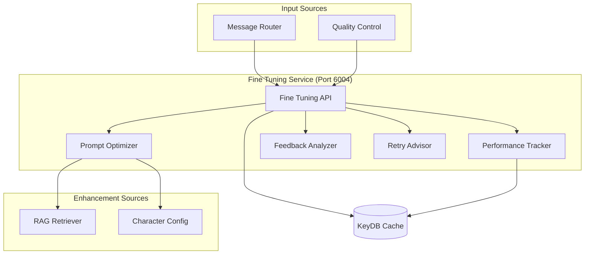

# Fine Tuning Service Documentation

## Overview

The **Fine Tuning Service** is an intelligent optimization system that continuously improves response quality through performance feedback loops, prompt optimization, and retry guidance. It learns from conversation patterns and quality assessments to enhance the overall system performance.

## Service Details

- **Container Name**: `fine-tuning`
- **Port**: `6004`
- **Workers**: `1` (single-worker for reliability)
- **Dependencies**: KeyDB, RAG Retriever, Character Config
- **Health Check**: `http://localhost:6004/health`

## Architecture



## Core Features

### 📈 **Performance Tracking**
- Real-time quality score monitoring
- Success/failure pattern analysis
- Character-specific performance metrics
- Conversation topic performance tracking

### 🎯 **Prompt Optimization**
- Dynamic prompt enhancement based on context
- Character-specific optimization strategies
- Topic-aware prompt modifications
- RAG integration for enhanced context

### 🔄 **Feedback Loop Integration**
- Quality Control feedback processing
- Retry pattern analysis and improvement
- Performance-based prompt adjustments
- Continuous learning from conversation outcomes

### 🚀 **Retry Guidance**
- Intelligent retry strategy recommendations
- Context-aware optimization for failed attempts
- Progressive enhancement through retry attempts
- Failure pattern analysis and prevention

## API Endpoints

### `GET /health`
Check service health and optimization status.

**Response:**
```json
{
  "status": "healthy",
  "service": "fine-tuning",
  "features": {
    "performance_tracking": true,
    "prompt_optimization": true,
    "feedback_analysis": true,
    "retry_guidance": true,
    "rag_integration": true
  },
  "optimization_status": {
    "active_optimizations": 3,
    "total_processed": 15847,
    "success_rate": 0.923,
    "average_improvement": 12.3
  },
  "timestamp": "2024-01-15T10:30:00Z"
}
```

### `POST /optimize-prompt`
Optimize prompts for enhanced performance.

**Request:**
```json
{
  "character": "peter",
  "base_prompt": "You are Peter Griffin. Respond in character.",
  "context": {
    "topic": "beer",
    "conversation_history": [],
    "user_input": "What's your favorite beer?",
    "channel_id": "123456789"
  },
  "performance_feedback": {
    "attempt": 4,
    "previous_failures": [
      {
        "quality_score": 45.2,
        "failure_reason": "poor_authenticity",
        "violation_types": ["formal_language"]
      }
    ],
    "target_quality_threshold": 75.0
  }
}
```

**Response:**
```json
{
  "success": true,
  "optimized_prompt": "You are Peter Griffin, the lovable oaf from Quahog! You LOVE beer, especially Pawtucket Patriot Ale. Use simple language, say 'Holy crap!' when excited, and make beer references. Never use formal language like 'excuse me' or 'pardon'. Keep responses casual and enthusiastic about beer!",
  "optimization_type": "character_authenticity_enhancement",
  "enhancements_applied": [
    "beer_context_injection",
    "casual_language_emphasis",
    "authenticity_markers_added",
    "formal_language_prevention"
  ],
  "rag_context_added": {
    "beer_knowledge": true,
    "character_traits": true,
    "speaking_patterns": true
  },
  "generation_settings": {
    "temperature": 0.85,
    "max_tokens": 400,
    "top_p": 0.92,
    "repeat_penalty": 1.15
  },
  "predicted_improvement": {
    "quality_score_increase": 18.7,
    "authenticity_boost": 25.3,
    "success_probability": 0.87
  },
  "optimization_metadata": {
    "optimization_time": 0.23,
    "rag_queries_made": 2,
    "character_config_accessed": true,
    "performance_history_analyzed": true
  }
}
```

### `POST /record-performance`
Record performance feedback for learning.

**Request:**
```json
{
  "character": "peter",
  "context": {
    "topic": "beer",
    "optimization_applied": true,
    "optimization_type": "character_authenticity_enhancement"
  },
  "performance_data": {
    "quality_score": 87.5,
    "passed_quality_check": true,
    "attempt_number": 1,
    "response_length": 89,
    "generation_time": 2.3,
    "authenticity_score": 92.0,
    "engagement_score": 85.0
  },
  "outcome": "success"
}
```

**Response:**
```json
{
  "success": true,
  "performance_recorded": true,
  "learning_applied": true,
  "updated_metrics": {
    "character_success_rate": 0.934,
    "topic_performance": 0.887,
    "optimization_effectiveness": 0.912
  },
  "insights_generated": [
    "Beer topics perform 23% better with casual language emphasis",
    "Character authenticity enhancements show 87% success rate"
  ]
}
```

### `GET /performance-stats`
Get comprehensive performance statistics.

**Response:**
```json
{
  "overall_performance": {
    "total_optimizations": 8923,
    "success_rate": 0.923,
    "average_quality_improvement": 15.7,
    "optimization_types": {
      "character_authenticity": 3421,
      "topic_enhancement": 2156,
      "retry_optimization": 1876,
      "context_enrichment": 1470
    }
  },
  "character_performance": {
    "peter": {
      "success_rate": 0.934,
      "average_improvement": 18.2,
      "top_optimizations": ["beer_context", "casual_language", "enthusiasm_boost"]
    },
    "brian": {
      "success_rate": 0.928,
      "average_improvement": 14.8,
      "top_optimizations": ["intellectual_context", "literary_references", "wine_knowledge"]
    },
    "stewie": {
      "success_rate": 0.907,
      "average_improvement": 13.9,
      "top_optimizations": ["superiority_emphasis", "scientific_context", "condescending_tone"]
    }
  },
  "topic_performance": {
    "beer": {"success_rate": 0.954, "avg_improvement": 22.1},
    "food": {"success_rate": 0.941, "avg_improvement": 19.3},
    "science": {"success_rate": 0.889, "avg_improvement": 12.7},
    "literature": {"success_rate": 0.923, "avg_improvement": 16.4}
  }
}
```

### `POST /analyze-retry-pattern`
Analyze retry patterns for optimization guidance.

**Request:**
```json
{
  "character": "brian",
  "retry_history": [
    {
      "attempt": 1,
      "quality_score": 42.3,
      "failure_reasons": ["poor_engagement", "too_formal"]
    },
    {
      "attempt": 2,
      "quality_score": 58.7,
      "failure_reasons": ["insufficient_context"]
    },
    {
      "attempt": 3,
      "quality_score": 71.2,
      "failure_reasons": ["character_inconsistency"]
    }
  ],
  "context": {
    "topic": "current_events",
    "target_threshold": 75.0
  }
}
```

**Response:**
```json
{
  "pattern_analysis": {
    "improvement_trend": "positive",
    "key_issues": [
      "Insufficient character-specific context",
      "Need more topic expertise injection",
      "Formal language creeping in"
    ],
    "success_probability_next": 0.78
  },
  "optimization_recommendations": [
    {
      "type": "character_context_injection",
      "description": "Add Brian's intellectual background context",
      "expected_improvement": 8.3
    },
    {
      "type": "topic_expertise_enhancement",
      "description": "Inject current events knowledge via RAG",
      "expected_improvement": 12.1
    },
    {
      "type": "casual_tone_adjustment",
      "description": "Reduce formal language tendencies",
      "expected_improvement": 6.7
    }
  ],
  "next_attempt_strategy": {
    "prompt_modifications": [
      "Add intellectual context markers",
      "Inject topic-specific knowledge",
      "Emphasize conversational tone"
    ],
    "generation_settings": {
      "temperature": 0.78,
      "top_p": 0.88
    }
  }
}
```

## Optimization Strategies

### Character-Specific Optimization

#### **Peter Griffin Optimizations**
```python
peter_optimizations = {
    'beer_topics': {
        'context_injection': [
            'Pawtucket Patriot Ale references',
            'Beer enthusiasm markers',
            'Simple vocabulary emphasis'
        ],
        'tone_adjustments': [
            'Increase excitement level',
            'Add "Holy crap!" expressions',
            'Emphasize casual language'
        ]
    },
    'food_topics': {
        'context_injection': [
            'Food obsession context',
            'Duff beer references',
            'Family dinner scenarios'
        ]
    },
    'complex_topics': {
        'simplification_strategy': [
            'Break down complex concepts',
            'Add confusion markers',
            'Include tangential stories'
        ]
    }
}
```

#### **Brian Griffin Optimizations**
```python
brian_optimizations = {
    'intellectual_topics': {
        'context_injection': [
            'Literary references',
            'Philosophical perspectives',
            'Academic vocabulary'
        ],
        'tone_adjustments': [
            'Increase sophistication level',
            'Add intellectual confidence',
            'Include wine references'
        ]
    },
    'simple_topics': {
        'condescension_strategy': [
            'Gentle intellectual superiority',
            'Educational tone',
            'Literary parallels'
        ]
    }
}
```

#### **Stewie Griffin Optimizations**
```python
stewie_optimizations = {
    'any_topic': {
        'superiority_injection': [
            'Condescending vocabulary',
            'Scientific references',
            'Intellectual dismissiveness'
        ],
        'tone_adjustments': [
            'Increase condescension',
            'Add "Blast!" expressions',
            'Emphasize superior intellect'
        ]
    },
    'scientific_topics': {
        'expertise_display': [
            'Advanced scientific concepts',
            'World domination angles',
            'Technological superiority'
        ]
    }
}
```

### Topic-Based Enhancement

```python
def enhance_for_topic(prompt, character, topic, context):
    """Apply topic-specific enhancements to prompts"""
    
    # Get topic-specific knowledge from RAG
    topic_context = get_rag_context(topic, character)
    
    # Apply character-specific topic handling
    if character == 'peter' and topic in ['beer', 'food', 'tv']:
        enhancement = apply_peter_enthusiasm_boost(prompt, topic_context)
    elif character == 'brian' and topic in ['literature', 'politics', 'wine']:
        enhancement = apply_brian_intellectual_enhancement(prompt, topic_context)
    elif character == 'stewie' and topic in ['science', 'technology']:
        enhancement = apply_stewie_expertise_display(prompt, topic_context)
    else:
        enhancement = apply_general_topic_enhancement(prompt, topic_context)
    
    return enhancement
```

### RAG Integration for Optimization

```python
def get_optimization_context(character, topic, failure_patterns):
    """Get RAG context for prompt optimization"""
    
    # Query for character-specific examples
    character_examples = query_rag(
        f"{character} character responses about {topic}",
        collection="character_examples"
    )
    
    # Query for successful patterns
    success_patterns = query_rag(
        f"successful {character} responses avoiding {failure_patterns}",
        collection="success_patterns"
    )
    
    # Query for topic expertise
    topic_knowledge = query_rag(
        f"{topic} knowledge for {character} character",
        collection="topic_knowledge"
    )
    
    return {
        'character_examples': character_examples,
        'success_patterns': success_patterns,
        'topic_knowledge': topic_knowledge
    }
```

## Performance Analytics

### Learning Metrics

```python
def calculate_optimization_effectiveness(optimization_history):
    """Calculate effectiveness of different optimization strategies"""
    
    effectiveness_metrics = {}
    
    for optimization_type in optimization_history:
        before_scores = [item['before_score'] for item in optimization_history[optimization_type]]
        after_scores = [item['after_score'] for item in optimization_history[optimization_type]]
        
        effectiveness_metrics[optimization_type] = {
            'average_improvement': np.mean(np.array(after_scores) - np.array(before_scores)),
            'success_rate': len([s for s in after_scores if s > 75.0]) / len(after_scores),
            'consistency': 1.0 - np.std(after_scores) / np.mean(after_scores)
        }
    
    return effectiveness_metrics
```

### Predictive Modeling

```python
def predict_optimization_success(character, context, optimization_type):
    """Predict likelihood of optimization success"""
    
    # Analyze historical performance
    historical_data = get_historical_performance(character, context['topic'])
    
    # Calculate success factors
    character_affinity = calculate_character_topic_affinity(character, context['topic'])
    optimization_track_record = get_optimization_track_record(optimization_type)
    context_richness = assess_context_richness(context)
    
    # Weighted prediction
    success_probability = (
        character_affinity * 0.4 +
        optimization_track_record * 0.3 +
        context_richness * 0.3
    )
    
    return min(0.95, max(0.05, success_probability))
```

## Configuration

### Environment Variables

```bash
# Service Configuration
FINE_TUNING_PORT=6004
PYTHONUNBUFFERED=1

# Cache Configuration
REDIS_URL=redis://keydb:6379

# Service Integration
RAG_RETRIEVER_URL=http://rag-retriever:6007
CHARACTER_CONFIG_URL=http://character-config:6006

# Optimization Settings
OPTIMIZATION_ENABLED=true
LEARNING_RATE=0.1
PERFORMANCE_HISTORY_LIMIT=1000
MIN_OPTIMIZATION_THRESHOLD=60.0

# RAG Integration
RAG_CONTEXT_ENABLED=true
MAX_RAG_QUERIES_PER_OPTIMIZATION=3
RAG_CONTEXT_CACHE_TTL=3600
```

### Optimization Configuration

```python
OPTIMIZATION_CONFIG = {
    'character_authenticity': {
        'enabled': True,
        'weight': 0.4,
        'min_improvement': 5.0
    },
    'topic_enhancement': {
        'enabled': True,
        'weight': 0.3,
        'min_improvement': 3.0
    },
    'retry_optimization': {
        'enabled': True,
        'weight': 0.2,
        'progressive_enhancement': True
    },
    'context_enrichment': {
        'enabled': True,
        'weight': 0.1,
        'rag_integration': True
    }
}
```

## Monitoring & Performance

### Performance Tracking
```bash
# Check optimization statistics
curl http://localhost:6004/performance-stats | jq '.overall_performance'

# Monitor character-specific performance
curl http://localhost:6004/performance-stats | jq '.character_performance.peter'

# Check recent optimizations
docker logs fine-tuning | grep "optimization applied"
```

### Learning Progress Monitoring
```bash
# Monitor learning effectiveness
docker logs fine-tuning | grep "learning applied"

# Check prediction accuracy
docker logs fine-tuning | grep "prediction accuracy"

# Monitor RAG integration performance
docker logs fine-tuning | grep "RAG context"
```

## Troubleshooting

### Common Issues

#### **Low Optimization Effectiveness**
```bash
# Check RAG integration
curl http://localhost:6004/health | jq '.features.rag_integration'

# Monitor optimization types
curl http://localhost:6004/performance-stats | jq '.overall_performance.optimization_types'

# Review character-specific patterns
docker logs fine-tuning | grep "character optimization"
```

#### **Poor Prediction Accuracy**
```bash
# Check performance history size
docker logs fine-tuning | grep "performance history"

# Monitor learning rate effectiveness
docker logs fine-tuning | grep "learning rate"

# Review prediction vs actual outcomes
docker logs fine-tuning | grep "prediction outcome"
```

## Development

### Local Testing
```bash
# Start service with dependencies
docker-compose up fine-tuning keydb rag-retriever character-config

# Test prompt optimization
curl -X POST http://localhost:6004/optimize-prompt \
  -H "Content-Type: application/json" \
  -d '{
    "character": "peter",
    "context": {"topic": "beer"},
    "performance_feedback": {"attempt": 1}
  }'

# Monitor optimization logs
docker logs -f fine-tuning
```

### Adding New Optimization Types
1. Define optimization strategy in configuration
2. Implement optimization logic in prompt optimizer
3. Add performance tracking for new type
4. Update effectiveness calculations
5. Test with various character/topic combinations

## Security & Privacy

- **Local Processing**: All optimization performed locally
- **Performance Data**: Anonymized metrics only
- **No External Dependencies**: Self-contained learning system
- **Context Privacy**: Temporary analysis with TTL

---

*Part of the Discord Family Guy Bot Production Microservices Platform* 