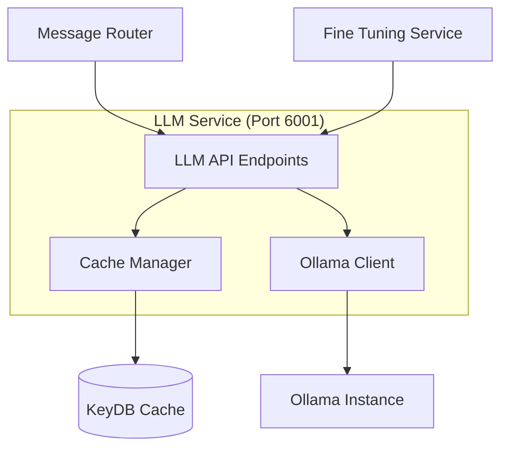

# LLM Service Documentation

## Overview

The **LLM Service** is the centralized language model processing unit that handles all interactions with the local Ollama instance. It provides a unified API for response generation, caching, and model management across the entire microservices ecosystem.

## Service Details

- **Container Name**: `llm-service`
- **Port**: `6001`
- **Workers**: `1` (single-worker for reliability)
- **Dependencies**: KeyDB, Ollama
- **Health Check**: `http://localhost:6001/health`

## Architecture



## Core Features

### 🧠 **Centralized LLM Access**
- Single point of access for all LLM operations
- Standardized request/response format
- Connection pooling and resource management
- Automatic retry with exponential backoff

### ⚡ **Intelligent Caching**
- Response caching with prompt hashing
- 1-hour TTL for generated responses
- Cache invalidation strategies
- Memory-efficient storage with KeyDB

### 🔧 **Model Management**
- Dynamic model loading and switching
- Health monitoring of Ollama instance
- Performance metrics and logging
- Resource utilization tracking

## API Endpoints

### `GET /health`
Check service health and Ollama connectivity.

**Response:**
```json
{
  "status": "healthy",
  "service": "llm-service",
  "ollama_status": "connected",
  "model": "llama3:8b-instruct-q5_K_M",
  "cache_status": "connected",
  "timestamp": "2024-01-15T10:30:00Z"
}
```

### `POST /generate`
Generate responses using the local LLM.

**Request:**
```json
{
  "prompt": "You are Peter Griffin. Say hello in character.",
  "character_name": "peter",
  "settings": {
    "temperature": 0.8,
    "max_tokens": 500,
    "top_p": 0.9
  },
  "conversation_id": "channel_123456",
  "use_cache": true
}
```

**Response:**
```json
{
  "response": "Holy crap! Hey there! You know what's awesome? Meeting new people! It's like finding a new beer but for conversations!",
  "model": "llama3:8b-instruct-q5_K_M",
  "generation_time": 2.3,
  "cache_hit": false,
  "metadata": {
    "temperature": 0.8,
    "tokens_generated": 45,
    "prompt_hash": "abc123def456"
  }
}
```

### `GET /metrics`
Retrieve service performance metrics.

**Response:**
```json
{
  "requests_total": 1524,
  "cache_hit_rate": 0.847,
  "average_response_time": 1.85,
  "ollama_status": "healthy",
  "memory_usage": "2.3GB",
  "uptime": "24h 15m 30s"
}
```

### `POST /validate-model`
Validate Ollama model availability and performance.

**Response:**
```json
{
  "model_available": true,
  "model_name": "llama3:8b-instruct-q5_K_M",
  "model_size": "4.7GB",
  "performance_score": 95.2,
  "last_validation": "2024-01-15T10:30:00Z"
}
```

## Configuration

### Environment Variables

```bash
# Service Configuration
LLM_SERVICE_PORT=6001
PYTHONUNBUFFERED=1

# Ollama Configuration
OLLAMA_BASE_URL=http://host.docker.internal:11434
OLLAMA_MODEL=llama3:8b-instruct-q5_K_M

# Cache Configuration
REDIS_URL=redis://keydb:6379
LLM_RESPONSE_CACHE_TTL=3600

# Performance Tuning
MAX_CONCURRENT_REQUESTS=10
REQUEST_TIMEOUT=30
CACHE_MAX_SIZE=1000
```

### Model Settings

```python
DEFAULT_GENERATION_SETTINGS = {
    "temperature": 0.8,
    "max_tokens": 500,
    "top_p": 0.9,
    "top_k": 40,
    "repeat_penalty": 1.1,
    "stop": ["Human:", "Assistant:", "\n\n\n"]
}
```

## Caching Strategy

### Cache Key Format
```
llm_response:{prompt_hash}:{character}:{settings_hash}
```

### Cache Hit Logic
1. Generate prompt hash using SHA-256
2. Include character name and generation settings
3. Check KeyDB for existing response
4. Return cached response if TTL valid
5. Generate new response if cache miss

### Cache Invalidation
- **TTL-based**: Automatic expiration after 1 hour
- **Manual**: API endpoint for cache clearing
- **Model change**: Clear all caches on model switch
- **Memory pressure**: LRU eviction when cache full

## Performance Optimization

### Request Batching
- Group multiple requests for efficiency
- Batch processing for similar prompts
- Parallel generation when possible

### Connection Pooling
```python
OLLAMA_CONNECTION_POOL = {
    "max_connections": 5,
    "connection_timeout": 10,
    "read_timeout": 30,
    "retry_attempts": 3
}
```

### Memory Management
- Prompt tokenization and optimization
- Response streaming for large outputs
- Garbage collection after each request

## Monitoring & Logging

### Structured Logging
```python
logger.info("LLM Request", extra={
    "character": character_name,
    "prompt_length": len(prompt),
    "response_time": response_time,
    "cache_hit": cache_hit,
    "tokens_generated": token_count
})
```

### Health Checks
- **Ollama connectivity**: Every 30 seconds
- **Cache availability**: Every 30 seconds  
- **Memory usage**: Continuous monitoring
- **Response quality**: Sample validation

### Error Handling
- **Connection errors**: Automatic retry with backoff
- **Timeout errors**: Graceful degradation
- **Model errors**: Fallback mechanisms
- **Cache errors**: Direct model access

## Integration Points

### Message Router Integration
- Primary consumer of LLM services
- Handles character-specific generation
- Manages conversation context

### Fine-Tuning Integration
- Receives optimized prompts
- Provides performance feedback
- Supports A/B testing scenarios

### Quality Control Integration
- No direct integration (stateless design)
- Responses validated after generation
- Quality metrics fed back for optimization

## Troubleshooting

### Common Issues

#### **Ollama Connection Failed**
```bash
# Check Ollama status
curl http://localhost:11434/api/tags

# Verify model availability
ollama list

# Restart Ollama if needed
ollama serve
```

#### **Cache Performance Issues**
```bash
# Check KeyDB status
docker logs keydb

# Monitor cache hit rate
curl http://localhost:6001/metrics | jq '.cache_hit_rate'

# Clear cache if needed
curl -X POST http://localhost:6001/cache/clear
```

#### **High Response Times**
```bash
# Check Ollama performance
curl http://localhost:6001/validate-model

# Monitor system resources
docker stats llm-service

# Check for memory pressure
curl http://localhost:6001/metrics | jq '.memory_usage'
```

### Performance Tuning

#### **For High Throughput**
```bash
# Increase cache size
LLM_RESPONSE_CACHE_TTL=7200
CACHE_MAX_SIZE=5000

# Optimize Ollama settings
OLLAMA_NUM_PARALLEL=4
OLLAMA_MAX_LOADED_MODELS=2
```

#### **For Low Latency**
```bash
# Reduce generation parameters
DEFAULT_MAX_TOKENS=200
DEFAULT_TEMPERATURE=0.7

# Increase connection pool
MAX_CONCURRENT_REQUESTS=20
```

## Development

### Local Testing
```bash
# Start service only
docker-compose up llm-service keydb

# Test generation
curl -X POST http://localhost:6001/generate \
  -H "Content-Type: application/json" \
  -d '{"prompt": "Test prompt", "character_name": "peter"}'

# Monitor logs
docker logs -f llm-service
```

### Adding New Models
1. Pull model with Ollama: `ollama pull model_name`
2. Update environment variable: `OLLAMA_MODEL=model_name`
3. Restart service: `docker-compose restart llm-service`
4. Validate model: `curl http://localhost:6001/validate-model`

## Security Considerations

- **No external API calls**: Completely local processing
- **Request validation**: Input sanitization and limits
- **Resource limits**: Prevent memory/CPU exhaustion
- **Access control**: Internal service communication only

---

*Part of the Discord Family Guy Bot Production Microservices Platform* 