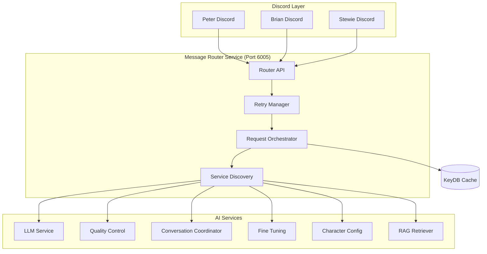
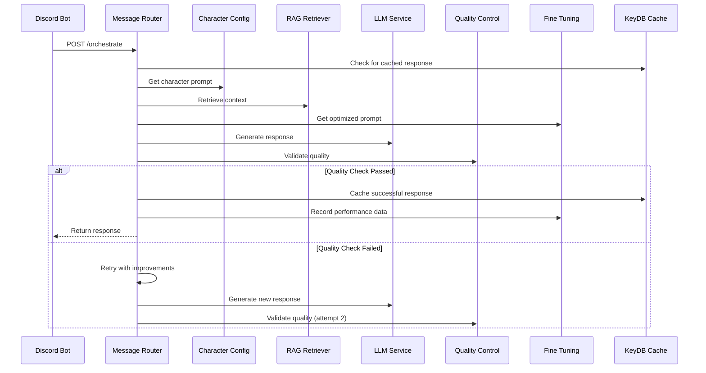
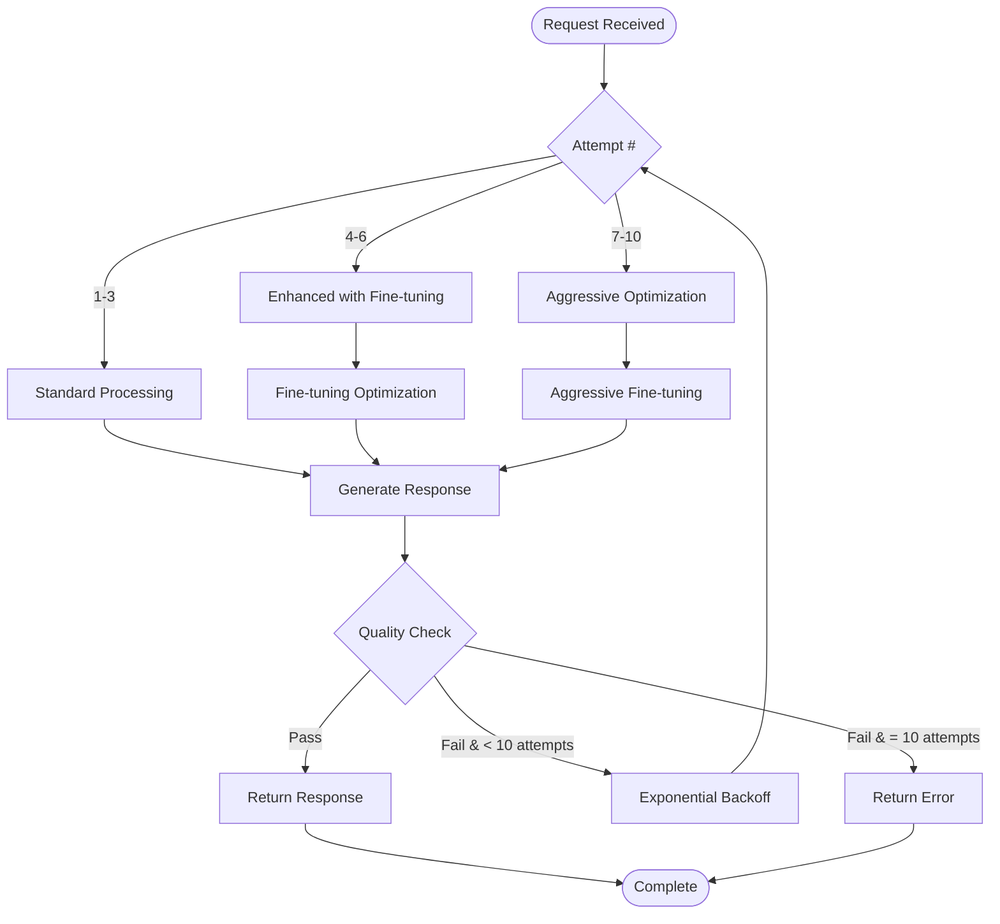

# Message Router Service Documentation

## Overview

The **Message Router Service** is the central orchestration hub that coordinates all message processing between Discord bots and AI services. It manages the complete conversation flow, handles retries with intelligent backoff, and ensures seamless integration between all microservices.

## Service Details

- **Container Name**: `message-router`
- **Port**: `6005`
- **Workers**: `1` (single-worker for reliability)
- **Dependencies**: LLM Service, Character Config, RAG Retriever, Quality Control, Conversation Coordinator, Fine Tuning, KeyDB
- **Health Check**: `http://localhost:6005/health`

## Architecture



## Core Features

### 🎯 **Central Orchestration**
- Single entry point for all conversation requests
- Standardized request/response handling
- Service discovery and load balancing
- Comprehensive error handling and recovery

### 🔄 **Intelligent Retry System**
- **10-attempt retry manager** with exponential backoff
- **Quality-aware retries**: Different strategies for quality vs. service failures
- **Context-preserving retries**: Maintains conversation state across attempts
- **Performance tracking**: Records success/failure patterns for optimization

### 🌐 **Service Integration**
- **LLM Service**: Response generation coordination
- **Quality Control**: Validation and scoring
- **Fine Tuning**: Performance optimization
- **RAG Retriever**: Context enhancement
- **Character Config**: Prompt management
- **Conversation Coordinator**: Flow control

### 📊 **Performance Monitoring**
- Request/response timing
- Service health monitoring
- Retry pattern analysis
- Cache performance tracking

## API Endpoints

### `GET /health`
Check service health and all dependent services.

**Response:**
```json
{
  "status": "healthy",
  "service": "message-router",
  "services": {
    "llm_service": {
      "status": "healthy",
      "response_time": "< 5s",
      "last_check": "2024-01-15T10:30:00Z"
    },
    "quality_control": {
      "status": "healthy",
      "response_time": "< 5s",
      "last_check": "2024-01-15T10:30:00Z"
    },
    "conversation_coordinator": {
      "status": "healthy",
      "response_time": "< 5s",
      "last_check": "2024-01-15T10:30:00Z"
    }
  },
  "timestamp": "2024-01-15T10:30:00Z"
}
```

### `POST /orchestrate`
Primary endpoint for processing conversation requests.

**Request:**
```json
{
  "character_name": "peter",
  "input_text": "What's your favorite beer?",
  "conversation_history": [
    {
      "author": "User",
      "content": "Hi Peter!",
      "timestamp": "2024-01-15T10:25:00Z"
    }
  ],
  "channel_id": "123456789",
  "user_id": "987654321",
  "message_type": "direct",
  "request_metadata": {
    "source": "discord",
    "priority": "normal"
  }
}
```

**Response:**
```json
{
  "success": true,
  "response": "Holy crap! You know what? Pawtucket Patriot Ale is the best beer ever! It's like drinking pure happiness with a hint of awesome!",
  "character": "peter",
  "processing_time": 2.3,
  "quality_score": 87.5,
  "metadata": {
    "attempts": 1,
    "cache_hit": false,
    "rag_context_used": true,
    "fine_tuning_applied": true,
    "conversation_state": "warm_conversation",
    "services_called": [
      "character_config",
      "rag_retriever", 
      "llm_service",
      "quality_control",
      "fine_tuning"
    ]
  }
}
```

### `POST /organic-notification`
Handle organic conversation notifications from Discord services.

**Request:**
```json
{
  "character": "peter",
  "message": "Holy crap! I just discovered this amazing beer!",
  "channel_id": "123456789",
  "context": {
    "topic": "beer",
    "last_speaker": "peter",
    "conversation_history": []
  }
}
```

**Response:**
```json
{
  "success": true,
  "action": "continue",
  "follow_up_character": "brian",
  "estimated_delay": "3-8 seconds",
  "processing_metadata": {
    "analysis_time": 0.45,
    "decision_confidence": 0.85,
    "conversation_momentum": "high"
  }
}
```

### `GET /services/health`
Comprehensive health check of all dependent services.

**Response:**
```json
{
  "overall_status": "healthy",
  "services": {
    "llm_service": {
      "status": "healthy",
      "last_response_time": 1.2,
      "cache_hit_rate": 0.847
    },
    "quality_control": {
      "status": "healthy", 
      "last_response_time": 0.045,
      "recent_pass_rate": 0.952
    },
    "conversation_coordinator": {
      "status": "healthy",
      "last_response_time": 0.23,
      "organic_success_rate": 0.891
    },
    "fine_tuning": {
      "status": "healthy",
      "optimization_active": true,
      "performance_score": 87.3
    }
  }
}
```

### `GET /metrics`
Detailed performance metrics and analytics.

**Response:**
```json
{
  "request_metrics": {
    "total_requests": 15847,
    "requests_per_minute": 23.4,
    "average_response_time": 2.1,
    "success_rate": 0.956
  },
  "retry_metrics": {
    "retry_rate": 0.088,
    "average_attempts": 1.2,
    "max_attempts_reached": 12,
    "retry_success_rate": 0.902
  },
  "service_metrics": {
    "llm_service_calls": 15847,
    "quality_control_calls": 19203,
    "rag_retriever_calls": 12394,
    "fine_tuning_calls": 8923
  },
  "cache_metrics": {
    "cache_hit_rate": 0.834,
    "cache_misses": 2634,
    "cache_size": "245MB"
  }
}
```

## Request Processing Flow

### Standard Message Processing



### Retry Logic with Quality Failures



## Retry Manager Implementation

### Retry Configuration

```python
RETRY_CONFIG = {
    "DISCORD_MESSAGE": {
        "max_attempts": 10,
        "base_delay": 1.0,
        "exponential_base": 2.0,
        "max_delay": 30.0,
        "jitter": True
    },
    "SERVICE_CALL": {
        "max_attempts": 3,
        "base_delay": 0.5,
        "exponential_base": 1.5,
        "max_delay": 5.0,
        "jitter": False
    }
}
```

### Intelligent Retry Strategy

```python
def retry_with_context(operation, validation_func, context):
    """Enhanced retry with conversation context preservation"""
    
    for attempt in range(1, max_attempts + 1):
        try:
            # Add attempt context for fine-tuning
            context['retry_attempt'] = attempt
            context['previous_failures'] = get_failure_patterns(context)
            
            if attempt > 3:
                # Enhanced processing with fine-tuning
                context = enhance_with_fine_tuning(context, attempt)
            
            result = operation(context)
            
            if validation_func(result):
                record_success(context, attempt, result)
                return result
            else:
                record_failure(context, attempt, result)
                
        except Exception as e:
            record_exception(context, attempt, e)
        
        # Exponential backoff with jitter
        delay = calculate_delay(attempt, base_delay, exponential_base)
        time.sleep(delay + random.uniform(0, 0.1))
    
    raise MaxRetriesExceeded(f"Failed after {max_attempts} attempts")
```

## Service Integration Details

### Character Config Integration
```python
def get_character_config(character_name, conversation_context):
    """Get optimized character configuration"""
    
    response = make_service_request(
        CHARACTER_CONFIG_URL,
        f"/llm_prompt/{character_name}",
        method="GET",
        timeout=5
    )
    
    if response['success']:
        config = response['data']
        
        # Apply conversation-specific optimizations
        if conversation_context.get('topic'):
            config = optimize_for_topic(config, conversation_context['topic'])
            
        return config
    else:
        raise ServiceException(f"Character config failed: {response['error']}")
```

### Quality Control Integration
```python
def validate_response_quality(response, character, context, message_type="direct"):
    """Validate response quality with context"""
    
    payload = {
        "response": response,
        "character": character,
        "conversation_id": context.get('channel_id'),
        "context": context.get('input_text', ''),
        "last_speaker": context.get('last_speaker'),
        "message_type": message_type
    }
    
    result = make_service_request(
        QUALITY_CONTROL_URL,
        "/analyze",
        method="POST",
        data=payload,
        timeout=10
    )
    
    if result['success']:
        analysis = result['data']
        return {
            'passed': analysis['quality_check_passed'],
            'score': analysis['overall_score'],
            'threshold': analysis['adaptive_threshold'],
            'recommendations': analysis.get('recommendations', [])
        }
    else:
        # Assume pass on service failure to avoid blocking
        return {'passed': True, 'score': 50.0, 'threshold': 50.0}
```

### Fine-Tuning Integration
```python
def apply_fine_tuning_optimization(context, attempt_number):
    """Apply fine-tuning optimizations based on attempt"""
    
    if attempt_number <= 3:
        return context  # Use standard processing
    
    # Get optimization from fine-tuning service
    payload = {
        "character": context['character_name'],
        "context": context,
        "performance_feedback": {
            "attempt": attempt_number,
            "previous_failures": context.get('previous_failures', [])
        }
    }
    
    result = make_service_request(
        FINE_TUNING_URL,
        "/optimize-prompt",
        method="POST", 
        data=payload,
        timeout=10
    )
    
    if result['success']:
        optimization = result['data']
        context['optimized_prompt'] = optimization.get('optimized_prompt')
        context['generation_settings'] = optimization.get('generation_settings', {})
        
    return context
```

## Configuration

### Environment Variables

```bash
# Service Configuration
MESSAGE_ROUTER_PORT=6005
PYTHONUNBUFFERED=1

# Service URLs
LLM_SERVICE_URL=http://llm-service:6001
CHARACTER_CONFIG_API_URL=http://character-config:6006
RAG_RETRIEVER_URL=http://rag-retriever:6007
CONVERSATION_COORDINATOR_URL=http://conversation-coordinator:6002
QUALITY_CONTROL_URL=http://quality-control:6003
FINE_TUNING_URL=http://fine-tuning:6004

# Cache Configuration
REDIS_URL=redis://keydb:6379

# Retry Configuration
MAX_RETRY_ATTEMPTS=10
RETRY_BASE_DELAY=1.0
RETRY_MAX_DELAY=30.0

# Performance Tuning
REQUEST_TIMEOUT=30
MAX_CONCURRENT_REQUESTS=50
CACHE_TTL=300
```

### Service Discovery Configuration

```python
SERVICE_ENDPOINTS = {
    "llm_service": {
        "url": LLM_SERVICE_URL,
        "health_endpoint": "/health",
        "timeout": 30,
        "retries": 3
    },
    "quality_control": {
        "url": QUALITY_CONTROL_URL,
        "health_endpoint": "/health", 
        "timeout": 10,
        "retries": 2
    },
    "conversation_coordinator": {
        "url": CONVERSATION_COORDINATOR_URL,
        "health_endpoint": "/health",
        "timeout": 15,
        "retries": 10  # High retries for organic responses
    }
}
```

## Performance Optimization

### Caching Strategy
```python
CACHE_STRATEGIES = {
    "character_config": {
        "ttl": 86400,  # 24 hours
        "key_pattern": "char_config:{character}:{topic_hash}"
    },
    "rag_context": {
        "ttl": 3600,   # 1 hour
        "key_pattern": "rag_context:{query_hash}"
    },
    "conversation_state": {
        "ttl": 1800,   # 30 minutes
        "key_pattern": "conv_state:{channel_id}"
    }
}
```

### Request Batching
- Group similar requests for efficiency
- Batch character config requests
- Parallel RAG context retrieval
- Async service communication where possible

### Memory Management
```python
MEMORY_LIMITS = {
    "max_conversation_history": 50,
    "max_cache_size": "500MB",
    "response_streaming": True,
    "garbage_collection": "auto"
}
```

## Monitoring & Debugging

### Health Check Monitoring
```bash
# Check all service health
curl http://localhost:6005/services/health | jq

# Monitor specific service
curl http://localhost:6005/services/health | jq '.services.quality_control'

# Check retry patterns
curl http://localhost:6005/metrics | jq '.retry_metrics'
```

### Performance Monitoring
```bash
# Monitor request patterns
docker logs message-router | grep "Request completed"

# Check retry success rates
docker logs message-router | grep "retry attempt"

# Monitor service call distribution
curl http://localhost:6005/metrics | jq '.service_metrics'
```

### Debugging Common Issues

#### **High Retry Rates**
```bash
# Check quality control pass rates
curl http://localhost:6003/conversation-analysis

# Monitor fine-tuning optimization
curl http://localhost:6004/performance-stats

# Check LLM service performance
curl http://localhost:6001/metrics
```

#### **Service Timeout Issues**
```bash
# Check service health
curl http://localhost:6005/services/health

# Monitor response times
docker logs message-router | grep "response_time"

# Check service dependencies
docker-compose ps
```

## Development

### Local Testing
```bash
# Start with dependencies
docker-compose up message-router keydb llm-service character-config quality-control

# Test orchestration
curl -X POST http://localhost:6005/orchestrate \
  -H "Content-Type: application/json" \
  -d '{
    "character_name": "peter",
    "input_text": "Hello!",
    "conversation_history": [],
    "channel_id": "test_channel"
  }'

# Monitor logs
docker logs -f message-router
```

### Adding New Service Integration
1. Add service URL to environment variables
2. Update SERVICE_ENDPOINTS configuration
3. Implement service-specific request/response handling
4. Add health check monitoring
5. Update retry configuration if needed

## Security Considerations

- **Internal Service Communication**: All service calls are internal
- **Request Validation**: Comprehensive input sanitization
- **Rate Limiting**: Prevents service overload
- **Error Handling**: No sensitive information in error responses
- **Access Control**: Service-to-service authentication

---

*Part of the Discord Family Guy Bot Production Microservices Platform* 