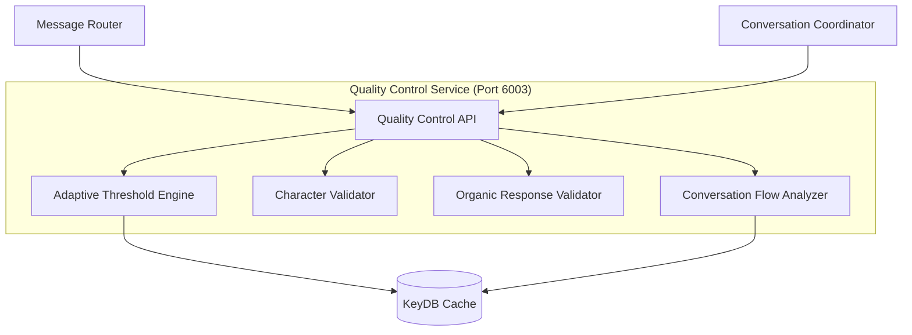

# Quality Control Service Documentation

## Overview

The **Quality Control Service** is an advanced AI-powered response assessment system that ensures high-quality, character-authentic responses through adaptive thresholds, organic response validation, and comprehensive quality metrics. It serves as the quality gatekeeper for all generated content.

## Service Details

- **Container Name**: `quality-control`
- **Port**: `6003`
- **Workers**: `1` (single-worker for reliability)
- **Dependencies**: KeyDB
- **Health Check**: `http://localhost:6003/health`

## Architecture



## Core Features

### 🎯 **Adaptive Quality Thresholds**
- Dynamic threshold calculation based on conversation depth
- Cold Start (0-6 messages): 30.0/100 baseline
- Warm Conversation (7-20 messages): 60.0/100 baseline  
- Hot Conversation (21+ messages): 75.0/100 baseline
- Organic Response penalty: +2.0 for natural standards

### 🌱 **Organic Response Validation**
- Specialized validation for organic follow-up responses
- Context relevance checking with engagement indicators
- Natural conversation flow assessment
- Character-specific organic behavior patterns

### 🎭 **Character-Aware Assessment**
- Individual authenticity rules for Peter, Brian, and Stewie
- Character-specific anti-hallucination settings
- Personality marker validation
- Speaking style enforcement

### 🔍 **Comprehensive Quality Metrics**
- Authenticity scoring (character consistency)
- Hallucination risk detection
- Engagement level assessment  
- Toxicity screening
- Conversation flow quality

## API Endpoints

### `GET /health`
Check service health and feature status.

**Response:**
```json
{
  "status": "healthy",
  "service": "enhanced-quality-control",
  "features": {
    "adaptive_quality_control": true,
    "character_aware_anti_hallucination": true,
    "conversation_flow_assessment": true,
    "self_conversation_detection": true,
    "keydb_conversation_history": true
  },
  "timestamp": "2024-01-15T10:30:00Z",
  "version": "2.0.0"
}
```

### `POST /analyze`
Comprehensive response quality analysis.

**Request:**
```json
{
  "response": "Holy crap! That's awesome! You know what this reminds me of? The time I fought that giant chicken!",
  "character": "peter",
  "conversation_id": "channel_123456",
  "context": "User mentioned they like fighting games",
  "last_speaker": "user",
  "message_type": "organic_response"
}
```

**Response:**
```json
{
  "overall_score": 87.5,
  "quality_check_passed": true,
  "adaptive_threshold": 77.0,
  "conversation_state": "warm_conversation",
  "message_type": "organic_response",
  "is_organic_response": true,
  "metrics": {
    "authenticity_score": 92.0,
    "hallucination_risk": 1.5,
    "engagement_score": 85.0,
    "toxicity_score": 0.0,
    "flow_score": 4.2
  },
  "character_analysis": {
    "character": "peter",
    "violations": [],
    "character_specific_score": 92.0,
    "anti_hallucination_settings": {
      "length_multiplier": 0.7,
      "risk_multiplier": 1.2,
      "strictness_multiplier": 1.3
    }
  },
  "conversation_flow": {
    "flow_score": 4.2,
    "issues": [],
    "strengths": ["Natural organic follow-up", "Good context awareness"],
    "conversation_awareness": true,
    "monologue_tendency": false,
    "self_conversation_detected": false,
    "organic_flow_validation": {
      "natural_follow_up": true,
      "context_responsive": true,
      "appropriate_timing": true,
      "flow_issues": [],
      "flow_strengths": ["Uses natural conversation connectors"]
    }
  },
  "recommendations": [
    "Response meets 77.0/100 adaptive quality standard"
  ],
  "analysis_metadata": {
    "analysis_time_seconds": 0.045,
    "timestamp": "2024-01-15T10:30:00Z",
    "response_length": 89,
    "response_hash": "abc12def",
    "conversation_history_length": 12,
    "adaptive_features_enabled": true,
    "organic_response_processing": true
  }
}
```

### `GET /config`
Get quality control configuration.

**Response:**
```json
{
  "adaptive_thresholds": {
    "cold_start": 30.0,
    "warm_conversation": 60.0,
    "hot_conversation": 75.0
  },
  "conversation_boundaries": {
    "cold_limit": 6,
    "warm_limit": 20
  },
  "character_anti_hallucination": {
    "peter": {
      "length_multiplier": 0.7,
      "risk_multiplier": 1.2,
      "strictness_multiplier": 1.3
    },
    "brian": {
      "length_multiplier": 1.3,
      "risk_multiplier": 1.0,
      "strictness_multiplier": 1.0
    },
    "stewie": {
      "length_multiplier": 1.0,
      "risk_multiplier": 0.8,
      "strictness_multiplier": 0.9
    }
  },
  "features_enabled": {
    "adaptive_quality_control": true,
    "character_aware_anti_hallucination": true,
    "conversation_flow_assessment": true,
    "keydb_integration": true
  }
}
```

### `GET /conversation-analysis`
Analyze conversation history and patterns.

**Request:**
```
GET /conversation-analysis?conversation_id=channel_123456
```

**Response:**
```json
{
  "conversation_id": "channel_123456",
  "total_messages": 18,
  "conversation_state": "warm_conversation",
  "adaptive_threshold": 62.5,
  "recent_quality_average": 78.3,
  "character_participation": {
    "peter": 7,
    "brian": 6,
    "stewie": 5
  },
  "conversation_history": [
    {
      "timestamp": "2024-01-15T10:25:00Z",
      "author": "Peter Griffin",
      "content": "Holy crap! That's awesome!",
      "message_type": "peter",
      "quality_score": 85.2
    }
  ]
}
```

## Quality Assessment Components

### 🎯 **Adaptive Threshold Calculation**

The service dynamically adjusts quality standards based on conversation richness:

```python
def calculate_adaptive_threshold(conversation_history, conversation_id):
    message_count = len(conversation_history)
    
    if message_count <= 6:  # Cold start
        base_threshold = 30.0
    elif message_count <= 20:  # Warm conversation
        base_threshold = 60.0
    else:  # Hot conversation
        base_threshold = 75.0
    
    # Adjust based on recent quality patterns
    if len(conversation_history) >= 3:
        recent_quality = analyze_recent_quality(conversation_history[-5:])
        if recent_quality > 80:
            base_threshold *= 1.1  # Raise standards
        elif recent_quality < 50:
            base_threshold *= 0.9  # Lower standards
    
    return min(95.0, max(25.0, base_threshold))
```

### 🌱 **Organic Response Validation**

Enhanced validation specifically for organic follow-up responses:

#### **Context Relevance Check**
- Expanded engagement indicators (29 different patterns)
- Character name recognition as engagement
- Typical character response patterns
- Leniency for authentic character language

#### **Natural Follow-up Patterns**
```python
natural_follow_patterns = [
    # Reactions
    r'\b(yeah|yep|nah|nope|oh|wow|really|seriously|exactly)\b',
    # Questions/clarifications  
    r'\b(what|why|how|when|where|who)\b.*\?',
    # Character-specific reactions
    r'\b(sweet|awesome|dude|freakin\'|holy crap)\b',  # Peter
    r'\b(indeed|precisely|actually|however|quite)\b',  # Brian
    r'\b(blast|fool|peasant|excellent|fascinating)\b'  # Stewie
]
```

#### **Relaxed Violation Criteria**
- Context relevance: Only check contexts >10 characters
- Length limit: Increased to 500 characters (was 300)
- Repetition threshold: Raised to 80% (was 60%)
- Formal starters: Only flag obvious formal language

### 🎭 **Character-Specific Rules**

#### **Peter Griffin**
```python
peter_rules = {
    'forbidden_phrases': ['excuse me', 'pardon', 'i apologize', 'as an ai'],
    'personality_markers': ['nyehehe', 'oh my god', 'this is worse than', 'holy crap'],
    'speaking_style': 'casual',
    'typical_responses': ['holy crap', 'sweet', 'awesome', 'freakin', 'beer', 'food']
}
```

#### **Brian Griffin**
```python
brian_rules = {
    'forbidden_phrases': ['awesome', 'cool', 'rad', 'as an ai'],
    'personality_markers': ['well actually', 'fascinating', 'i read'],
    'speaking_style': 'formal',
    'typical_responses': ['indeed', 'actually', 'however', 'sophisticated', 'wine']
}
```

#### **Stewie Griffin**
```python
stewie_rules = {
    'forbidden_phrases': ['please', 'thank you', 'sorry', 'as an ai'],
    'personality_markers': ['blast', 'what the deuce', 'clearly', 'inferior'],
    'speaking_style': 'sophisticated',
    'typical_responses': ['blast', 'fool', 'inferior', 'genius', 'brilliant', 'mother']
}
```

## Configuration

### Environment Variables

```bash
# Service Configuration
QUALITY_CONTROL_PORT=6003
PYTHONUNBUFFERED=1

# Cache Configuration
REDIS_URL=redis://keydb:6379

# Adaptive Thresholds
COLD_START_THRESHOLD=30.0
WARM_CONVERSATION_THRESHOLD=60.0
HOT_CONVERSATION_THRESHOLD=75.0

# Conversation Boundaries
CONVERSATION_HISTORY_COLD_LIMIT=6
CONVERSATION_HISTORY_WARM_LIMIT=20

# Organic Response Settings
ORGANIC_RESPONSE_THRESHOLD_PENALTY=2.0
ORGANIC_FLOW_PENALTY=0.1
```

### Character Anti-Hallucination Settings

```python
character_settings = {
    'peter': {
        'length_multiplier': 0.7,    # Shorter responses preferred
        'risk_multiplier': 1.2,      # Higher risk detection
        'strictness_multiplier': 1.3  # Stricter validation
    },
    'brian': {
        'length_multiplier': 1.3,    # Extended responses allowed
        'risk_multiplier': 1.0,      # Standard risk
        'strictness_multiplier': 1.0  # Standard validation
    },
    'stewie': {
        'length_multiplier': 1.0,    # Standard length
        'risk_multiplier': 0.8,      # Lower risk tolerance
        'strictness_multiplier': 0.9  # More lenient
    }
}
```

## Performance Optimization

### Caching Strategy
- **Conversation History**: Cached for 24 hours
- **Quality Assessments**: Cached for response reuse
- **Character Rules**: Cached for 24 hours
- **Adaptive Thresholds**: Computed on-demand, cached briefly

### Response Time Optimization
```python
# Typical analysis times
analysis_times = {
    'simple_response': '0.02-0.05 seconds',
    'organic_response': '0.03-0.08 seconds',
    'complex_flow_analysis': '0.05-0.12 seconds'
}
```

## Integration Points

### Message Router Integration
- Primary quality validation for all responses
- Provides pass/fail decisions
- Returns detailed quality metrics

### Conversation Coordinator Integration  
- Validates organic response quality
- Supports retry decision making
- Provides conversation flow analysis

### Fine-Tuning Service Integration
- No direct integration (stateless design)
- Quality scores used for performance tracking
- Violation patterns inform optimization

## Monitoring & Debugging

### Quality Metrics Dashboard
```bash
# Monitor quality pass rates
curl http://localhost:6003/conversation-analysis?conversation_id=channel_123

# Check adaptive threshold performance
docker logs quality-control | grep "adaptive response threshold"

# Monitor organic response processing
docker logs quality-control | grep "organic response"
```

### Common Quality Issues

#### **High Failure Rate**
```bash
# Check threshold settings
curl http://localhost:6003/config | jq '.adaptive_thresholds'

# Monitor conversation state distribution
curl http://localhost:6003/conversation-analysis?conversation_id=test

# Adjust thresholds if needed (via environment variables)
```

#### **Organic Response Failures**
```bash
# Check organic-specific logs
docker logs quality-control | grep "Organic violation"

# Monitor organic flow validation
docker logs quality-control | grep "organic flow validation"

# Review engagement indicator performance
```

## Troubleshooting

### Common Issues

#### **KeyDB Connection Problems**
```bash
# Check KeyDB connectivity
curl http://localhost:6003/health | jq '.features.keydb_conversation_history'

# Verify conversation history storage
redis-cli -h localhost -p 6379 keys "conversation_history:*"
```

#### **High Quality Control Latency**
```bash
# Monitor analysis times
curl http://localhost:6003/analyze -X POST -d '{"response":"test","character":"peter"}' | jq '.analysis_metadata.analysis_time_seconds'

# Check for conversation history size issues
redis-cli -h localhost -p 6379 llen conversation_history:channel_123
```

#### **Inconsistent Quality Scores**
```bash
# Review character rule configurations
curl http://localhost:6003/config | jq '.character_anti_hallucination'

# Monitor adaptive threshold calculations
docker logs quality-control | grep "adaptive quality threshold"
```

## Development

### Local Testing
```bash
# Start service with dependencies
docker-compose up quality-control keydb

# Test quality analysis
curl -X POST http://localhost:6003/analyze \
  -H "Content-Type: application/json" \
  -d '{
    "response": "Holy crap! That is awesome!",
    "character": "peter",
    "message_type": "organic_response"
  }'

# Monitor detailed logs
docker logs -f quality-control
```

### Testing Organic Responses
```bash
# Test organic response validation
python test_organic_quality_control.py

# Test adaptive thresholds
python test_adaptive_thresholds.py

# Test character-specific validation
python test_character_validation.py
```

## Security & Privacy

- **Local Processing**: All analysis performed locally
- **No External APIs**: Completely self-contained
- **Data Retention**: Conversation history with TTL
- **Input Validation**: Comprehensive request sanitization

---

*Part of the Discord Family Guy Bot Production Microservices Platform* 