# RAG Crawler Service Documentation

## Overview

The **RAG Crawler Service** is the knowledge acquisition and indexing system that maintains and updates the Family Guy knowledge base. It performs automated web scraping, content processing, and vector indexing to ensure the RAG system has comprehensive and up-to-date information for character response enhancement.

## Service Details

- **Container Name**: `rag-crawler`
- **Port**: `6009`
- **Workers**: `1` (single-worker for reliability)
- **Dependencies**: ChromaDB
- **Health Check**: `http://localhost:6009/health`

## Architecture

```mermaid
graph TD
    subgraph "RAG Crawler Service (Port 6009)"
        CRAWLER_API[Crawler API]
        WEB_SCRAPER[Web Scraper]
        CONTENT_PROCESSOR[Content Processor]
        VECTOR_INDEXER[Vector Indexer]
        SCHEDULER[Crawl Scheduler]
    end
    
    subgraph "Data Sources"
        WIKIA[Family Guy Wikia]
        IMDB[IMDB Episodes]
        TRANSCRIPTS[Episode Transcripts]
        FAN_SITES[Fan Sites & Forums]
    end
    
    subgraph "Processing Pipeline"
        EXTRACTOR[Content Extractor]
        CLEANER[Data Cleaner]
        EMBEDDER[Embedding Generator]
        VALIDATOR[Quality Validator]
    end
    
    subgraph "Knowledge Base"
        CHROMADB[(ChromaDB<br/>Vector Store)]
        COLLECTIONS[Collections<br/>• Episodes<br/>• Characters<br/>• Quotes<br/>• Trivia]
    end
    
    WIKIA --> WEB_SCRAPER
    IMDB --> WEB_SCRAPER
    TRANSCRIPTS --> WEB_SCRAPER
    FAN_SITES --> WEB_SCRAPER
    
    WEB_SCRAPER --> CONTENT_PROCESSOR
    CONTENT_PROCESSOR --> EXTRACTOR
    EXTRACTOR --> CLEANER
    CLEANER --> EMBEDDER
    EMBEDDER --> VALIDATOR
    VALIDATOR --> VECTOR_INDEXER
    
    VECTOR_INDEXER --> CHROMADB
    CHROMADB --> COLLECTIONS
    
    SCHEDULER --> WEB_SCRAPER
```



## Core Features

### 🕷️ **Intelligent Web Scraping**
- Multi-source content acquisition
- Respectful crawling with rate limiting
- Dynamic content handling with JavaScript support
- Error recovery and retry mechanisms

### 📊 **Content Processing Pipeline**
- Automated content extraction and cleaning
- Character-specific information categorization
- Quote and dialogue extraction
- Episode and trivia organization

### 🔢 **Vector Indexing System**
- Automatic embedding generation
- Multi-collection organization
- Metadata enrichment and tagging
- Quality validation and filtering

### ⏰ **Automated Scheduling**
- Periodic knowledge base updates
- Source-specific crawl frequencies
- Incremental updates and change detection
- Performance-based scheduling optimization

## API Endpoints

### `GET /health`
Check service health and crawling status.

**Response:**
```json
{
  "status": "healthy",
  "service": "rag-crawler",
  "chromadb_status": "connected",
  "crawl_status": {
    "active_crawls": 0,
    "last_successful_crawl": "2024-01-15T06:00:00Z",
    "next_scheduled_crawl": "2024-01-16T06:00:00Z",
    "total_documents_indexed": 30358
  },
  "sources": {
    "family_guy_wikia": {"status": "active", "last_crawl": "2024-01-15T06:00:00Z"},
    "imdb_episodes": {"status": "active", "last_crawl": "2024-01-15T04:00:00Z"},
    "episode_transcripts": {"status": "active", "last_crawl": "2024-01-15T02:00:00Z"},
    "fan_sites": {"status": "active", "last_crawl": "2024-01-14T20:00:00Z"}
  },
  "processing_stats": {
    "documents_processed_today": 245,
    "successful_indexes": 238,
    "failed_indexes": 7,
    "duplicate_content_filtered": 12
  },
  "timestamp": "2024-01-15T10:30:00Z"
}
```

### `POST /crawl`
Initiate manual crawl of specified sources.

**Request:**
```json
{
  "sources": ["family_guy_wikia", "episode_transcripts"],
  "crawl_type": "incremental",
  "options": {
    "max_pages": 100,
    "respect_robots_txt": true,
    "delay_between_requests": 2.0,
    "update_existing": true
  }
}
```

**Response:**
```json
{
  "success": true,
  "crawl_id": "crawl_2024011510300001",
  "sources_queued": ["family_guy_wikia", "episode_transcripts"],
  "estimated_duration": "15-30 minutes",
  "crawl_options": {
    "max_pages": 100,
    "crawl_type": "incremental",
    "delay_configured": 2.0
  },
  "status": "queued",
  "started_at": "2024-01-15T10:30:00Z"
}
```

### `GET /crawl-status/{crawl_id}`
Check status of specific crawl operation.

**Request:**
```
GET /crawl-status/crawl_2024011510300001
```

**Response:**
```json
{
  "crawl_id": "crawl_2024011510300001",
  "status": "in_progress",
  "started_at": "2024-01-15T10:30:00Z",
  "estimated_completion": "2024-01-15T10:45:00Z",
  "progress": {
    "total_sources": 2,
    "completed_sources": 1,
    "current_source": "episode_transcripts",
    "pages_processed": 67,
    "pages_remaining": 33,
    "documents_indexed": 89,
    "errors_encountered": 2
  },
  "source_progress": {
    "family_guy_wikia": {
      "status": "completed",
      "pages_processed": 45,
      "documents_indexed": 52,
      "completion_time": "2024-01-15T10:38:00Z"
    },
    "episode_transcripts": {
      "status": "in_progress",
      "pages_processed": 22,
      "documents_indexed": 37,
      "estimated_remaining": "7 minutes"
    }
  }
}
```

### `POST /index-content`
Manually index specific content into knowledge base.

**Request:**
```json
{
  "content": {
    "title": "Peter Griffin Character Profile",
    "text": "Peter Griffin is the main character of Family Guy. He loves beer, especially Pawtucket Patriot Ale, and works at the Pawtucket Brewery.",
    "metadata": {
      "character": "peter",
      "content_type": "character_background",
      "source": "manual_entry",
      "tags": ["peter_griffin", "character", "background"]
    }
  },
  "collection": "characters",
  "processing_options": {
    "generate_embeddings": true,
    "validate_quality": true,
    "check_duplicates": true
  }
}
```

**Response:**
```json
{
  "success": true,
  "document_id": "doc_peter_bg_20240115103001",
  "collection": "characters",
  "indexed_at": "2024-01-15T10:30:01Z",
  "processing_results": {
    "embedding_generated": true,
    "quality_score": 0.89,
    "duplicate_check": "no_duplicates_found",
    "metadata_enriched": true
  },
  "document_stats": {
    "content_length": 142,
    "embedding_dimension": 384,
    "metadata_fields": 6
  }
}
```

### `GET /collections/stats`
Get comprehensive statistics for all collections.

**Response:**
```json
{
  "collections": {
    "episodes": {
      "total_documents": 15847,
      "last_updated": "2024-01-15T06:00:00Z",
      "size_on_disk": "2.3GB",
      "average_document_length": 487,
      "sources": {
        "imdb_episodes": 8934,
        "episode_transcripts": 4512,
        "wikia_episodes": 2401
      }
    },
    "characters": {
      "total_documents": 3421,
      "last_updated": "2024-01-15T06:00:00Z", 
      "size_on_disk": "456MB",
      "average_document_length": 324,
      "sources": {
        "wikia_characters": 2156,
        "fan_site_profiles": 897,
        "manual_entries": 368
      }
    },
    "quotes": {
      "total_documents": 8934,
      "last_updated": "2024-01-15T02:00:00Z",
      "size_on_disk": "1.1GB", 
      "average_document_length": 89,
      "sources": {
        "episode_transcripts": 7823,
        "wikia_quotes": 891,
        "fan_compilations": 220
      }
    },
    "trivia": {
      "total_documents": 2156,
      "last_updated": "2024-01-15T04:00:00Z",
      "size_on_disk": "287MB",
      "average_document_length": 156,
      "sources": {
        "wikia_trivia": 1445,
        "fan_sites": 567,
        "manual_entries": 144
      }
    }
  },
  "total_stats": {
    "total_documents": 30358,
    "total_size": "4.2GB",
    "last_full_rebuild": "2024-01-10T00:00:00Z",
    "embedding_model": "all-MiniLM-L6-v2"
  }
}
```

## Data Sources & Crawling Strategies

### 🌐 **Family Guy Wikia**
```python
WIKIA_CONFIG = {
    "base_url": "https://familyguy.fandom.com",
    "crawl_patterns": [
        "/wiki/Category:Characters",
        "/wiki/Category:Episodes",
        "/wiki/Category:Quotes",
        "/wiki/Category:Locations"
    ],
    "crawl_frequency": "daily",
    "max_pages_per_session": 200,
    "request_delay": 2.0,
    "content_extraction": {
        "character_pages": "infobox + biography + relationships",
        "episode_pages": "plot + trivia + quotes",
        "quote_pages": "quote_content + context + speaker"
    }
}
```

### 🎬 **IMDB Episodes**
```python
IMDB_CONFIG = {
    "base_url": "https://www.imdb.com/title/tt0182576",
    "crawl_patterns": [
        "/episodes?season=*",
        "/trivia",
        "/quotes"
    ],
    "crawl_frequency": "weekly",
    "max_pages_per_session": 50,
    "request_delay": 3.0,
    "content_extraction": {
        "episode_summaries": "plot_summary + user_reviews",
        "trivia_items": "trivia_text + verification_status",
        "quotes": "quote_text + context + character"
    }
}
```

### 📝 **Episode Transcripts**
```python
TRANSCRIPT_CONFIG = {
    "sources": [
        "https://www.springfieldspringfield.co.uk/episode_scripts.php?tv-show=family-guy",
        "https://transcripts.foreverdreaming.org/viewforum.php?f=431"
    ],
    "crawl_frequency": "weekly",
    "processing": {
        "dialogue_extraction": True,
        "speaker_identification": True,
        "scene_context_preservation": True,
        "timestamp_alignment": False
    }
}
```

### 👥 **Fan Sites & Forums**
```python
FAN_SITES_CONFIG = {
    "sources": [
        "reddit.com/r/familyguy",
        "familyguyfanon.fandom.com",
        "familyguyaddicts.com"
    ],
    "crawl_frequency": "monthly",
    "content_filters": {
        "min_upvotes": 10,
        "verified_content_only": True,
        "exclude_speculation": True
    }
}
```

## Content Processing Pipeline

### Data Extraction

```python
def extract_character_info(page_content, source_type):
    """Extract character information from crawled content"""
    
    extracted_data = {}
    
    if source_type == "wikia":
        extracted_data = {
            "name": extract_character_name(page_content),
            "description": extract_infobox_description(page_content),
            "personality": extract_personality_traits(page_content),
            "relationships": extract_relationships(page_content),
            "catchphrases": extract_catchphrases(page_content),
            "background": extract_background_story(page_content)
        }
    elif source_type == "transcript":
        extracted_data = {
            "dialogue": extract_character_dialogue(page_content),
            "context": extract_scene_context(page_content),
            "interactions": extract_character_interactions(page_content)
        }
    
    return extracted_data
```

### Content Cleaning & Validation

```python
def clean_and_validate_content(raw_content, content_type):
    """Clean and validate extracted content"""
    
    # Remove HTML tags and formatting
    cleaned_content = remove_html_tags(raw_content)
    cleaned_content = normalize_whitespace(cleaned_content)
    
    # Content-type specific cleaning
    if content_type == "quote":
        cleaned_content = clean_quote_formatting(cleaned_content)
        cleaned_content = remove_stage_directions(cleaned_content)
    elif content_type == "episode_summary":
        cleaned_content = remove_spoiler_tags(cleaned_content)
        cleaned_content = standardize_character_names(cleaned_content)
    
    # Quality validation
    quality_score = calculate_content_quality(cleaned_content)
    
    if quality_score < 0.6:
        return None  # Reject low-quality content
    
    return {
        "content": cleaned_content,
        "quality_score": quality_score,
        "word_count": len(cleaned_content.split()),
        "processing_timestamp": datetime.utcnow().isoformat()
    }
```

### Metadata Enrichment

```python
def enrich_metadata(content, content_type, source_info):
    """Enrich content with comprehensive metadata"""
    
    base_metadata = {
        "content_type": content_type,
        "source": source_info["source_name"],
        "crawl_date": source_info["crawl_timestamp"],
        "source_url": source_info["original_url"]
    }
    
    # Extract semantic metadata
    if content_type == "character":
        semantic_metadata = {
            "character_name": extract_character_name(content),
            "personality_traits": extract_personality_keywords(content),
            "relationship_mentions": extract_relationship_references(content),
            "topic_tags": generate_topic_tags(content)
        }
    elif content_type == "quote":
        semantic_metadata = {
            "speaker": extract_quote_speaker(content),
            "emotion": classify_quote_emotion(content),
            "context": extract_quote_context(content),
            "catchphrase": is_catchphrase(content)
        }
    elif content_type == "episode":
        semantic_metadata = {
            "season": extract_season_number(content),
            "episode": extract_episode_number(content),
            "main_characters": extract_featured_characters(content),
            "plot_themes": extract_plot_themes(content)
        }
    
    return {**base_metadata, **semantic_metadata}
```

## Vector Indexing System

### Embedding Generation

```python
def generate_embeddings_for_content(content, metadata, content_type):
    """Generate optimized embeddings for different content types"""
    
    # Content-type specific embedding strategies
    if content_type == "character":
        # Combine personality, background, and key traits
        embedding_text = f"""
        Character: {metadata.get('character_name', '')}
        Personality: {' '.join(metadata.get('personality_traits', []))}
        Background: {content}
        Relationships: {' '.join(metadata.get('relationship_mentions', []))}
        """
    elif content_type == "quote":
        # Emphasize speaker and emotional context
        embedding_text = f"""
        Speaker: {metadata.get('speaker', '')}
        Quote: {content}
        Emotion: {metadata.get('emotion', '')}
        Context: {metadata.get('context', '')}
        """
    elif content_type == "episode":
        # Focus on plot, characters, and themes
        embedding_text = f"""
        Episode: {metadata.get('season', '')}x{metadata.get('episode', '')}
        Characters: {' '.join(metadata.get('main_characters', []))}
        Plot: {content}
        Themes: {' '.join(metadata.get('plot_themes', []))}
        """
    else:
        embedding_text = content
    
    # Generate embedding using sentence transformer
    embedding = embedding_model.encode(embedding_text.strip())
    
    return embedding.tolist()
```

### Collection Management

```python
def index_to_collection(content, metadata, embeddings, collection_name):
    """Index content to appropriate ChromaDB collection"""
    
    # Generate unique document ID
    doc_id = generate_document_id(content, metadata)
    
    # Check for duplicates
    if check_for_duplicates(doc_id, collection_name):
        return {"status": "duplicate", "doc_id": doc_id}
    
    # Prepare document for indexing
    document = {
        "id": doc_id,
        "content": content,
        "metadata": metadata,
        "embeddings": embeddings,
        "indexed_at": datetime.utcnow().isoformat()
    }
    
    # Index to ChromaDB
    try:
        collection = chromadb_client.get_collection(collection_name)
        collection.add(
            documents=[document["content"]],
            metadatas=[document["metadata"]],
            embeddings=[document["embeddings"]],
            ids=[document["id"]]
        )
        
        return {"status": "success", "doc_id": doc_id}
    except Exception as e:
        return {"status": "error", "error": str(e)}
```

## Crawl Scheduling & Automation

### Automated Scheduling

```python
CRAWL_SCHEDULE = {
    "family_guy_wikia": {
        "frequency": "daily",
        "time": "06:00",
        "timezone": "UTC",
        "max_duration": "2 hours"
    },
    "imdb_episodes": {
        "frequency": "weekly", 
        "day": "monday",
        "time": "04:00",
        "timezone": "UTC"
    },
    "episode_transcripts": {
        "frequency": "weekly",
        "day": "wednesday", 
        "time": "02:00",
        "timezone": "UTC"
    },
    "fan_sites": {
        "frequency": "monthly",
        "day": 1,
        "time": "20:00",
        "timezone": "UTC"
    }
}
```

### Incremental Updates

```python
def perform_incremental_crawl(source_name):
    """Perform incremental crawl to update only changed content"""
    
    # Get last crawl timestamp
    last_crawl = get_last_crawl_timestamp(source_name)
    
    # Configure crawler for incremental mode
    crawler_config = get_crawler_config(source_name)
    crawler_config["since"] = last_crawl
    crawler_config["check_modifications"] = True
    
    # Perform crawl
    crawl_results = execute_crawl(source_name, crawler_config)
    
    # Process only new/modified content
    for result in crawl_results:
        if result["modification_date"] > last_crawl:
            process_and_index_content(result)
    
    # Update crawl timestamp
    update_last_crawl_timestamp(source_name, datetime.utcnow())
    
    return crawl_results
```

## Configuration

### Environment Variables

```bash
# Service Configuration
RAG_CRAWLER_PORT=6009
PYTHONUNBUFFERED=1

# ChromaDB Configuration
CHROMA_DB_PATH=/app/chroma_db
CHROMA_DB_HOST=chromadb
CHROMA_DB_PORT=8000

# Crawling Configuration
DEFAULT_REQUEST_DELAY=2.0
MAX_CONCURRENT_CRAWLS=3
CRAWL_TIMEOUT=7200
RESPECT_ROBOTS_TXT=true

# Content Processing
CONTENT_QUALITY_THRESHOLD=0.6
MAX_CONTENT_LENGTH=5000
DUPLICATE_SIMILARITY_THRESHOLD=0.95

# Embedding Configuration
EMBEDDINGS_MODEL_NAME=all-MiniLM-L6-v2
EMBEDDING_BATCH_SIZE=32
EMBEDDING_CACHE_SIZE=10000

# Scheduling
ENABLE_SCHEDULED_CRAWLS=true
CRAWL_SCHEDULE_CHECK_INTERVAL=300
MAX_CRAWL_DURATION=7200
```

### Source Configuration

```python
CRAWL_SOURCES = {
    "family_guy_wikia": {
        "enabled": True,
        "base_url": "https://familyguy.fandom.com",
        "rate_limit": "2 requests/second",
        "user_agent": "FamilyGuyBot/1.0 (Educational Use)",
        "collections": ["characters", "episodes", "quotes", "trivia"]
    },
    "imdb_episodes": {
        "enabled": True,
        "base_url": "https://www.imdb.com/title/tt0182576",
        "rate_limit": "1 request/3 seconds",
        "collections": ["episodes", "trivia"]
    },
    "episode_transcripts": {
        "enabled": True,
        "sources": ["springfieldspringfield.co.uk", "foreverdreaming.org"],
        "rate_limit": "1 request/2 seconds",
        "collections": ["quotes", "episodes"]
    }
}
```

## Performance Optimization

### Crawling Efficiency

```python
CRAWL_OPTIMIZATION = {
    "concurrent_requests": 3,
    "request_pooling": True,
    "content_caching": {
        "enabled": True,
        "cache_duration": 86400,  # 24 hours
        "cache_size_limit": "1GB"
    },
    "duplicate_detection": {
        "content_fingerprinting": True,
        "similarity_threshold": 0.95,
        "fast_duplicate_check": True
    }
}
```

### Processing Pipeline Optimization

```python
def optimize_processing_pipeline():
    """Optimize content processing for efficiency"""
    
    # Batch processing for embeddings
    batch_size = 32
    
    # Parallel content cleaning
    max_workers = 4
    
    # Memory management
    max_memory_usage = "2GB"
    
    # Quality filtering early in pipeline
    early_quality_filter = True
    
    return {
        "batch_size": batch_size,
        "max_workers": max_workers,
        "max_memory": max_memory_usage,
        "early_filtering": early_quality_filter
    }
```

## Monitoring & Analytics

### Crawl Performance Monitoring

```bash
# Check crawler health
curl http://localhost:6009/health | jq '.crawl_status'

# Monitor collection statistics
curl http://localhost:6009/collections/stats | jq '.total_stats'

# Check active crawls
curl http://localhost:6009/health | jq '.crawl_status.active_crawls'
```

### Content Quality Analytics

```bash
# Monitor processing success rates
docker logs rag-crawler | grep "successful_indexes"

# Check content quality scores
docker logs rag-crawler | grep "quality_score"

# Monitor duplicate detection
docker logs rag-crawler | grep "duplicate_content_filtered"
```

## Troubleshooting

### Common Issues

#### **ChromaDB Connection Problems**
```bash
# Check ChromaDB connectivity
curl http://localhost:6009/health | jq '.chromadb_status'

# Verify collection accessibility
curl http://localhost:6009/collections/stats

# Check ChromaDB logs
docker logs chromadb
```

#### **Crawling Failures**
```bash
# Check active crawl status
curl http://localhost:6009/health | jq '.sources'

# Monitor error rates
docker logs rag-crawler | grep "crawl_error"

# Review rate limiting issues
docker logs rag-crawler | grep "rate_limit"
```

#### **Content Processing Issues**
```bash
# Check processing statistics
curl http://localhost:6009/health | jq '.processing_stats'

# Monitor quality filtering
docker logs rag-crawler | grep "quality_threshold"

# Review embedding generation
docker logs rag-crawler | grep "embedding_error"
```

## Development

### Local Testing

```bash
# Start service with dependencies
docker-compose up rag-crawler chromadb

# Test manual crawl
curl -X POST http://localhost:6009/crawl \
  -H "Content-Type: application/json" \
  -d '{
    "sources": ["family_guy_wikia"],
    "crawl_type": "incremental",
    "options": {"max_pages": 10}
  }'

# Monitor logs
docker logs -f rag-crawler
```

### Adding New Data Sources

1. Define source configuration with URL patterns
2. Implement content extraction strategy
3. Add metadata enrichment logic
4. Configure crawl scheduling
5. Test content quality and indexing
6. Monitor performance and adjust rate limits

## Security & Privacy

- **Respectful Crawling**: Honors robots.txt and rate limits
- **Local Storage**: All data stored locally in ChromaDB
- **No Personal Data**: Focus on public knowledge only
- **Content Validation**: Quality checks prevent malicious content
- **User Agent Identification**: Clear identification as educational bot

---

*Part of the Discord Family Guy Bot Production Microservices Platform* 