# RAG Retriever Service Documentation

## Overview

The **RAG Retriever Service** is the knowledge engine that provides real-time context retrieval from the Family Guy vector database. It enhances character responses with relevant background knowledge, episode references, and character-specific information using advanced semantic search and ChromaDB integration.

## Service Details

- **Container Name**: `rag-retriever`
- **Port**: `6007`
- **Workers**: `1` (single-worker for reliability)
- **Dependencies**: ChromaDB, KeyDB
- **Health Check**: `http://localhost:6007/health`

## Architecture

```mermaid
graph TD
    subgraph "RAG Retriever Service (Port 6007)"
        RAG_API[RAG API]
        QUERY_PROCESSOR[Query Processor]
        VECTOR_SEARCH[Vector Search Engine]
        CONTEXT_FORMATTER[Context Formatter]
        CACHE_MGR[Cache Manager]
    end
    
    subgraph "Client Services"
        MESSAGE_ROUTER[Message Router]
        FINE_TUNING[Fine Tuning]
        CHARACTER_CONFIG[Character Config]
    end
    
    subgraph "Knowledge Base"
        CHROMADB[(ChromaDB<br/>Vector Store)]
        COLLECTIONS[Knowledge Collections<br/>• Episodes<br/>• Characters<br/>• Quotes<br/>• Trivia]
    end
    
    MESSAGE_ROUTER --> RAG_API
    FINE_TUNING --> RAG_API
    CHARACTER_CONFIG --> RAG_API
    
    RAG_API --> QUERY_PROCESSOR
    RAG_API --> VECTOR_SEARCH
    RAG_API --> CONTEXT_FORMATTER
    RAG_API --> CACHE_MGR
    
    VECTOR_SEARCH --> CHROMADB
    CHROMADB --> COLLECTIONS
    
    CACHE_MGR --> KEYDB[(KeyDB Cache)]
```



## Core Features

### 🔍 **Semantic Vector Search**
- Advanced embedding-based similarity search
- Multi-collection query optimization
- Relevance scoring and ranking
- Character-specific knowledge filtering

### 📚 **Family Guy Knowledge Base**
- Comprehensive episode database
- Character background information
- Quote and dialogue collections
- Show trivia and references

### ⚡ **Intelligent Caching**
- Query result caching with semantic hashing
- Context-aware cache invalidation
- Performance-optimized retrieval
- Multi-level caching strategy

### 🎯 **Character-Aware Retrieval**
- Character-specific knowledge filtering
- Personality-relevant context selection
- Relationship-aware information retrieval
- Topic-specific knowledge enhancement

## API Endpoints

### `GET /health`
Check service health and knowledge base status.

**Response:**
```json
{
  "status": "healthy",
  "service": "rag-retriever",
  "chromadb_status": "connected",
  "collections": {
    "episodes": {"documents": 15847, "status": "active"},
    "characters": {"documents": 3421, "status": "active"},
    "quotes": {"documents": 8934, "status": "active"},
    "trivia": {"documents": 2156, "status": "active"}
  },
  "features": {
    "semantic_search": true,
    "character_filtering": true,
    "context_caching": true,
    "relevance_scoring": true
  },
  "cache_stats": {
    "hit_rate": 0.847,
    "total_queries": 23456,
    "cache_size": "256MB"
  },
  "timestamp": "2024-01-15T10:30:00Z"
}
```

### `POST /retrieve`
Retrieve relevant context for character and topic.

**Request:**
```json
{
  "query": "beer and drinking",
  "character": "peter",
  "context": {
    "topic": "beer",
    "conversation_history": [
      "What's your favorite beer?"
    ],
    "user_input": "What's your favorite beer?",
    "channel_id": "123456789"
  },
  "retrieval_settings": {
    "max_results": 5,
    "min_relevance_score": 0.7,
    "character_focused": true,
    "include_quotes": true
  }
}
```

**Response:**
```json
{
  "success": true,
  "query": "beer and drinking",
  "character": "peter",
  "retrieved_context": [
    {
      "content": "Peter Griffin's favorite beer is Pawtucket Patriot Ale, brewed by the Pawtucket Brewery. He's obsessed with beer and often drinks at The Drunken Clam with his friends.",
      "source": "character_background",
      "relevance_score": 0.95,
      "collection": "characters",
      "metadata": {
        "character": "peter",
        "topic": "beer_preferences",
        "episode_references": ["S1E1", "S3E16", "S8E20"]
      }
    },
    {
      "content": "Peter: 'Holy crap, this beer is awesome! Pawtucket Patriot Ale is like drinking liquid happiness!'",
      "source": "episode_quote",
      "relevance_score": 0.92,
      "collection": "quotes",
      "metadata": {
        "character": "peter",
        "episode": "S3E16",
        "context": "beer_enthusiasm"
      }
    },
    {
      "content": "The Drunken Clam is Peter's favorite bar where he drinks with Joe, Quagmire, and Cleveland. It's where Peter spends most evenings consuming large quantities of beer.",
      "source": "location_info",
      "relevance_score": 0.88,
      "collection": "trivia",
      "metadata": {
        "location": "the_drunken_clam",
        "characters": ["peter", "joe", "quagmire", "cleveland"],
        "activity": "drinking"
      }
    }
  ],
  "context_summary": {
    "total_results": 3,
    "average_relevance": 0.92,
    "character_specific_results": 3,
    "quote_results": 1,
    "background_results": 2
  },
  "formatted_context": "Peter Griffin loves Pawtucket Patriot Ale and considers it the best beer ever. He's known for his enthusiasm about beer, often saying things like 'Holy crap, this beer is awesome!' He frequently drinks at The Drunken Clam with his friends.",
  "cache_info": {
    "cache_hit": false,
    "query_hash": "abc123def456",
    "cached_for_future": true
  },
  "processing_metadata": {
    "query_time": 0.123,
    "embedding_time": 0.045,
    "search_time": 0.067,
    "formatting_time": 0.011,
    "total_time": 0.246
  }
}
```

### `POST /character-knowledge`
Retrieve character-specific knowledge and background.

**Request:**
```json
{
  "character": "brian",
  "knowledge_type": "personality_traits",
  "context": {
    "topic": "literature",
    "depth": "detailed"
  }
}
```

**Response:**
```json
{
  "character": "brian",
  "knowledge_type": "personality_traits",
  "character_knowledge": [
    {
      "trait": "intellectual_pretentiousness",
      "description": "Brian considers himself highly intelligent and often corrects others with literary references and sophisticated vocabulary.",
      "examples": [
        "Brian frequently quotes famous authors",
        "He condescends to family members about their lack of culture",
        "Often references wine, literature, and politics"
      ],
      "relevance_score": 0.96
    },
    {
      "trait": "literary_enthusiasm",
      "description": "Brian is passionate about literature, especially American authors, and aspires to be a writer himself.",
      "examples": [
        "Discusses Hemingway, Fitzgerald, and other classic authors",
        "Attempts to write novels and screenplays",
        "Criticizes popular culture in favor of 'high art'"
      ],
      "relevance_score": 0.94
    }
  ],
  "background_context": "Brian Griffin is the family dog who considers himself the most intelligent member of the Griffin household. He's well-read, politically liberal, and often acts as the voice of reason, though his pretentiousness can be off-putting.",
  "speaking_patterns": [
    "Actually, from a literary perspective...",
    "Well, the intellectual discourse here...",
    "I find it fascinating that...",
    "The cultural significance of..."
  ]
}
```

### `GET /collections`
List available knowledge collections and statistics.

**Response:**
```json
{
  "collections": {
    "episodes": {
      "name": "Family Guy Episodes",
      "document_count": 15847,
      "description": "Comprehensive episode summaries, plots, and key moments",
      "last_updated": "2024-01-15T08:00:00Z",
      "categories": ["plot_summaries", "character_moments", "memorable_scenes"]
    },
    "characters": {
      "name": "Character Profiles",
      "document_count": 3421,
      "description": "Detailed character backgrounds, personalities, and relationships",
      "last_updated": "2024-01-15T08:00:00Z",
      "categories": ["main_characters", "supporting_characters", "background_info"]
    },
    "quotes": {
      "name": "Character Quotes",
      "document_count": 8934,
      "description": "Memorable quotes and dialogue from characters",
      "last_updated": "2024-01-15T08:00:00Z",
      "categories": ["peter_quotes", "brian_quotes", "stewie_quotes", "other_quotes"]
    },
    "trivia": {
      "name": "Show Trivia",
      "document_count": 2156,
      "description": "Fun facts, locations, running gags, and show references",
      "last_updated": "2024-01-15T08:00:00Z",
      "categories": ["locations", "running_gags", "cultural_references", "easter_eggs"]
    }
  },
  "total_documents": 30358,
  "embedding_model": "all-MiniLM-L6-v2",
  "last_index_update": "2024-01-15T08:00:00Z"
}
```

### `POST /semantic-search`
Perform advanced semantic search across collections.

**Request:**
```json
{
  "query": "Peter's adventures and mishaps",
  "collections": ["episodes", "trivia"],
  "filters": {
    "character": "peter",
    "category": ["memorable_scenes", "character_moments"]
  },
  "search_settings": {
    "max_results": 10,
    "min_relevance": 0.75,
    "diversity_threshold": 0.3
  }
}
```

**Response:**
```json
{
  "query": "Peter's adventures and mishaps",
  "search_results": [
    {
      "content": "Peter Griffin's epic fight with Ernie the Giant Chicken spans multiple episodes and involves destroying half of Quahog in elaborate action sequences.",
      "collection": "episodes",
      "relevance_score": 0.94,
      "diversity_score": 0.87,
      "metadata": {
        "episodes": ["S3E4", "S4E1", "S8E15"],
        "character": "peter",
        "type": "recurring_adventure"
      }
    },
    {
      "content": "Peter's time as a bodyguard for Mr. Weed led to numerous comedic mishaps and eventually Mr. Weed's accidental death.",
      "collection": "episodes", 
      "relevance_score": 0.89,
      "diversity_score": 0.82,
      "metadata": {
        "episode": "S2E18",
        "character": "peter",
        "type": "job_adventure"
      }
    }
  ],
  "search_metadata": {
    "total_results": 2,
    "average_relevance": 0.915,
    "search_time": 0.156,
    "collections_searched": ["episodes", "trivia"],
    "filters_applied": true
  }
}
```

## Knowledge Collections

### 📺 **Episodes Collection**
```python
EPISODES_SCHEMA = {
    "content": "Episode summary and key moments",
    "metadata": {
        "season": "int",
        "episode": "int", 
        "title": "string",
        "air_date": "date",
        "main_characters": "list",
        "plot_points": "list",
        "memorable_quotes": "list",
        "cultural_references": "list"
    },
    "embedding_strategy": "plot_summary + character_moments + quotes"
}
```

### 🎭 **Characters Collection**
```python
CHARACTERS_SCHEMA = {
    "content": "Character background and personality",
    "metadata": {
        "character_name": "string",
        "family_role": "string",
        "personality_traits": "list",
        "relationships": "dict",
        "catchphrases": "list",
        "interests": "list",
        "backstory": "string"
    },
    "embedding_strategy": "personality + background + relationships + traits"
}
```

### 💬 **Quotes Collection**
```python
QUOTES_SCHEMA = {
    "content": "Character quote or dialogue",
    "metadata": {
        "character": "string",
        "episode": "string",
        "context": "string",
        "emotion": "string",
        "topic": "string",
        "quote_type": "string"  # catchphrase, reaction, dialogue
    },
    "embedding_strategy": "quote_text + context + character_voice"
}
```

### 🎪 **Trivia Collection**
```python
TRIVIA_SCHEMA = {
    "content": "Show trivia and fun facts",
    "metadata": {
        "category": "string",  # location, running_gag, reference
        "characters_involved": "list",
        "episodes": "list",
        "cultural_reference": "string",
        "trivia_type": "string"
    },
    "embedding_strategy": "trivia_content + cultural_context + character_relevance"
}
```

## Query Processing Pipeline

### Semantic Query Enhancement

```python
def enhance_query_for_character(query, character, context):
    """Enhance query with character-specific context"""
    
    # Add character-specific terms
    character_terms = get_character_keywords(character)
    enhanced_query = f"{query} {' '.join(character_terms)}"
    
    # Add topic context if available
    if context.get('topic'):
        topic_terms = get_topic_keywords(context['topic'])
        enhanced_query += f" {' '.join(topic_terms)}"
    
    # Add relationship context
    if context.get('conversation_history'):
        relationship_context = extract_relationship_context(context['conversation_history'])
        enhanced_query += f" {relationship_context}"
    
    return enhanced_query
```

### Multi-Collection Search Strategy

```python
def search_multiple_collections(query, character, retrieval_settings):
    """Search across multiple collections with relevance weighting"""
    
    search_results = []
    
    # Collection priority based on character and query
    collection_weights = {
        'characters': 0.4,   # Character background always important
        'quotes': 0.3,       # Authentic dialogue examples
        'episodes': 0.2,     # Situational context
        'trivia': 0.1        # Additional background
    }
    
    for collection, weight in collection_weights.items():
        results = search_collection(
            collection=collection,
            query=query,
            character_filter=character,
            max_results=retrieval_settings.get('max_results', 5)
        )
        
        # Apply collection weight to relevance scores
        for result in results:
            result['weighted_score'] = result['relevance_score'] * weight
            result['collection'] = collection
        
        search_results.extend(results)
    
    # Sort by weighted relevance and remove duplicates
    search_results.sort(key=lambda x: x['weighted_score'], reverse=True)
    return remove_duplicate_results(search_results)
```

### Context Formatting

```python
def format_context_for_character(search_results, character, max_length=500):
    """Format retrieved context for character response generation"""
    
    formatted_context = ""
    character_info = []
    quotes = []
    background = []
    
    # Categorize results
    for result in search_results:
        if result['collection'] == 'characters':
            character_info.append(result['content'])
        elif result['collection'] == 'quotes':
            quotes.append(result['content'])
        else:
            background.append(result['content'])
    
    # Build formatted context with priority order
    if character_info:
        formatted_context += f"Character background: {' '.join(character_info[:2])} "
    
    if quotes:
        formatted_context += f"Speaking style examples: {' '.join(quotes[:2])} "
    
    if background:
        formatted_context += f"Additional context: {' '.join(background[:2])} "
    
    # Truncate to max length while preserving sentence boundaries
    if len(formatted_context) > max_length:
        formatted_context = truncate_at_sentence_boundary(formatted_context, max_length)
    
    return formatted_context.strip()
```

## Caching Strategy

### Query Result Caching

```python
CACHE_CONFIG = {
    "rag_query_results": {
        "ttl": 3600,  # 1 hour
        "key_pattern": "rag:{query_hash}:{character}:{settings_hash}",
        "compression": True
    },
    "character_knowledge": {
        "ttl": 86400,  # 24 hours  
        "key_pattern": "char_knowledge:{character}:{knowledge_type}",
        "compression": False
    },
    "collection_metadata": {
        "ttl": 43200,  # 12 hours
        "key_pattern": "collection_meta:{collection_name}",
        "compression": False
    }
}
```

### Semantic Cache Key Generation

```python
def generate_semantic_cache_key(query, character, settings):
    """Generate semantic-aware cache key for query results"""
    
    # Normalize query for semantic similarity
    normalized_query = normalize_query_for_caching(query)
    
    # Create settings hash
    settings_str = json.dumps(settings, sort_keys=True)
    settings_hash = hashlib.md5(settings_str.encode()).hexdigest()[:8]
    
    # Generate semantic query hash
    query_embedding = generate_query_embedding(normalized_query)
    query_hash = hashlib.md5(str(query_embedding).encode()).hexdigest()[:12]
    
    return f"rag:{query_hash}:{character}:{settings_hash}"
```

## Performance Optimization

### Vector Search Optimization

```python
SEARCH_OPTIMIZATION = {
    "embedding_cache": {
        "enabled": True,
        "max_size": 10000,
        "ttl": 7200
    },
    "index_optimization": {
        "preload_frequent_queries": True,
        "similarity_threshold": 0.7,
        "batch_processing": True
    },
    "result_caching": {
        "semantic_deduplication": True,
        "relevance_filtering": True,
        "diversity_scoring": True
    }
}
```

### ChromaDB Integration

```python
def optimize_chromadb_queries(query, collections, filters):
    """Optimize ChromaDB queries for performance"""
    
    # Use query embeddings cache
    query_embedding = get_cached_embedding(query)
    if not query_embedding:
        query_embedding = generate_embedding(query)
        cache_embedding(query, query_embedding)
    
    # Optimize collection selection
    if len(collections) > 2:
        collections = prioritize_collections_by_relevance(query, collections)[:2]
    
    # Apply efficient filtering
    optimized_filters = optimize_metadata_filters(filters)
    
    # Use batched queries for multiple collections
    if len(collections) > 1:
        return batch_query_collections(query_embedding, collections, optimized_filters)
    else:
        return single_collection_query(query_embedding, collections[0], optimized_filters)
```

## Configuration

### Environment Variables

```bash
# Service Configuration
RAG_RETRIEVER_PORT=6007
PYTHONUNBUFFERED=1

# ChromaDB Configuration
CHROMA_DB_PATH=/app/chroma_db
CHROMA_DB_HOST=chromadb
CHROMA_DB_PORT=8000

# Cache Configuration
REDIS_URL=redis://keydb:6379
RAG_CACHE_TTL=3600
CONTEXT_CACHE_TTL=1800

# Embedding Configuration
EMBEDDINGS_MODEL_NAME=all-MiniLM-L6-v2
EMBEDDING_DIMENSION=384
MAX_EMBEDDING_BATCH_SIZE=32

# Search Configuration
DEFAULT_MAX_RESULTS=5
DEFAULT_MIN_RELEVANCE=0.7
SEMANTIC_SIMILARITY_THRESHOLD=0.75
DIVERSITY_THRESHOLD=0.3
```

### Collection Configuration

```python
COLLECTION_CONFIG = {
    "episodes": {
        "enabled": True,
        "weight": 0.2,
        "max_results_per_query": 3,
        "embedding_strategy": "content + metadata"
    },
    "characters": {
        "enabled": True,
        "weight": 0.4,
        "max_results_per_query": 2,
        "embedding_strategy": "comprehensive"
    },
    "quotes": {
        "enabled": True,
        "weight": 0.3,
        "max_results_per_query": 2,
        "embedding_strategy": "quote + context"
    },
    "trivia": {
        "enabled": True,
        "weight": 0.1,
        "max_results_per_query": 1,
        "embedding_strategy": "content_only"
    }
}
```

## Integration Points

### Message Router Integration
- Primary consumer for character context
- Receives enhanced prompts with RAG context
- Provides topic-specific knowledge enrichment

### Fine Tuning Integration
- Supplies context for prompt optimization
- Provides character-specific knowledge examples
- Supports optimization with relevant background

### Character Config Integration
- Enhances character prompts with background knowledge
- Provides personality-relevant examples
- Supplies speaking pattern references

## Monitoring & Debugging

### Performance Monitoring
```bash
# Check RAG service health
curl http://localhost:6007/health | jq '.chromadb_status'

# Monitor cache performance
curl http://localhost:6007/health | jq '.cache_stats'

# Check collection status
curl http://localhost:6007/collections | jq '.collections'
```

### Query Performance Analysis
```bash
# Monitor query response times
docker logs rag-retriever | grep "query_time"

# Check relevance score distributions
docker logs rag-retriever | grep "average_relevance"

# Monitor cache hit rates
docker logs rag-retriever | grep "cache_hit"
```

## Troubleshooting

### Common Issues

#### **ChromaDB Connection Problems**
```bash
# Check ChromaDB status
curl http://localhost:6007/health | jq '.chromadb_status'

# Verify collection accessibility
curl http://localhost:6007/collections

# Check ChromaDB logs
docker logs chromadb
```

#### **Poor Retrieval Quality**
```bash
# Test semantic search directly
curl -X POST http://localhost:6007/semantic-search \
  -H "Content-Type: application/json" \
  -d '{"query": "beer", "collections": ["characters"]}'

# Check embedding model status
docker logs rag-retriever | grep "embedding"

# Monitor relevance scores
docker logs rag-retriever | grep "relevance_score"
```

## Development

### Local Testing
```bash
# Start service with dependencies
docker-compose up rag-retriever chromadb keydb

# Test context retrieval
curl -X POST http://localhost:6007/retrieve \
  -H "Content-Type: application/json" \
  -d '{
    "query": "beer drinking",
    "character": "peter"
  }'

# Monitor logs
docker logs -f rag-retriever
```

### Adding New Collections
1. Define collection schema and metadata structure
2. Implement embedding strategy for content type
3. Add collection to ChromaDB with proper indexing
4. Update search weighting and filtering logic
5. Test retrieval quality and performance

## Security & Privacy

- **Local Knowledge Base**: All data stored locally in ChromaDB
- **No External APIs**: Self-contained vector search
- **Query Privacy**: Queries cached with TTL expiration
- **Data Integrity**: Vector embeddings validated on retrieval

---

*Part of the Discord Family Guy Bot Production Microservices Platform* 